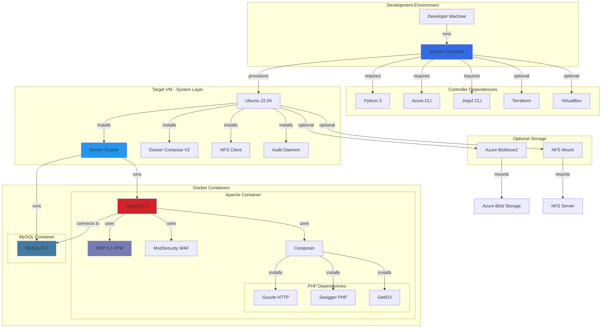

# GigHive Dependency Graph

This document provides a visual representation of GigHive's dependency structure.

## Architecture Overview



## Dependency Layers

### Layer 1: Controller (Development Machine)
- **Ansible** - Orchestrates all deployments
- **Python 3** - Ansible runtime
- **Azure CLI** - Cloud resource management
- **Jinja2 CLI** - Template processing
- **Terraform** - Infrastructure as Code (optional)
- **VirtualBox** - Local testing (optional)

### Layer 2: Target VM Base System
- **Ubuntu 22.04** - Operating system
- **Docker Engine** - Container runtime
- **Docker Compose V2** - Multi-container orchestration
- **NFS Client** - Network file system support
- **Audit Daemon** - Security auditing

### Layer 3: Application Containers

#### Apache Web Server Container
- **Base**: Ubuntu 22.04
- **Web Server**: Apache 2.4 with HTTP/2
- **PHP Runtime**: PHP 8.1 with FPM
- **Security**: ModSecurity WAF with OWASP CRS
- **Package Manager**: Composer

#### MySQL Database Container
- **Base**: MySQL 8.0 official image
- **Storage**: Persistent volume for data

### Layer 4: Application Dependencies

#### PHP/Composer Packages
- **Guzzle** - HTTP client for API calls
- **Swagger PHP** - OpenAPI documentation
- **GetID3** - Audio file metadata extraction
- **PSR-7** - HTTP message interfaces

### Layer 5: Optional Storage Backends
- **Azure Blobfuse2** - Mount Azure Blob Storage as filesystem
- **NFS Mount** - Network file system for shared storage

## Dependency Management

### Python Dependencies
Managed in: `/docs/DEPENDENCIES.md`
- Installed in Python virtualenv on controller
- Used by Ansible for Azure integration

### PHP Dependencies
Managed in: `ansible/roles/docker/files/apache/webroot/composer.json`
- Installed during Docker image build
- Locked with `composer.lock`

### System Packages
Managed by: Ansible roles
- `roles/base/tasks/main.yml` - Core system packages
- `roles/installprerequisites/` - Controller prerequisites
- `roles/docker/files/apache/Dockerfile` - Container packages

### Docker Images
- **Apache**: Built from Dockerfile with custom configuration
- **MySQL**: Official mysql:8.0 image from Docker Hub

## Security Considerations

1. **ModSecurity WAF** - Protects against OWASP Top 10 vulnerabilities
2. **Audit Daemon** - Logs security-relevant events
3. **SSL/TLS** - Self-signed certificates for HTTPS
4. **Basic Auth** - Optional HTTP basic authentication
5. **PHP Security** - Configured with secure defaults

## Monitoring Dependencies

GitHub will automatically:
1. Track `composer.json` for PHP dependency updates
2. Track `azure-prereqs.txt` for Python dependency updates
3. Monitor Docker base images (ubuntu:22.04, mysql:8.0)
4. Alert on security vulnerabilities via Dependabot

## Viewing the Dependency Graph

After pushing this configuration:

1. Go to your GitHub repository
2. Navigate to **Insights** → **Dependency graph**
3. View dependencies by ecosystem:
   - **Python** (azure-prereqs.txt)
   - **PHP** (composer.json)
   - **Docker** (Dockerfile)

## Updating Dependencies

### Python Dependencies
```bash
# Update azure-prereqs.txt
pip install --upgrade -r azure-prereqs.txt
```

### PHP Dependencies
```bash
cd ansible/roles/docker/files/apache/webroot
composer update
```

### System Packages
Managed automatically by Ansible during deployment.

### Docker Images
Update base image tags in:
- `ansible/roles/docker/files/apache/Dockerfile` (FROM ubuntu:22.04)
- `ansible/roles/docker/templates/docker-compose.yml.j2` (mysql:8.0)
