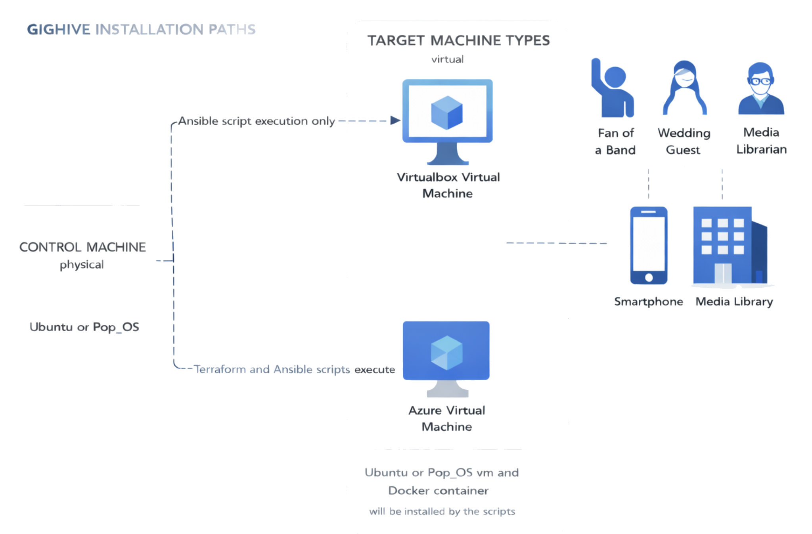

# GigHive Music and Video Library Setup

GigHive is an **open-source deployment framework** for hosting your own media library, a band’s library or fan videos, or even videos uploaded by guests from events like a wedding.  There are two pieces to Gighive:
- A pre-built web-accessible media library waiting to be populated.  This is the server piece. Gighive uses Ansible and Terraform to build a vm and on top, a fast Apache server and MySQL database. It includes a few audio and video clips donated from one of our other users as a sample.
- Companion iPhone app for fans and wedding guests to upload content (web-based upload also built-in).

The automation spins up a fully reproducible environment using **Docker, Ansible, and Terraform**.  It has a very simple interface: a splash page, a single database of stored videos and an upload utility.

This project is designed to be portable, easy to deploy, and suitable for local development or cloud environments (Azure supported out of the box).

## Components
- **Ansible Control Machine**: Tested on Ubuntu 24.04 or 22.04, so the requirements are **any flavor of Ubuntu or Pop-OS 24.04 or 22.04**, installed on bare metal.  Virtualbox implementation assumes Control Machine would also be home to your Virtualbox VMs.
- **Target Server**: Your choice of Virtualbox or Azure deployment targets for the vm and containerized environment.
  - Default vm size is 64GB, ~10GB of which will be used by the OS (configurable in ansible/group_vars).  
  - You will have ~54GB for media files.  
  - Docker will be installed to that VM. Bind mounts used for config files and media files. Check Dockerfile for exact specs.

## Software Prerequisites
Software needed for either option, Virtualbox or Azure:
 - Ansible, Python and git will be installed.  More detailed listing [here](PREREQS.html).
 - An id_rsa.pub file is needed for passwordless authentication into the Gighive server.

For Virtualbox installations, Virtualbox will be the additional component installed.
For Azure deployments, az and azure-cli will be installed.

## Architecture (logical)

<a href="images/architecture.png" target="_blank">
  
</a>

*Click the diagram above to view full size*

## Suggested Platforms
- Gighive runs very efficiently on an [Orange Pi 5](https://a.co/d/90UDcvi) or [GMKtech mini PC](https://www.amazon.com/dp/B0F8NL4ST4?ref=ppx_yo2ov_dt_b_fed_asin_title&th=1).  Stuff a few NVMe's in either and you'll have plenty of storage for your videos.  We've tested on both of them.
- Note that both cpu architectures are supported: amd64, arm64

## Secrets and Default Passwords

GigHive ships with example credentials to make first-time setup fast and simple.
These **defaults are for local/demo use only** and must be changed before any
Internet-exposed or production deployment.  You will see a step for this below.

---

# Setup

Choose one of the following:

## Quickstart (one-shot bundle)

[Quickstart Setup](setup_instructions_quickstart.html)

## Full build (normal Ansible/Terraform workflow)

[setup_instructions_fullbuild.html](setup_instructions_fullbuild.html)

## Benefits and Drawbacks of Quickstart vs Full Build

[process_download_quickstart_versus_full_build.html](process_download_quickstart_versus_full_build.html)

---


## 📂 Repository Structure
```
├── 1prereqsInstall.sh
├── 2bootstrap.sh
├── 3deleteAll.sh
├── ansible
│   ├── inventories
│   │   ├── group_vars
│   │   ├── inventory_azure.yml
│   │   ├── inventory_azure.yml.j2
│   │   ├── inventory_baremetal.yml
│   │   └── inventory_virtualbox.yml
│   ├── playbooks
│   │   └── site.yml
│   ├── roles
│   │   ├── base
│   │   ├── blobfuse2
│   │   ├── cloud_init
│   │   ├── cloud_init_disable
│   │   ├── docker
│   │   ├── mysql_backup
│   │   ├── nfs_mount
│   │   ├── post_build_checks
│   │   ├── security_basic_auth
│   │   ├── security_owasp_crs
│   │   ├── validate_app
│   │   └── varscope
│   └── vdiLockedWriteDelete.sh
├── ansible.cfg
├── assets
│   ├── audio
│   └── video
├── azure.env
├── azure-prereqs.txt
├── CHANGELOG.md
├── docs
│   ├── index.html
│   ├── PREREQS.md
│   └── README.md
├── inventory.ini
├── terraform
│   └── variables.tf
└── tree.txt
```

---

### License
GigHive is dual-licensed:

**[Licenses](LICENSE.md)**: Covers both the AGPL v3 license and the commercial license model.

---

## 🤝 Contributing
Contributions welcome! Please open issues and pull requests.  

👉 [Contact us](mailto:contactus@gighive.app) for commercial licensing or for any other questions regarding Gighive. 
