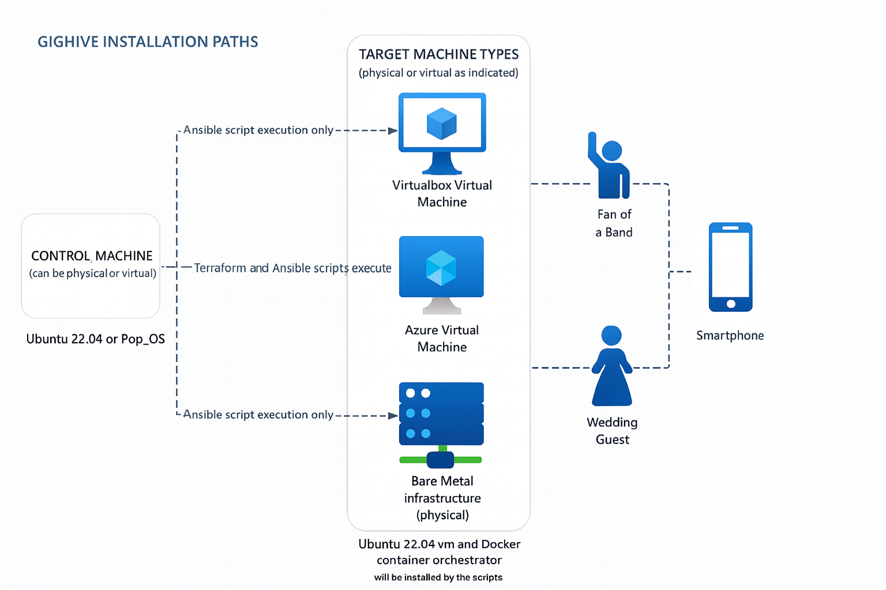

# GigHive Music and Video Library 

GigHive is an **open-source deployment framework** for hosting your own media library, a band’s library or fan videos, or even videos uploaded by guests from events like a wedding.  There are two pieces to Gighive:
- A pre-built web-accessible media library waiting to be populated.  This is the server piece. Gighive uses Ansible and Terraform to build a vm (or optionally, configure a bare metal server) and on top, a fast Apache server and MySQL database. It includes a few audio and video clips donated from one of our other users as a sample.
- Companion iPhone app for fans and wedding guests to upload content (web-based version also built-in).

The automation spins up a fully reproducible environment using **Docker, Ansible, and Terraform**.  It has a very simple interface: a splash page, a single database of stored videos and an upload utility.

This project is designed to be portable, easy to deploy, and suitable for local development or cloud environments (Azure supported out of the box).

## Requirements
- **Control Machine**: Tested on Ubuntu 24.10 or 22.04, so the requirements are **any flavor of Ubuntu 22.04 or Pop-OS**, installed on bare metal for the Virtualbox implementation or you can install to a VM if you are deploying to an external Azure or bare metal server.  Virtualbox implementation assumes Control Machine would also be home to your Virtualbox VMs.
- **Target Server**: Your choice of virtualbox, Azure or bare metal deployment targets for the vm and containerized environment.

## Architecture (logical)

<a href="images/architecture.png" target="_blank">
  
</a>

*Click the diagram above to view full size*

---

## ⚙️  Option A: Install to Local Machine
1. Decide on where you will install Ansible as the controller and what target (virtualbox or Azure) that you will install Gighive on. 

2. Log onto that server and install Ansible:
```bash
sudo apt update && sudo apt install -y pipx python3-venv git
pipx ensurepath
```

3. Log out.

4. Log back in.
```bash
pipx install --include-deps ansible
ansible --version # Should be 2.17.2 or higher
```

5. Clone the repo from your desired location (usually /home/$USER).  
- The repo has some sample media files, so it's about 690MB in size.  
- Takes a few minutes to download on an average connection.
```bash
git clone https://github.com/gighive/gighive
```

6. Wherever you have installed gighive to, set the GIGHIVE_HOME variable and test to see if it's correct.  
- Example: GIGHIVE_HOME is located in user's home directory.  
```bash
export GIGHIVE_HOME=/home/$USER/gighive
echo $GIGHIVE_HOME
cd $GIGHIVE_HOME
```

7. Add GIGHIVE_HOME export to your .bashrc.
```bash
echo "export GIGHIVE_HOME=/home/$USER/gighive" >> ~/.bashrc
```

8. Make sure you have id_rsa.pub in ./ssh for passwordless authentication.
```bash
ssh-keygen -t rsa
```

9. Install prerequisites using Ansible. 
- If your target is virtualbox, set install_virtualbox=true in the below Ansible command.
- If your target is Azure, set install_virtualbox=false, but set the terraform and azure_cli options to true.
- The script will ask for your sudo password, so enter it in when prompted.
- Default below is for the virtualbox install.
```bash
ansible-playbook -i ansible/inventories/inventory_vbox_new_bootstrap.yml ansible/playbooks/install_controller.yml -e install_virtualbox=true -e install_terraform=false -e install_azure_cli=false --ask-become-pass
```

10. Reboot.

11. Verify the installation.
```bash
cd $GIGHIVE_HOME
ansible-playbook -i ansible/inventories/inventory_vbox_new_bootstrap.yml ansible/playbooks/verify_controller.yml  -e target_provider=vbox -e install_virtualbox=true -e install_terraform=false -e install_azure_cli=false
```

12. Update your Ansible control target, the IP of the VM that will run the Gighive Apache web server and MySQL database.
- In the inventory file below, set the ansible_host IP address 
```bash
vi ansible/inventories/inventory_vbox_new_bootstrap.yml 
```

13. Execute the Ansible playbook that will install Gighive (this is where we should fix target)
```bash
ansible-playbook -i ansible/inventories/inventory_vbox_new_bootstrap.yml ansible/playbooks/site.yml --ask-become-pass
```

14. If you've made it this far, CONGRATULATIONS!!  You've installed all the prerequsities and actually installed Gighive! Awesome!! Now access it in a browser:
```bash
https://<ansible_host IP from step 11>
```

OPTIONAL It is helpful to set an alias in your .bashrc to access the vm you've created so you can check it out.
```bash
alias gighive='ssh ubuntu@<ansible_host value found in ansible/inventories/inventory_virtualbox.yml>"
```

---

## Option B: Install to Azure VM (requires an Azure subscription)
### Default is 64GB, ~10GB of which will be used by the OS.  
So you will have ~54GB of space for media files.

1. Export Azure Vars (as noted at top of 2bootstrap.sh)
```bash
export ARM_SUBSCRIPTION_ID=[put your subscription id here]
export ARM_TENANT_ID=[put your tenant id/mgmt group id here]
```

2. Provision infrastructure.  Run ./2bootstrap.sh. Watch for and respond to these prompts:
.. apply Terraform plan 
.. update the ansible inventory file
.. run the ansible_playbook
```bash
./2bootstrap.sh
```

3. If you're finished with the VM, delete all resources in Azure
```bash
cd $GIGHIVE_HOME;./3deleteAll.sh 
```

---


## ⚙️ Setup & Installation
- Once installed, there will be a splash page, a link to the database and a link to the uploads page. Simple! 
- Default install will populate the database with ~10 sample video and audio files. These can be deleted later with <a href="">database reset procedure</a>.
- There are three users: 
  * viewer: Viewers can view media files, but can't upload. 
  * uploader: Uploaders can upload and view media files. 
  * admin: Admin can view and upload files and change passwords.
- Default passwords are set in $GIGHIVE_HOME/ansible/inventories/group_vars/gighive.yml and should be changed.
- Admin utility: a page for the admins to reset default password in GUI as well.

---


## 📂 Repository Structure
```
├── 1prereqsInstall.sh
├── 2bootstrap.sh
├── 3deleteAll.sh
├── ansible
│   ├── inventories
│   │   ├── group_vars
│   │   ├── inventory_azure.yml
│   │   ├── inventory_azure.yml.j2
│   │   ├── inventory_baremetal.yml
│   │   └── inventory_virtualbox.yml
│   ├── playbooks
│   │   └── site.yml
│   ├── roles
│   │   ├── base
│   │   ├── blobfuse2
│   │   ├── cloud_init
│   │   ├── cloud_init_disable
│   │   ├── docker
│   │   ├── mysql_backup
│   │   ├── nfs_mount
│   │   ├── post_build_checks
│   │   ├── security_basic_auth
│   │   ├── security_owasp_crs
│   │   ├── validate_app
│   │   └── varscope
│   └── vdiLockedWriteDelete.sh
├── ansible.cfg
├── assets
│   ├── audio
│   └── video
├── azure.env
├── azure-prereqs.txt
├── CHANGELOG.md
├── docs
│   ├── index.html
│   ├── PREREQS.md
│   └── README.md
├── inventory.ini
├── terraform
│   └── variables.tf
└── tree.txt
```

---

### License
GigHive is dual-licensed:

- **[MIT License](LICENSE_MIT.md)**: Free for personal, single-instance, non-commercial use.
- **[Commercial License](LICENSE_COMMERCIAL.md)**: Required for SaaS, multi-tenant, or commercial use.

---

## 🤝 Contributing
Contributions welcome! Please open issues and pull requests.  

👉 [Contact us](mailto:contactus@gighive.app) for commercial licensing or for any other questions regarding Gighive. 
