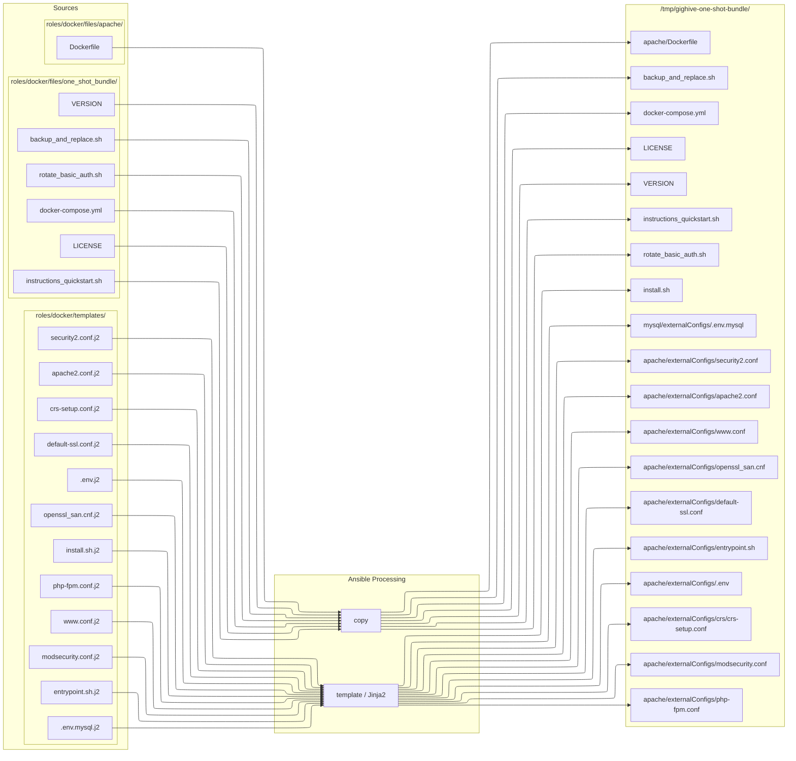
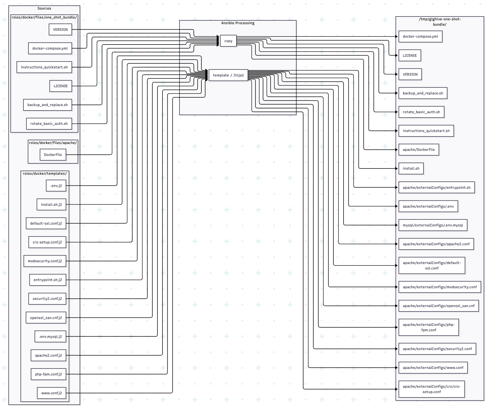

# One-Shot Bundle Assembly Flow

## Plain English Summary

`ansible/roles/one_shot_bundle/tasks/main.yml` (via `output_bundle.yml`) renders all the `.j2` templates from `roles/docker/templates/` and dumps them into `/tmp/gighive-one-shot-bundle/`, and also does a direct copy of the static files from `roles/docker/files/one_shot_bundle/` (and `roles/docker/files/apache/Dockerfile`) into that same `/tmp/gighive-one-shot-bundle/` folder.

The two passes are:

1. **`ansible.builtin.template`** — loops over everything under `roles/docker/templates/`, renders each `.j2` with Jinja2 variable substitution from `group_vars`, writes to `/tmp/gighive-one-shot-bundle/` with the mapped destination path. Runs **first**.

2. **`ansible.builtin.copy`** — loops over everything that is NOT under `templates/` (i.e., `roles/docker/files/one_shot_bundle/` static files + `roles/docker/files/apache/Dockerfile`), copies them as-is to `/tmp/gighive-one-shot-bundle/`. Runs **second**.

---

Shows how `/tmp/gighive-one-shot-bundle` is assembled by the `one_shot_bundle` Ansible role.

## Notes

### docker-compose.yml source

The authoritative bundle compose file is `ansible/roles/docker/files/one_shot_bundle/docker-compose.yml` (static copy). `docker-compose.yml.j2` is explicitly excluded from the bundle template render step (same as `gighive.htpasswd.j2`) because it is designed for a deployed VM (absolute paths, hardcoded TZ) and is not portable for the self-contained bundle. The static file uses relative paths and shell env var defaults (`${TZ:-America/New_York}`, `${GIGHIVE_AUDIO_DIR:-./_host_audio}`, etc.).

### gighive.htpasswd.j2 is excluded

`gighive.htpasswd.j2` is explicitly skipped during template rendering. Instead, the role copies the existing `gighive.htpasswd` from the previously-deployed bundle directory (`one_shot_bundle_bundle_dir`).

### Previously stale: gighive-one-shot-bundle/ in repo root

The repo root's `gighive-one-shot-bundle/` directory was a manually-maintained static copy — it was **not** read or written by the assembly role. The install.sh there has been removed. The real sources are the two directories shown in column 1 above.
