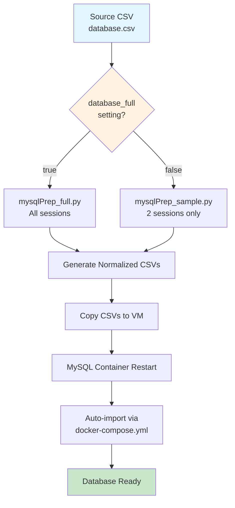
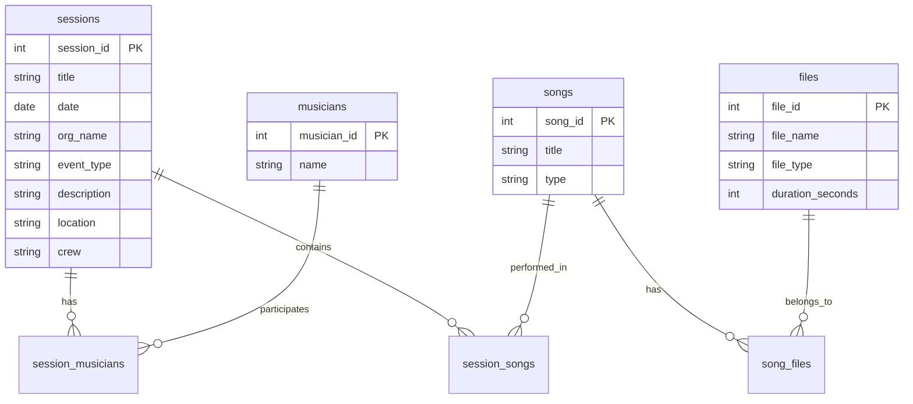

# Database Import Process

This document explains how GigHive imports CSV data into the MySQL database, including the data transformation pipeline and configuration options.

## Overview

GigHive uses a multi-step process to transform a single source CSV file into normalized database tables. This process handles session data, musicians, songs, and media files while maintaining referential integrity.

## Process Flow



## Configuration

### Database Size Selection

The import process is controlled by the `database_full` variable in your inventory group vars file:

**File:** `/home/sodo/scripts/gighive/ansible/inventories/group_vars/gighive.yml`

```yaml
# app flavor for build-time overlay; database_full kept as-is
app_flavor: gighive
database_full: false  # Set to true for full dataset, false for sample
```

- **`database_full: true`** → Uses `mysqlPrep_full.py` (processes all sessions)
- **`database_full: false`** → Uses `mysqlPrep_sample.py` (processes only 2 sessions: 2002-10-24 and 2005-03-03)

## File Locations

### Source Data
- **Source CSV:** `/home/sodo/scripts/gighive/ansible/roles/docker/files/mysql/dbScripts/loadutilities/database.csv`

### Processing Scripts
- **Full Dataset:** `/home/sodo/scripts/gighive/ansible/roles/docker/files/mysql/dbScripts/loadutilities/mysqlPrep_full.py`
- **Sample Dataset:** `/home/sodo/scripts/gighive/ansible/roles/docker/files/mysql/dbScripts/loadutilities/mysqlPrep_sample.py`
- **Driver Script:** `/home/sodo/scripts/gighive/ansible/roles/docker/files/mysql/dbScripts/loadutilities/doAllFull.sh`

### Output Directory
- **Generated CSVs:** `/home/sodo/scripts/gighive/ansible/roles/docker/files/mysql/externalConfigs/prepped_csvs/full/`

### Docker Configuration
- **Template:** `/home/sodo/scripts/gighive/ansible/roles/docker/templates/docker-compose.yml.j2`
- **Rendered:** `~/scripts/gighive/ansible/roles/docker/files/docker-compose.yml` (on VM)

## Data Transformation Process

### Step 1: CSV Preprocessing

The Python scripts transform the single source CSV into multiple normalized tables:

#### Input: `database.csv`
Single CSV with columns for sessions, musicians, songs, and files all in one row per session.

#### Output: Normalized CSVs
1. **`sessions.csv`** - Session metadata (date, location, crew, etc.)
2. **`musicians.csv`** - Unique musician names with IDs
3. **`session_musicians.csv`** - Many-to-many relationship between sessions and musicians
4. **`songs.csv`** - Unique songs with IDs (⚠️ **Critical Fix Applied**)
5. **`session_songs.csv`** - Many-to-many relationship between sessions and songs
6. **`files.csv`** - Media files (audio/video) with metadata
7. **`song_files.csv`** - Many-to-many relationship between songs and files
8. **`database_augmented.csv`** - Original CSV with added columns for reference

### Step 2: Critical Fix - Unique Song IDs

**Problem Solved:** Previously, songs with identical titles across different sessions received the same `song_id`, causing files to be incorrectly associated with multiple sessions.

**Solution Implemented:** Each song now gets a unique ID per session using the pattern `{session_id}_{song_title}` as the internal key while preserving the original song title in the database.

#### Before Fix
```python
# Problematic: Same song_id for identical titles
if title not in songs:
    songs[title] = {"song_id": len(songs) + 1, "type": "song"}
```

#### After Fix
```python
# Fixed: Unique song_id per session
song_key = f"{session_id}_{title}"
if song_key not in songs:
    songs[song_key] = {
        "song_id": len(songs) + 1,
        "type": "song",
        "title": title  # Preserve original title
    }
```

### Step 3: File Processing Logic

Files are mapped to songs positionally based on track numbers in filenames:

1. **Extract track numbers** from filenames (e.g., `19971230_2.mp3` → track 2)
2. **Sort files** by track number within each session
3. **Map files to songs** in order (file 1 → song 1, file 2 → song 2, etc.)

## Import Process Steps

### Manual Process

1. **Edit Source Data**
   ```bash
   # Edit the source CSV
   vim /home/sodo/scripts/gighive/ansible/roles/docker/files/mysql/dbScripts/loadutilities/database.csv
   ```

2. **Configure Database Size**
   ```bash
   # Edit inventory file
   vim /home/sodo/scripts/gighive/ansible/inventories/group_vars/gighive.yml
   # Set database_full: true or false
   ```

3. **Generate Normalized CSVs**
   ```bash
   cd /home/sodo/scripts/gighive/ansible/roles/docker/files/mysql/dbScripts/loadutilities
   
   # Run the appropriate script based on database_full setting
   python3 mysqlPrep_full.py    # if database_full: true
   # OR
   python3 mysqlPrep_sample.py  # if database_full: false
   ```

4. **Deploy to VM**
   ```bash
   # Ansible copies files and restarts containers
   ansible-playbook -i inventories/inventory_azure.yml playbooks/site.yml
   ```

### Automated Process

The entire process is automated through Ansible:

1. **Ansible determines** which script to use based on `database_full` setting
2. **Runs preprocessing** script to generate normalized CSVs
3. **Copies files** to VM host
4. **Restarts MySQL container** which triggers auto-import
5. **MySQL imports** all CSV files on container startup

## Database Schema

The import process creates the following table relationships:



## Troubleshooting

### Common Issues

1. **Files Associated with Wrong Sessions**
   - **Cause:** Songs with identical titles getting same song_id
   - **Status:** ✅ **FIXED** - Unique song IDs now generated per session

2. **Missing Files in Output**
   - **Check:** Ensure files are listed in the `f_singles` column of source CSV
   - **Check:** Verify file extensions are supported (mp3, mp4, etc.)

3. **Import Fails**
   - **Check:** CSV syntax and encoding (UTF-8)
   - **Check:** MySQL container logs for specific errors
   - **Check:** File permissions on CSV files

### Validation

After import, verify data integrity:

```sql
-- Check for duplicate song associations (should be none after fix)
SELECT f.file_name, s.title, sess.date, sess.title as session_title
FROM files f
JOIN song_files sf ON f.file_id = sf.file_id
JOIN songs s ON sf.song_id = s.song_id
JOIN session_songs ss ON s.song_id = ss.song_id
JOIN sessions sess ON ss.session_id = sess.session_id
WHERE f.file_name LIKE '%19971230_2%'
ORDER BY sess.date;
```

## Best Practices

1. **Always backup** the source CSV before making changes
2. **Test with sample dataset** (`database_full: false`) before full import
3. **Verify file associations** after import using the validation query above
4. **Use consistent naming** for media files (date_track format recommended)
5. **Keep track of changes** in the source CSV for audit purposes

## Security Notes

- CSV files may contain sensitive session information
- Ensure proper file permissions on the VM
- Database credentials are managed through Ansible vault in production
- Media file paths may expose directory structure

---

*This documentation reflects the current state after applying the critical fix for unique song IDs per session.*
