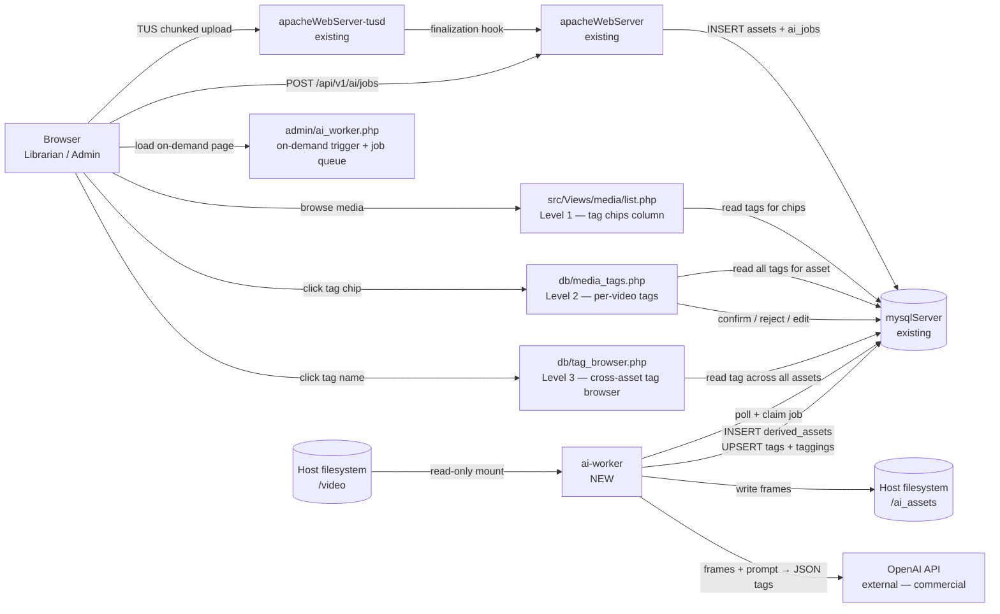
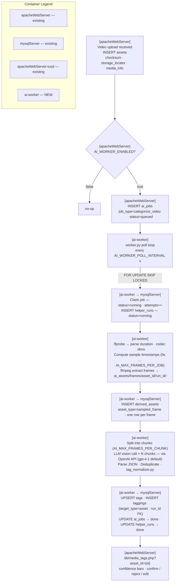
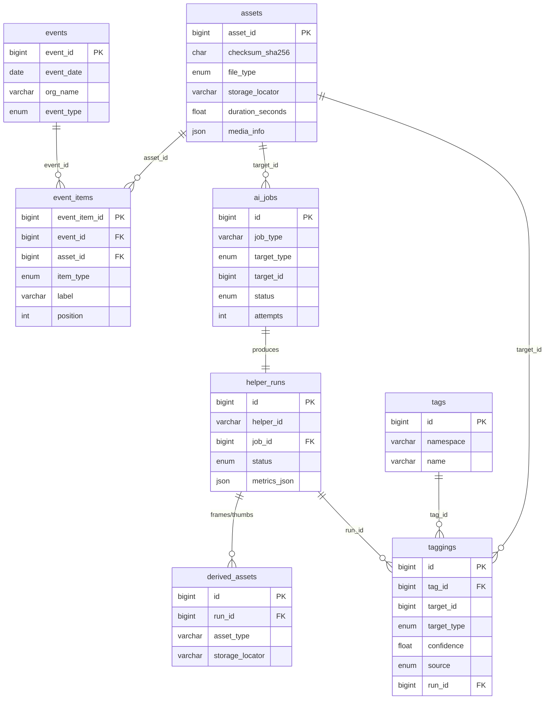


# Feature: AI Video Tagger (`video_tagger_v1`)

Date: 2026-04-25  
Status: Draft / Design  
Parent framework: [GigHive Intelligence Platform Framework](feature_ai_intelligence_platform.md)

---

## Overview

Once a user uploads a video to GigHive, the AI Video Tagger automatically analyzes the video content using a multimodal LLM and applies structured tags — people, objects, places, activities — without any manual effort. This is the first LLM-driven helper built on top of the GigHive Intelligence Platform framework.

---

## Why This First?

Tags derived from video content are the most broadly useful AI output GigHive can produce:

- Power search and filtering across events/videos immediately
- No human-in-the-loop required for an initial pass (unlike face labeling)
- Demonstrates end-to-end AI pipeline value quickly
- Results feed directly into the existing `tags`/`taggings` schema — no new framework tables needed

---

## How It Works (High Level)

When a video is uploaded and registered in `assets`, the system enqueues a `video_tagger_v1` job. An AI worker picks it up and runs `ffmpeg` to extract a set of representative frames — at regular intervals of one frame every 5 seconds (scene-change detection is a v2 option). These frames are encoded as base64 images and bundled into a prompt that instructs the multimodal LLM to return structured JSON describing what it observes: the types of people present (musician on stage, audience member, officiant, wedding party), physical objects (guitar, drum kit, microphone, crowd, stage lighting, flowers, cake), setting/environment (concert venue, outdoor festival, indoor reception hall, recording studio), and notable activities (performing, dancing, speaking). The LLM's JSON response is parsed and normalized into tag namespaces — `scene`, `object`, `activity`, `person_role` — and written into the existing `tags`/`taggings` tables with `source='ai'` and a `confidence` score.

From the user's perspective, videos automatically acquire searchable tags without any manual effort. An event might be tagged `scene:outdoor_stage`, `object:drum_kit`, `activity:live_performance`, `person_role:audience` within minutes of upload. These tags immediately power search and filtering in the admin UI — find all videos where a guitar is visible, or all wedding reception clips, or all concert footage with a large crowd. Because every tagging row carries a `run_id` back to `helper_runs`, results are fully auditable and re-runnable if you switch models or tune prompts.

The architecture cleanly separates the LLM provider from the rest of the system: the worker calls an adapter interface (`LLMVisionAdapter`) that accepts frames + prompt and returns parsed tags. Swapping from GPT-4.1 to Gemini or a self-hosted model requires only a new adapter implementation — no changes to the job queue, tagging schema, or UI.

### User Interaction

#### Navigation model — three-level drill-down

```
src/Views/media/list.php  (existing, Level 1)
  └─ tag chips column added to each video row
       │
       ↓ click a chip, e.g. "drum_kit"
       │
db/media_tags.php?asset_id=123#tag-drum_kit  (Level 2)
  └─ all tags for ONE video, grouped by namespace with section anchors
     arriving from Level 1 scrolls directly to the clicked tag's section
       │
       ↓ click a tag name in the table
       │
db/tag_browser.php?namespace=object&name=drum_kit  (Level 3)
  └─ all instances of "drum_kit" across ALL scanned videos
     same table structure as Level 2, with an Asset column added
```

#### UI surface summary

| Surface | Page | Phase |
|---------|------|-------|
| On-demand trigger + job queue | **New** `admin/ai_worker.php` (modeled on `admin/admin_system.php`) | Phase 6c |
| Tag chips column | **Modified** `src/Views/media/list.php` — extra column on video rows | Phase 8 |
| Per-video tag detail + confirm/reject | **New** `db/media_tags.php?asset_id={id}` | Phase 8a + 10 |
| Cross-asset tag browser | **New** `db/tag_browser.php?namespace={ns}&name={tag}` | Phase 8b |
| Search / filter chips | **Modified** existing media/event list views linked from `src/Views/media/list.php` | Phase 9 |

#### Level 1 — `src/Views/media/list.php` (modified)

An extra **Tags** column appended to the video rows in the existing database view. Each cell shows tag chips — short `namespace:name` pills. Clicking a chip links to `db/media_tags.php?asset_id={id}#tag-{name}`, landing directly at that tag's section on the per-video page.

#### Level 2 — `db/media_tags.php` (new page)

The primary tag management page for a single video. Tags are **grouped by namespace** with section dividers (matching `admin_system.php`'s section style), so URL anchors like `#tag-drum_kit` scroll directly to the right row. Each row: Namespace | Tag | Confidence bar | Time range | Source (AI / Human) | Actions.

- **Confirm** → `PATCH /api/v1/taggings/{id}` — flips `source` to `'human'`; row updates in place
- **Reject** → `DELETE /api/v1/taggings/{id}` with `confirm()` dialog; row fades out
- **Edit** → inline form: pre-filled namespace/tag inputs → DELETE original + POST new with `source='human'`
- **Add manual tag** — inline form at bottom of each namespace section
- **Tag name is a link** → clicking it navigates to Level 3 (`db/tag_browser.php?namespace=...&name=...`)
- **"Re-run AI Tagger"** button at top → `POST /api/v1/ai/jobs` for this asset

#### Level 3 — `db/tag_browser.php` (new page)

Same table structure as Level 2 but not confined to one video. Adds an **Asset** column (filename + link back to Level 2 for that asset). URL params: `?namespace=object&name=drum_kit`. Shows every tagging row for that tag across all scanned videos, with confidence, time range, and source.

From this page, clicking an asset filename navigates back to Level 2 for that video, anchored to the relevant tag section.

#### On-demand trigger — `admin/ai_worker.php` (new page)

Modeled on `admin/admin_system.php`. Contains:
- Status summary: total video assets · assets with tags · assets pending tagging
- **"Scan / Tag Untagged Assets"** button → `POST /api/v1/ai/jobs` for every asset with no `taggings` row yet
- Job queue view: recent `ai_jobs` rows with status, asset name, timestamps, attempt count

The automatic upload trigger (Phase 6a) means most assets self-enqueue; this page handles bulk back-fills, post-model-upgrade re-runs, and diagnostics.

---

### Component Architecture



---

### Processing Pipeline (one job, end to end)



---

## Tag Namespaces

| Namespace | Example values |
|-----------|----------------|
| `scene` | `outdoor_stage`, `indoor_reception`, `recording_studio`, `rehearsal_space` |
| `object` | `guitar`, `drum_kit`, `microphone`, `wedding_cake`, `stage_lighting`, `crowd` |
| `activity` | `live_performance`, `dancing`, `speech`, `soundcheck` |
| `person_role` | `musician`, `audience`, `officiant`, `wedding_party` |

These four namespaces are **fixed** — the prompt instructs the LLM to classify observations strictly within them, and the normalizer discards any response that falls outside. Tag *values* within each namespace (e.g. `drum_kit`, `outdoor_stage`) are **LLM-generated** and open-ended. Adding a new namespace is a future change requiring prompt and normalizer updates; the schema itself requires no changes.

---

## Implementation Plan

| Phase | Scope |
|-------|-------|
| **0 — Pre-implementation decisions** | Resolve all blockers before writing any code (LLM provider, API key storage, adapter boundary, frame strategy, caps) |
| **1 — Database schema** | Add `ai_jobs`, `helper_runs`, `derived_assets`, `tags`, `taggings` to `create_music_db.sql` |
| **2 — `ai_worker` Ansible role** | New role: host directory tree, compose fragment, env vars, `ai-worker` container |
| **3 — Frame extractor** | `frame_extractor.py`: `ffprobe` preflight → `ffmpeg` frame sampling → `derived_assets` writes; no LLM involved |
| **4 — LLM adapter layer** | `LLMVisionAdapter` ABC + `openai_adapter.py` concrete implementation (default `gpt-4.1`); returns `[{namespace, name, confidence, start_seconds, end_seconds}]` |
| **5 — Tag normalizer** | `tag_normalizer.py`: parse LLM JSON → deduplicate → upsert `tags` + `taggings` |
| **6 — Job wiring (PHP)** | Auto-enqueue `video_tagger_v1` on `assets` insert; REST API `POST /api/v1/ai/jobs`; admin on-demand button |
| **7 — Worker polling loop** | `worker.py`: claim → dispatch `video_tagger_v1` helper → mark done/failed; `db.py` lifecycle helpers |
| **8 — Tag browsing UI** | Admin views: per-video tag list with confidence scores; per-tag view listing all matching videos |
| **9 — Search integration** | Filter events/videos by tag namespace+name in existing search/query surfaces |
| **10 — Human review layer** | Admin can confirm, reject, or edit AI-generated tags; `source` flips to `'human'`; `run_id` preserved for provenance |

---

## MCP Server as Provider Conduit

An MCP server (`gighive-ai-mcp`) is the recommended integration layer between GigHive's AI worker and external LLM providers. It exposes GigHive-specific tools as MCP tool definitions:

- `analyze_video_frames` — accepts a set of frame images + prompt, returns structured tag JSON
- `get_media_tags` — returns current tags for a given `asset_id`
- `enqueue_categorization_job` — triggers `video_tagger_v1` for a given asset

**Benefits of the MCP approach:**

- **Provider agnosticism** — the MCP server owns the adapter layer; switching from GPT-4.1 to Gemini or a self-hosted model requires only a new adapter in the MCP server, not changes to GigHive worker code
- **Agentic extensibility** — an LLM agent can chain tools autonomously (e.g., "find all videos tagged `outdoor_stage`, extract highlights, generate a reel") without GigHive writing that orchestration logic
- **Reuse across surfaces** — the same MCP server serves both the background AI worker and any future chat/assistant interface built on top of GigHive
- **Separation of concerns** — MCP server = integration layer (tool definitions, LLM API auth, adapter impls); GigHive worker = execution layer (job queue, DB writes, file I/O)

The MCP server communicates with the GigHive worker through the existing `ai_jobs`/`taggings` schema, keeping the boundary clean.

---

## Related

- [GigHive Intelligence Platform Framework](feature_ai_intelligence_platform.md) — parent framework, schema definitions, helper registry model, job queue

---

## Detailed Implementation Plan

### Phase 0 — Pre-Implementation Decisions (Blockers)

Resolve all of these before writing any code:

| Decision | Decision |
|----------|----------|
| LLM provider for v1 | **GPT-4.1** (default); evaluate `gpt-5.4` / `gpt-5.4-mini` at implementation time against current OpenAI model lineup — model is an env var, no code change required to switch |
| API key storage (v1) | **`secrets.yml`** (gitignored) — migrate to Ansible Vault as a follow-on |
| Who supplies the API key | **Each GigHive installation provides its own `OPENAI_API_KEY`** |
| Worker runtime | **Python** (broadest LLM SDK + ffmpeg support) |
| v1 adapter boundary | **Direct adapter in worker** — MCP deferred to v2 |
| Frame sampling strategy | **Fixed interval at 1 frame / 5 s** — scene-change as v2 |
| Max frames per job (hard cap) | **48 frames** (8 LLM chunks × 6 frames each) — cost/token ceiling based on vision LLM image limits; frames are **distributed evenly** across the full video duration so long videos are fully covered at a wider interval rather than only the first N minutes |
| Frames per LLM chunk | **6** (safe for current vision LLM context + cost) |
| Frame retention policy | **Retain 30 days** in `ai_assets/frames/`, then purge |
| `helper_id` canonical name | **`video_tagger_v1`** |
| `job_type` canonical value | **`categorize_video`** — used in `ai_jobs.job_type`, PHP enqueue, and worker claim filter |

---

### Phase 1 — Database Schema Migrations

**Add the tables below directly to `ansible/roles/docker/files/mysql/externalConfigs/create_music_db.sql`** — the database is in a pristine state across all SDLC environments so no separate migration file is needed.

> **Future feature (separate release)**: Rename the database from `music_db` to `media_db`. Affected items include: the database name in all connection strings, `create_music_db.sql` → `create_media_db.sql` (file rename + internal references), Ansible group_vars DB_NAME, PHP config, and any hardcoded references in scripts. This deserves its own release/deploy bucket and must not be bundled here.

#### 1a. Framework tables — add all to `create_music_db.sql`

`assets` and `event_items` are owned by the PR1 cutover and must already be present. The three AI platform tables below are **new** and go directly in `create_music_db.sql`:

```sql
CREATE TABLE IF NOT EXISTS ai_jobs (
  id          BIGINT UNSIGNED  NOT NULL AUTO_INCREMENT PRIMARY KEY,
  job_type    VARCHAR(64)      NOT NULL,
  target_type ENUM('asset','event','event_item','participant') NOT NULL,
  target_id   BIGINT UNSIGNED  NOT NULL,
  params_json JSON             NULL,
  status      ENUM('queued','running','done','failed') NOT NULL DEFAULT 'queued',
  priority    SMALLINT         NOT NULL DEFAULT 100,
  attempts    SMALLINT         NOT NULL DEFAULT 0,
  locked_by   VARCHAR(128)     NULL,
  locked_at   DATETIME         NULL,
  error_msg   TEXT             NULL,
  created_at  DATETIME         NOT NULL DEFAULT CURRENT_TIMESTAMP,
  updated_at  DATETIME         NOT NULL DEFAULT CURRENT_TIMESTAMP ON UPDATE CURRENT_TIMESTAMP,
  KEY idx_ai_jobs_claim  (status, job_type, priority, created_at),
  KEY idx_ai_jobs_target (target_type, target_id)
) ENGINE=InnoDB DEFAULT CHARSET=utf8mb4 COLLATE=utf8mb4_unicode_ci;

CREATE TABLE IF NOT EXISTS helper_runs (
  id           BIGINT UNSIGNED NOT NULL AUTO_INCREMENT PRIMARY KEY,
  helper_id    VARCHAR(64)     NOT NULL,
  job_id       BIGINT UNSIGNED NOT NULL,
  version      VARCHAR(32)     NULL,
  params_json  JSON            NULL,
  status       ENUM('running','done','failed') NOT NULL DEFAULT 'running',
  error_msg    TEXT            NULL,
  metrics_json JSON            NULL,
  started_at   DATETIME        NOT NULL DEFAULT CURRENT_TIMESTAMP,
  finished_at  DATETIME        NULL,
  KEY idx_helper_runs_job    (job_id),
  KEY idx_helper_runs_helper (helper_id),
  CONSTRAINT fk_helper_runs_job FOREIGN KEY (job_id) REFERENCES ai_jobs (id)
) ENGINE=InnoDB DEFAULT CHARSET=utf8mb4 COLLATE=utf8mb4_unicode_ci;

CREATE TABLE IF NOT EXISTS derived_assets (
  id               BIGINT UNSIGNED NOT NULL AUTO_INCREMENT PRIMARY KEY,
  run_id           BIGINT UNSIGNED NOT NULL,
  asset_type       VARCHAR(64)     NOT NULL,
  storage_locator  VARCHAR(512)    NOT NULL,
  mime_type        VARCHAR(128)    NULL,
  created_at       DATETIME        NOT NULL DEFAULT CURRENT_TIMESTAMP,
  KEY idx_derived_assets_run (run_id),
  CONSTRAINT fk_derived_assets_run FOREIGN KEY (run_id) REFERENCES helper_runs (id)
) ENGINE=InnoDB DEFAULT CHARSET=utf8mb4 COLLATE=utf8mb4_unicode_ci;
```

#### 1b. Tagging tables

```sql
CREATE TABLE IF NOT EXISTS tags (
  id         BIGINT UNSIGNED NOT NULL AUTO_INCREMENT PRIMARY KEY,
  namespace  VARCHAR(64)  NOT NULL,
  name       VARCHAR(128) NOT NULL,
  created_at DATETIME     NOT NULL DEFAULT CURRENT_TIMESTAMP,
  UNIQUE KEY uq_tags_ns_name (namespace, name),
  KEY idx_tags_namespace (namespace)
) ENGINE=InnoDB DEFAULT CHARSET=utf8mb4 COLLATE=utf8mb4_unicode_ci;

CREATE TABLE IF NOT EXISTS taggings (
  id            BIGINT UNSIGNED NOT NULL AUTO_INCREMENT PRIMARY KEY,
  tag_id        BIGINT UNSIGNED NOT NULL,
  target_type   ENUM('asset','event','event_item','segment') NOT NULL,
  target_id     BIGINT UNSIGNED NOT NULL,
  start_seconds FLOAT          NULL,
  end_seconds   FLOAT          NULL,
  confidence    FLOAT          NULL,
  source        ENUM('ai','human') NOT NULL DEFAULT 'ai',
  run_id        BIGINT UNSIGNED NULL,
  created_at    DATETIME        NOT NULL DEFAULT CURRENT_TIMESTAMP,
  UNIQUE KEY uq_taggings_tag_target (tag_id, target_type, target_id),  -- one tagging per tag+target pair; run_id is provenance only, not identity. ON DUPLICATE KEY UPDATE upserts on retry (same or new run) and prevents duplicate manual tags
  KEY idx_taggings_target     (target_type, target_id),
  KEY idx_taggings_run        (run_id),
  KEY idx_taggings_source     (source),
  CONSTRAINT fk_taggings_tag FOREIGN KEY (tag_id) REFERENCES tags (id),
  CONSTRAINT fk_taggings_run FOREIGN KEY (run_id) REFERENCES helper_runs (id)
) ENGINE=InnoDB DEFAULT CHARSET=utf8mb4 COLLATE=utf8mb4_unicode_ci;
```

#### Schema relationships (ERD)



---

### Phase 2 — `ai_worker` Ansible Role

All ai-worker infrastructure lives in a **dedicated Ansible role** (`ansible/roles/ai_worker/`), separate from the existing `docker` role which owns the Apache/PHP/MySQL containers. The role creates the `ai_assets` directory tree on the host, renders config templates, and adds the `ai-worker` service to the Docker Compose stack. Keeping it isolated also supports business flexibility — the AI feature can be gated, licensed, or offered as a paid upgrade independently of the core application.

**Role layout:**
```
ansible/roles/ai_worker/
  tasks/main.yml                 ← create ai_assets dirs (ansible.builtin.file), render templates (ansible.builtin.template), deploy container (community.docker.docker_compose_v2)
  handlers/
    main.yml                     ← restart ai-worker on config/code change
  files/
    ai-worker/
      Dockerfile
      requirements.txt           ← openai, mysql-connector-python, Pillow
      worker.py                  ← main polling loop
      db.py                      ← MySQL connection + claim/complete/fail helpers
      frame_extractor.py         ← ffprobe + ffmpeg wrapper
      tag_normalizer.py          ← parse LLM JSON → normalized TagResult list + DB writes
      helpers/
        video_tagger.py          ← video_tagger_v1 orchestrator (frames → LLM → taggings)
      adapters/
        base.py                  ← LLMVisionAdapter ABC (FrameData, TagResult dataclasses)
        openai_adapter.py        ← GPT-4.1 concrete implementation
  templates/
    docker-compose-ai-worker.yml.j2  ← separate compose file; applied with `docker compose -f docker-compose.yml -f docker-compose-ai-worker.yml`
```

#### Deployment path on the VM

The ai-worker Python source must land somewhere Docker can build from. The existing `base` role synchronizes `ansible/roles/docker/files/` → `{{ docker_dir }}` with `delete: yes`. **Placing `ai-worker/` inside `docker_dir` would cause the base role to delete it on the next run** — the same pattern as the backups directory issue.

**Safe approach**: sync to a peer directory alongside `docker_dir`:
```
{{ gighive_home }}/
  ansible/roles/docker/files/   ← docker_dir (base role owns this)
  ai-worker/                    ← ai_worker role owns this; separate from docker_dir
```

The docker-compose fragment then uses an absolute path for the build context:
```yaml
ai-worker:
  build: {{ gighive_home }}/ai-worker
  env_file:
    - ./apache/externalConfigs/.env
```

> **Phase 2 requirement**: the `env_file` reference to `apache/externalConfigs/.env` must be in the fragment from the start. Without it the worker container has no MySQL credentials (smoke test fails immediately) and no `UPLOAD_ALLOWED_MIMES_JSON` (mime-type guard rejects every asset).

#### `tasks/main.yml` skeleton

```yaml
---
- name: Assert OPENAI_API_KEY is set when AI worker is enabled
  ansible.builtin.assert:
    that: openai_api_key is defined and openai_api_key | length > 0
    fail_msg: "OPENAI_API_KEY must be defined in secrets.yml when AI_WORKER_ENABLED=true"
  when: ai_worker_enabled | default(false) | bool

- name: Create ai_assets directory tree on host
  ansible.builtin.file:
    path: "{{ gighive_home }}/ai_assets/{{ item }}"
    state: directory
    owner: "{{ ansible_user }}"
    group: "{{ ansible_user }}"
    mode: "0755"
  loop:
    - frames
    - diagnostics
    - thumbnails
  when: ai_worker_enabled | default(false) | bool

- name: Sync ai-worker Python source to host
  ansible.posix.synchronize:
    src: "ai-worker/"
    dest: "{{ gighive_home }}/ai-worker/"
    delete: yes
    rsync_opts:
      - "--exclude=__pycache__"
      - "--exclude=*.pyc"
  notify: restart ai-worker
  when: ai_worker_enabled | default(false) | bool

- name: Render ai-worker docker-compose fragment
  ansible.builtin.template:
    src: docker-compose-ai-worker.yml.j2
    dest: "{{ docker_dir }}/docker-compose-ai-worker.yml"
    owner: "{{ ansible_user }}"
    group: "{{ ansible_user }}"
    mode: "0644"
  notify: restart ai-worker
  when: ai_worker_enabled | default(false) | bool

- name: Deploy ai-worker container
  community.docker.docker_compose_v2:
    project_src: "{{ docker_dir }}"
    files:
      - docker-compose.yml
      - docker-compose-ai-worker.yml
    state: present
    build: always
  when: ai_worker_enabled | default(false) | bool

- name: Run ai-worker role validation
  ansible.builtin.include_tasks: validate.yml
```

#### `handlers/main.yml`

```yaml
---
- name: restart ai-worker
  community.docker.docker_compose_v2:
    project_src: "{{ docker_dir }}"
    files:
      - docker-compose.yml
      - docker-compose-ai-worker.yml
    services:
      - ai-worker
    state: restarted
  when: ai_worker_enabled | default(false) | bool
```

#### Technical Components

**Base image**: `python:3.11-slim` (Debian Bookworm slim)

```dockerfile
FROM python:3.11-slim
RUN apt-get update && apt-get install -y --no-install-recommends ffmpeg \
    && rm -rf /var/lib/apt/lists/*
```

Debian slim is preferred over Alpine because FFmpeg on Alpine has occasional codec/library gaps with real-world video formats.

| Component | License | Role |
|-----------|---------|------|
| CPython 3.11 | PSF | Runtime |
| FFmpeg / ffprobe | LGPL/GPL | Frame extraction, video metadata |
| Pillow | HPND | Image handling / base64 encoding |
| `mysql-connector-python` | GPL | Database access |
| `openai` Python SDK | MIT | HTTP client to OpenAI API |

> **The inference is not FOSS.** Frame extraction, tag normalization, and all DB writes run locally on FOSS software. The intelligence (understanding video content, generating tags) is performed by **GPT-4.1 on OpenAI's servers** (default model) — a commercial API call. The `openai` SDK is only the HTTP client.

**`docker-compose-ai-worker.yml.j2` — full standalone file** (Docker Compose merges services from all `-f` files into one shared default network; no explicit `networks:` block needed):
```yaml
services:
  ai-worker:
    build: {{ gighive_home }}/ai-worker
    restart: unless-stopped
    env_file: ./apache/externalConfigs/.env
    volumes:
      - {{ video_dir }}:/data/video:ro
      - {{ audio_dir }}:/data/audio:ro
      - {{ gighive_home }}/ai_assets:/data/ai_assets:rw
    depends_on:
      - mysql
```

**`.env.j2` additions** (add these lines to `ansible/roles/docker/templates/.env.j2`):
```
AI_WORKER_ENABLED={{ ai_worker_enabled | default(false) | lower }}
LLM_PROVIDER={{ llm_provider | default('openai') }}
OPENAI_API_KEY={{ openai_api_key | default('') }}
OPENAI_MODEL={{ openai_model | default('gpt-4.1') }}
LLM_BASE_URL={{ llm_base_url | default('https://api.openai.com/v1') }}
AI_FRAME_INTERVAL_SECONDS={{ ai_frame_interval_seconds | default(5) }}
AI_MAX_FRAMES_PER_JOB={{ ai_max_frames_per_job | default(48) }}
AI_MAX_FRAMES_PER_CHUNK={{ ai_max_frames_per_chunk | default(6) }}
AI_FRAME_RETENTION_DAYS={{ ai_frame_retention_days | default(30) }}
AI_WORKER_POLL_INTERVAL={{ ai_worker_poll_interval | default(5) }}
AI_WORKER_MAX_ATTEMPTS={{ ai_worker_max_attempts | default(3) }}
GIGHIVE_AI_ASSETS_ROOT={{ gighive_ai_assets_root | default('/data/ai_assets') }}
```

**New env vars for `group_vars`:**

| Variable | Default | Purpose |
|----------|---------|---------|
| `AI_WORKER_ENABLED` | `false` | PHP-side gate — no-ops job enqueue when false |
| `LLM_PROVIDER` | `openai` | `openai` \| `gemini` |
| `OPENAI_API_KEY` | — | v1: plain `secrets.yml` (gitignored); v2: migrate to Ansible Vault |
| `OPENAI_MODEL` | `gpt-4.1` | Override to `gpt-4.1-mini` for cost testing; evaluate `gpt-5.4` / `gpt-5.4-mini` at implementation time against current OpenAI model lineup |
| `LLM_BASE_URL` | `https://api.openai.com/v1` | OpenAI SDK `base_url` — override to point at a local inference server (e.g. Ollama) without changing adapter code |
| `AI_FRAME_INTERVAL_SECONDS` | `5` | Seconds between sampled frames (**confirmed**) |
| `AI_MAX_FRAMES_PER_JOB` | `48` | Hard cap per job |
| `AI_MAX_FRAMES_PER_CHUNK` | `6` | Frames per single LLM API call |
| `AI_FRAME_RETENTION_DAYS` | `30` | Days to keep sampled frames before purge |
| `AI_WORKER_POLL_INTERVAL` | `5` | Seconds to sleep when queue is empty |
| `AI_WORKER_MAX_ATTEMPTS` | `3` | Max retries before marking job permanently failed |
| `GIGHIVE_AI_ASSETS_ROOT` | `/data/ai_assets` | Container path to AI assets mount |

#### `tasks/validate.yml` — self-contained role validation

Included from `tasks/main.yml` as the final task block. **Every task is gated `when: ai_worker_enabled | bool`** so the entire file is a no-op on installs where the AI worker is not enabled. These tests do not belong in `post_build_checks` or `app_validation` — the AI worker is a bolt-on feature with its own isolated test surface.

```yaml
---
- name: AI worker | verify container is running
  community.docker.docker_container_info:
    name: ai-worker
  register: __ai_container
  failed_when: not (__ai_container.container.State.Running | default(false))
  when: ai_worker_enabled | bool

- name: AI worker | stat ai_assets subdirectories
  ansible.builtin.stat:
    path: "{{ gighive_home }}/ai_assets/{{ item }}"
  register: __ai_dir_stats
  loop:
    - frames
    - diagnostics
    - thumbnails
  when: ai_worker_enabled | bool

- name: AI worker | assert ai_assets directories exist, are owned correctly, and are writable
  ansible.builtin.assert:
    that:
      - item.stat.exists
      - item.stat.isdir
      - item.stat.pw_name == ansible_user
      - item.stat.writeable
    fail_msg: >-
      {{ item.item }} — exists={{ item.stat.exists | default(false) }}
      isdir={{ item.stat.isdir | default(false) }}
      owner={{ item.stat.pw_name | default('unknown') }}
      writable={{ item.stat.writeable | default(false) }}
  loop: "{{ __ai_dir_stats.results }}"
  when: ai_worker_enabled | bool

- name: AI worker | verify AI tables exist in database
  community.mysql.mysql_query:
    login_host: "127.0.0.1"
    login_user: "{{ mysql_appuser }}"
    login_password: "{{ mysql_appuser_password }}"
    login_db: "{{ mysql_database }}"
    query: >
      SELECT COUNT(*) AS n FROM information_schema.tables
      WHERE table_schema = '{{ mysql_database }}'
      AND table_name IN ('ai_jobs','helper_runs','derived_assets','tags','taggings')
  register: __ai_tables
  failed_when: (__ai_tables.query_result[0][0]['n'] | int) != 5
  when: ai_worker_enabled | bool

- name: AI worker | verify OPENAI_API_KEY is non-empty
  ansible.builtin.assert:
    that: openai_api_key is defined and openai_api_key | length > 0
    fail_msg: "openai_api_key must be set in secrets.yml when ai_worker_enabled=true"
  when: ai_worker_enabled | bool
```

> **Scope of this check — presence only, not validity**: This task confirms the key is set and non-empty. It does **not** make a live call to the OpenAI API. Reasons: (1) Ansible runs on the control node, whose network path differs from the worker container's; (2) if `LLM_BASE_URL` points to a local Ollama instance, key validity is meaningless; (3) an invalid/expired key produces a clear `AuthenticationError` (HTTP 401) on the first real job, stored in `ai_jobs.error_msg` and `helper_runs.error_msg`.
>
> **API reachability validation belongs in Phase 7** (`worker.py` startup): add a preflight `GET /v1/models` call before the polling loop begins. If it fails, log clearly and exit — the worker never picks up jobs with a bad key. This runs in the actual container, on the actual network path, using the actual env vars.

```yaml
- name: AI worker | job queue round-trip — insert synthetic job
  community.mysql.mysql_query:
    login_host: "127.0.0.1"
    login_user: "{{ mysql_appuser }}"
    login_password: "{{ mysql_appuser_password }}"
    login_db: "{{ mysql_database }}"
    query: "INSERT INTO ai_jobs (job_type, target_type, target_id, status) VALUES ('smoke_test', 'asset', 0, 'queued')"
  when: ai_worker_enabled | bool

- name: AI worker | job queue round-trip — capture inserted ID
  community.mysql.mysql_query:
    login_host: "127.0.0.1"
    login_user: "{{ mysql_appuser }}"
    login_password: "{{ mysql_appuser_password }}"
    login_db: "{{ mysql_database }}"
    query: "SELECT LAST_INSERT_ID() AS id"
  register: __smoke_id
  when: ai_worker_enabled | bool

- name: AI worker | job queue round-trip — mark done
  community.mysql.mysql_query:
    login_host: "127.0.0.1"
    login_user: "{{ mysql_appuser }}"
    login_password: "{{ mysql_appuser_password }}"
    login_db: "{{ mysql_database }}"
    query: "UPDATE ai_jobs SET status='done' WHERE id={{ __smoke_id.query_result[0][0]['id'] }}"
  when: ai_worker_enabled | bool

- name: AI worker | job queue round-trip — verify status
  community.mysql.mysql_query:
    login_host: "127.0.0.1"
    login_user: "{{ mysql_appuser }}"
    login_password: "{{ mysql_appuser_password }}"
    login_db: "{{ mysql_database }}"
    query: "SELECT status FROM ai_jobs WHERE id={{ __smoke_id.query_result[0][0]['id'] }}"
  register: __smoke_verify
  failed_when: (__smoke_verify.query_result[0][0]['status'] | default('')) != 'done'
  when: ai_worker_enabled | bool

- name: AI worker | job queue round-trip — cleanup
  community.mysql.mysql_query:
    login_host: "127.0.0.1"
    login_user: "{{ mysql_appuser }}"
    login_password: "{{ mysql_appuser_password }}"
    login_db: "{{ mysql_database }}"
    query: "DELETE FROM ai_jobs WHERE id={{ __smoke_id.query_result[0][0]['id'] }}"
  when: ai_worker_enabled | bool
```

> **Permissions lesson from the one-shot bundle**: never assume directories are writable just because they exist. The `stat.writeable` check (run as `ansible_user` via SSH) catches `root`-owned or `0755`-mode directories that appear valid but fail at runtime when the worker process tries to write frames. Ownership must be `ansible_user`, not `root`, because the Docker bind-mount inherits host permissions.

---

### Phase 3 — Frame Extractor (`frame_extractor.py`)

**Inputs:** `asset_id`, `storage_locator`, `run_id`, `params` (interval, max_frames)  
**Outputs:** `list[FrameData]` — each: `{path, timestamp_seconds, derived_asset_id}`

**Steps (in order):**

0. **Guard: unsupported media type** — skip non-video assets cleanly rather than crashing or silently no-oping:
   ```python
   # Derived from the existing UPLOAD_ALLOWED_MIMES_JSON env var (JSON array of all allowed MIME types).
   # Filter to video/* entries only; no hardcoded list in Python.
   SUPPORTED_VIDEO_MIME_TYPES = {
       m for m in json.loads(os.environ.get('UPLOAD_ALLOWED_MIMES_JSON', '[]'))
       if m.startswith('video/')
   }
   if asset['mime_type'] not in SUPPORTED_VIDEO_MIME_TYPES:
       logger.warning("Skipping asset %s: unsupported mime_type=%s", asset_id, asset['mime_type'])
       mark_run_failed(conn, run_id, f"unsupported mime_type: {asset['mime_type']}")
       return []
   ```
   Source of truth is `gighive_upload_allowed_mimes` in `group_vars`, already rendered as `UPLOAD_ALLOWED_MIMES_JSON` in `.env.j2`. No new env var needed; the worker filters to `video/*` entries at startup.

1. **Resolve path** — `abs_path = os.path.join('/data/video', storage_locator)` (`/data/video` is the fixed container-side mount point from the docker-compose volume; `{{ video_dir }}` on the host maps to it); raise `MediaNotFoundError` if absent.
2. **Preflight ffprobe** — `ffprobe -v quiet -print_format json -show_streams <path>`; parse duration, codec, width/height; write JSON to `ai_assets/diagnostics/<asset_id>/ffprobe.json`. Non-zero exit → raise `MediaDecodeError`, fail job immediately without retry.
3. **Calculate effective interval** — distribute frames evenly across the full video so long videos are fully covered rather than only the first `max_frames × interval` seconds:
   ```python
   natural_count = int(duration / interval)
   effective_interval = interval if natural_count <= max_frames else duration / max_frames
   ```
   A 4-min video at 5 s/frame = 48 natural frames → `effective_interval = 5`. A 60-min video capped at 48 = `effective_interval ≈ 75 s`, sampling throughout.
4. **Extract frames with ffmpeg** — output to `ai_assets/frames/<asset_id>/<run_id>/`; uses `effective_interval` from step 3:
   ```
   ffmpeg -i <path> -vf fps=1/<effective_interval>,scale=768:-1 -q:v 3 frame_%04d.jpg
   ```
   Zero output frames → raise `FrameExtractionError`, fail job.
5. **Write `derived_assets` rows** — one row per frame: `asset_type='sampled_frame'`, `storage_locator=<relative_path>`, `mime_type='image/jpeg'`, `run_id=<run_id>`. Note: `run_id` must already exist (created at pipeline start with `status='running'`).
6. **Return** `list[FrameData]` with path, `timestamp_seconds`, and `derived_asset_id`.

---

### Phase 4 — LLM Adapter Layer (`adapters/`)

#### `adapters/base.py` — abstract interface

```python
from dataclasses import dataclass
from typing import Optional
from abc import ABC, abstractmethod

@dataclass
class FrameData:
    path: str
    timestamp_seconds: float
    derived_asset_id: int

@dataclass
class TagResult:
    namespace: str
    name: str
    confidence: float
    start_seconds: Optional[float]
    end_seconds: Optional[float]

class LLMVisionAdapter(ABC):
    @abstractmethod
    def analyze_frames(self, frames: list[FrameData]) -> list[TagResult]:
        """Analyze one chunk of frames; return tags for that chunk only."""
        ...
```

#### Chunking strategy (in `helpers/video_tagger.py`)

Chunking is the caller's responsibility, not the adapter's. The orchestrator splits frames into chunks of `AI_MAX_FRAMES_PER_CHUNK` and calls `adapter.analyze_frames()` once per chunk:

```python
def analyze_in_chunks(adapter, frames, chunk_size):
    raw = []
    for i in range(0, len(frames), chunk_size):
        raw.extend(adapter.analyze_frames(frames[i:i + chunk_size]))
    return deduplicate_tags(raw)
```

**Deduplication rule:** same `(namespace, name)` across multiple chunks → merge into one `TagResult` with highest confidence and time union `[min(start_seconds), max(end_seconds)]`.

#### Prompt template (structured JSON, sent per chunk)

```
You are analyzing a video. Below are {N} sampled frames at these timestamps:
Frame 1 = {t1}s, Frame 2 = {t2}s, ...

Identify what is observable. Return ONLY valid JSON:
{
  "tags": [
    {"namespace": "<scene|object|activity|person_role>",
     "name": "<snake_case>",
     "confidence": <0.0-1.0>,
     "start_seconds": <float or null>,
     "end_seconds": <float or null>}
  ]
}

Allowed namespaces and examples:
- scene:       outdoor_stage, indoor_reception, recording_studio, rehearsal_space
- object:      guitar, drum_kit, microphone, crowd, stage_lighting, wedding_cake, flowers
- activity:    live_performance, dancing, speech, soundcheck, applauding
- person_role: musician, audience, officiant, wedding_party, photographer

Use null for start/end_seconds when a tag applies across the whole chunk.
Use snake_case for all name values. Do not invent namespaces.
```

#### `adapters/openai_adapter.py`

- **Endpoint**: `POST {LLM_BASE_URL}/chat/completions` — default resolves to `https://api.openai.com/v1/chat/completions`
- **Client init**: `openai.OpenAI(api_key=os.getenv('OPENAI_API_KEY'), base_url=os.getenv('LLM_BASE_URL', 'https://api.openai.com/v1'))` — `base_url` override is the hook for local inference (see Future Phases)
- Model: `OPENAI_MODEL` env var (default `gpt-4.1`; evaluate `gpt-5.4` / `gpt-5.4-mini` at implementation time)
- Call `client.chat.completions.create(response_format={"type":"json_object"}, ...)`
- Each frame: `{"type":"image_url","image_url":{"url":"data:image/jpeg;base64,<b64>","detail":"low"}}`
- `RateLimitError`: exponential backoff 1s/2s/4s, up to 3 retries before re-raising
- Unparseable JSON response: log ERROR, return `[]` for this chunk (do not abort entire job)

---

### Phase 5 — Tag Normalizer (`tag_normalizer.py`)

**Input:** raw `list[TagResult]` from adapter  
**Output:** validated, normalized list + upserts into `tags` and `taggings`

**Normalization rules:**
1. `namespace` must be in `{scene, object, activity, person_role}` — discard unknown; log WARN with raw value.
2. `name`: lowercase → strip whitespace → spaces to underscores → strip non-`[a-z0-9_]` → truncate to 128 chars.
3. `confidence`: clamp to `[0.0, 1.0]`; default `0.5` if null.
4. Time range: null valid (whole-video). If both present, validate `start < end`; swap if inverted; drop if equal.

**DB writes:**
- `tags`: `INSERT IGNORE INTO tags (namespace, name) VALUES (%s, %s)` then `SELECT id`.
- `taggings`: `INSERT ... ON DUPLICATE KEY UPDATE confidence=VALUES(confidence), run_id=VALUES(run_id)` — unique key is `(tag_id, target_type, target_id)`. One row per tag+target pair. A retry or re-run upserts rather than duplicating; `run_id` is updated to the latest run (most recent provenance wins).

---

### Phase 6 — Job Wiring

> **Ansible role ownership**: Phase 6 modifies PHP files (`UnifiedIngestionCore.php`, new `AiJobController.php`) that live inside the `apacheWebServer` container. These belong in the existing **`docker` role**, not in `ai_worker`. The boundary is clean: `ai_worker` role owns everything that runs inside the ai-worker container; `docker` role owns everything that runs inside the Apache/PHP container.

#### 6a. Automatic trigger on `assets` registration (PHP)

In `UnifiedIngestionCore.php`, after a new `assets` row is successfully inserted:

```php
if (getenv('AI_WORKER_ENABLED') === 'true') {
    // Guard: skip if a queued or running job already exists for this asset
    $existing = $this->db->fetchOne(
        "SELECT id FROM ai_jobs WHERE target_type='asset' AND target_id=? AND status IN ('queued','running') LIMIT 1",
        [$assetId]
    );
    if (!$existing) {
        $params = json_encode([
            'fps_interval' => (int)(getenv('AI_FRAME_INTERVAL_SECONDS') ?: 5),
            'max_frames'   => (int)(getenv('AI_MAX_FRAMES_PER_JOB') ?: 48),
        ]);
        $this->db->execute(
            "INSERT INTO ai_jobs (job_type, target_type, target_id, params_json, status, priority)
             VALUES ('categorize_video', 'asset', ?, ?, 'queued', 100)",
            [$assetId, $params]
        );
    }
}
```

This is a no-op when `AI_WORKER_ENABLED=false`, so PHP can be deployed safely before the worker container exists.

#### 6b. On-demand via REST API

New controller: `api/AiJobController.php`

- `POST /api/v1/ai/jobs` — validate `job_type` against allowlist, validate `target_id` exists, insert `ai_jobs` row, return `{id, status}` HTTP 201
- `GET /api/v1/ai/jobs` — list with optional `?status=&job_type=` filters
- `GET /api/v1/ai/jobs/{id}` — single job + associated `helper_runs` rows

#### 6c. On-demand via Admin UI

- "Analyze with AI Tagger" button on the asset detail page
- Fires `POST /api/v1/ai/jobs` via `fetch()`; polls `GET /api/v1/ai/jobs/{id}` every 3s to show inline job status

---

### Phase 7 — Worker Polling Loop (`worker.py`)

**`db.py` helper functions** (SQL signatures — implement these before wiring `worker.py`):

```python
def create_helper_run(conn, job, helper_id, version='1.0.0'):
    cur = conn.cursor()
    cur.execute(
        "INSERT INTO helper_runs (helper_id, job_id, version, params_json, status) "
        "VALUES (%s, %s, %s, %s, 'running')",
        (helper_id, job['id'], version, job['params_json'])
    )
    conn.commit()
    return {'id': cur.lastrowid}

def mark_run_done(conn, run_id, metrics=None):
    cur = conn.cursor()
    cur.execute(
        "UPDATE helper_runs SET status='done', finished_at=NOW(), metrics_json=%s WHERE id=%s",
        (json.dumps(metrics) if metrics else None, run_id)
    )
    conn.commit()

def mark_run_failed(conn, run_id, error_msg):
    cur = conn.cursor()
    cur.execute("DELETE FROM derived_assets WHERE run_id=%s", (run_id,))  # clean up orphan DB rows
    # Frame JPEG files in ai_assets/frames/<asset_id>/<run_id>/ are intentionally left on disk;
    # they are cleaned up by the 30-day retention purge. No immediate disk cleanup on failure.
    cur.execute(
        "UPDATE helper_runs SET status='failed', finished_at=NOW(), error_msg=%s WHERE id=%s",
        (error_msg[:65535], run_id)
    )
    conn.commit()

def mark_job_done(conn, job_id):
    cur = conn.cursor()
    cur.execute(
        "UPDATE ai_jobs SET status='done', updated_at=NOW() WHERE id=%s", (job_id,)
    )
    conn.commit()

def mark_job_failed(conn, job_id, error_msg, no_retry=False):
    # no_retry=True (e.g. MediaDecodeError): permanent failure, skip retry
    # no_retry=False: reset to 'queued' so the dead-letter check on next claim decides
    new_status = 'failed' if no_retry else 'queued'
    cur = conn.cursor()
    cur.execute(
        "UPDATE ai_jobs SET status=%s, error_msg=%s, locked_by=NULL, locked_at=NULL, "
        "updated_at=NOW() WHERE id=%s",
        (new_status, error_msg[:65535], job_id)
    )
    conn.commit()
```

**Atomic claim pattern** (prevents double-processing across multiple worker instances):

```python
def claim_next_job(conn, job_type, worker_id):
    conn.start_transaction()
    cur = conn.cursor(dictionary=True)
    cur.execute(
        "SELECT * FROM ai_jobs WHERE status='queued' AND job_type=%s "
        "ORDER BY priority ASC, created_at ASC LIMIT 1 FOR UPDATE SKIP LOCKED",
        (job_type,)
    )
    job = cur.fetchone()
    if not job:
        conn.rollback()
        return None
    cur.execute(
        "UPDATE ai_jobs SET status='running', locked_by=%s, locked_at=NOW(), "
        "attempts=attempts+1 WHERE id=%s",
        (worker_id, job['id'])
    )
    conn.commit()
    return job
```

**Main loop:**

```python
MAX_ATTEMPTS = int(os.getenv('AI_WORKER_MAX_ATTEMPTS', 3))

while True:
    job = claim_next_job(conn, 'categorize_video', WORKER_ID)
    if not job:
        time.sleep(POLL_INTERVAL)
        continue
    # job['attempts'] is the PRE-claim value (before this attempt's increment).
    # >= MAX_ATTEMPTS dead-letters after exactly MAX_ATTEMPTS executions.
    if job['attempts'] >= MAX_ATTEMPTS:
        mark_job_failed(conn, job['id'], 'exceeded max attempts')
        continue

    run = create_helper_run(conn, job, 'video_tagger_v1')   # status='running'
    try:
        video_tagger.run(conn, job, run)
        mark_run_done(conn, run['id'])                        # helper_runs → done
        mark_job_done(conn, job['id'])
    except MediaDecodeError as e:
        mark_run_failed(conn, run['id'], str(e))             # helper_runs → failed
        mark_job_failed(conn, job['id'], str(e), no_retry=True)
    except Exception as e:
        mark_run_failed(conn, run['id'], str(e))             # helper_runs → failed
        mark_job_failed(conn, job['id'], str(e))
        backoff = min(60, 2 ** job['attempts'])
        time.sleep(backoff)
```

**Dead-letter policy:** after `MAX_ATTEMPTS` failures, `status` is set to `'failed'` permanently. Worker logs at ERROR level. No automatic alerting in v1 — manual inspection of `ai_jobs WHERE status='failed'`.

---

### Phase 8 — Tag Browsing UI (Admin)

> **Auth levels**: `src/Views/media/list.php` (Level 1) is accessible to all authenticated users. `db/media_tags.php` (Level 2) and `db/tag_browser.php` (Level 3) must be **admin-only** — they expose confirm/reject/edit write operations. Guard with the same session role check used by other admin pages.

#### 8a. Per-video tag list — `db/media_tags.php?asset_id={id}`
- Table: Namespace | Tag name | Confidence bar | Time range | Source (AI / Human) | Actions
- Actions per row: **Confirm** (flip source to `'human'`), **Reject** (delete tagging), **Edit** (reject + add new)
- "Re-run AI Tagger" button → `POST /api/v1/ai/jobs`
- "Add manual tag" inline form

#### 8b. Tag browser — `db/tag_browser.php`
- Filter by namespace; tag list with video count per tag
- Click tag → media file list (thumbnails + confidence score)

#### 8c. Tag stats — admin dashboard sidebar widget
- Total AI tags, total human-confirmed tags, top 5 tags by count

**New PHP files:**
- `db/tag_browser.php` — tag browser (admin-only)
- `db/media_tags.php` — per-media tag list (admin-only)

**New API endpoints (new controller: `api/TagController.php`):**
- `GET /api/v1/tags?namespace=` — list tags
- `GET /api/v1/taggings?target_type=asset&target_id=` — list taggings for an asset
- `PATCH /api/v1/taggings/{id}` — confirm / reject / edit (admin-only)
- `POST /api/v1/taggings` — manual tag add (admin-only)

---

### Phase 9 — Search Integration

Extend existing event/video query surfaces with tag filters.

**SQL pattern:**
```sql
SELECT a.* FROM assets a
JOIN taggings tg ON tg.target_id = a.asset_id AND tg.target_type = 'asset'
JOIN tags t      ON t.id = tg.tag_id
WHERE t.namespace = ? AND t.name = ?
  AND tg.confidence >= ?
```

**API additions:**
- `GET /api/v1/assets?tag=scene:outdoor_stage&tag=object:guitar` — AND logic across tags
- `GET /api/v1/events?tag=activity:live_performance` — events with at least one matching media file

**UI additions:**
- Tag filter chips in admin media/event list views
- Namespace dropdown + tag name autocomplete fed by `GET /api/v1/tags`

---

### Phase 10 — Human Review Layer

| User action | DB change |
|-------------|-----------|
| Confirm AI tag | `UPDATE taggings SET source='human' WHERE id=?` — `run_id` preserved for provenance |
| Reject AI tag | `DELETE FROM taggings WHERE id=?` — hard delete in v1 |
| Edit AI tag | DELETE original + INSERT new with `source='human'`, `run_id=NULL` |
| Add manual tag | INSERT with `source='human'`, `run_id=NULL`, `confidence=1.0` |

On confirm, `run_id` is preserved so the originating run is still auditable. On edit or manual add, `run_id=NULL` indicates entirely human-authored.

---

### One-Shot Bundle Considerations

> See [feature_ai_video_tagger_osb.md](feature_ai_video_tagger_osb.md) for the full OSB integration design, including the `ai_worker_enabled` bundle gate, the `install.sh` API key prompt flow, and the complete implementation checklist.

---

### Implementation Sequence (Recommended Order)

| Step | Work item | Ansible role | Dependency | Status |
|------|-----------|--------------|------------|--------|
| 1 | Phase 0: all decisions resolved | — | — | ✓ Decided |
| 2 | Phase 1: add AI tables to `create_music_db.sql` | `docker` (existing) | — | |
| 3 | Phase 2: `ai_worker` role scaffold + DB connection smoke test | `ai_worker` (new) | Step 2 | ✓ group_vars added to `gighive2.yml` |
| 4 | Phase 3: `frame_extractor.py` (no LLM) | `ai_worker` (new) | Step 3 | |
| 5 | Phase 7: `worker.py` polling loop + mock helper smoke test | `ai_worker` (new) | Steps 3, 4 | |
| 6 | Phase 4 + 5: LLM adapter + tag normalizer | `ai_worker` (new) | Step 4 | |
| 7 | Phase 6a: PHP auto-trigger on `assets` registration | `docker` (existing) | Step 2 | |
| 8 | Phase 6b: REST API `POST /api/v1/ai/jobs` (`AiJobController.php`) | `docker` (existing) | Step 2 | |
| 9 | Phase 6c: `admin/ai_worker.php` on-demand trigger page | `docker` (existing) | Step 8 | |
| 10 | Phase 8: tag browsing UI — `src/Views/media/list.php` chips, `db/media_tags.php`, `db/tag_browser.php` | `docker` (existing) | Steps 7, 9 | |
| 11 | Phase 9: search / filter chip integration | `docker` (existing) | Step 10 | |
| 12 | Phase 10: human review layer (confirm / reject / edit) | `docker` (existing) | Step 10 | |

**Test gate between steps 5 and 6:** the worker should be able to claim jobs, extract frames, write `derived_assets` rows, and mark jobs `done` with zero LLM calls before the adapter is wired in. This validates the entire job queue and frame extraction path independently of LLM API costs.

---

### Files and Configuration Reference

One-stop list of every file created or modified by this feature, and every new variable required.

#### New files — `ai_worker` Ansible role (new role)

| File | Description |
|------|-------------|
| `ansible/roles/ai_worker/tasks/main.yml` | Create `ai_assets/` dirs, render templates, deploy container |
| `ansible/roles/ai_worker/handlers/main.yml` | Restart `ai-worker` container on config or source change |
| `ansible/roles/ai_worker/templates/docker-compose-ai-worker.yml.j2` | `ai-worker` service block merged into Docker Compose |
| `ansible/roles/ai_worker/files/ai-worker/Dockerfile` | Python image + ffmpeg install |
| `ansible/roles/ai_worker/files/ai-worker/requirements.txt` | `openai`, `mysql-connector-python`, `Pillow` |
| `ansible/roles/ai_worker/files/ai-worker/worker.py` | Main polling loop |
| `ansible/roles/ai_worker/files/ai-worker/db.py` | MySQL connection + claim/complete/fail helpers |
| `ansible/roles/ai_worker/files/ai-worker/frame_extractor.py` | ffprobe + ffmpeg wrapper |
| `ansible/roles/ai_worker/files/ai-worker/tag_normalizer.py` | Parse LLM JSON → `TagResult` list + DB upserts |
| `ansible/roles/ai_worker/files/ai-worker/helpers/video_tagger.py` | `video_tagger_v1` orchestrator |
| `ansible/roles/ai_worker/files/ai-worker/adapters/base.py` | `LLMVisionAdapter` ABC (`FrameData`, `TagResult` dataclasses) |
| `ansible/roles/ai_worker/files/ai-worker/adapters/openai_adapter.py` | GPT-4.1 concrete implementation |

#### New files — `docker` role (Phase 6 and beyond)

| File | Description |
|------|-------------|
| `ansible/roles/docker/files/apache/webroot/api/AiJobController.php` | REST API: `POST/GET /api/v1/ai/jobs` (admin-only; behind existing auth middleware) |
| `ansible/roles/docker/files/apache/webroot/api/TagController.php` | REST API: `GET /api/v1/tags`, `GET/PATCH/POST /api/v1/taggings` (admin-only for writes) |
| `ansible/roles/docker/files/apache/webroot/admin/ai_worker.php` | On-demand trigger + job queue view (Phase 6c) |
| `ansible/roles/docker/files/apache/webroot/db/media_tags.php` | Per-video tag detail + confirm/reject/edit — **admin-only** (Phase 8a + 10) |
| `ansible/roles/docker/files/apache/webroot/db/tag_browser.php` | Cross-asset tag browser — **admin-only** (Phase 8b) |

#### Modified files — `docker` role

| File | Change |
|------|--------|
| `ansible/roles/docker/files/mysql/externalConfigs/create_music_db.sql` | Add `ai_jobs`, `helper_runs`, `derived_assets`, `tags`, `taggings` tables |
| `ansible/roles/docker/templates/.env.j2` | Add all `AI_*` vars and `OPENAI_API_KEY` reference |
| `ansible/roles/docker/files/apache/webroot/src/Services/UnifiedIngestionCore.php` | Add AI job auto-enqueue on `assets` insert (Phase 6a) |
| `ansible/roles/docker/files/apache/webroot/src/Views/media/list.php` | Add Tags column with chip links to `db/media_tags.php` (Phase 8) |

#### Modified playbooks

| File | Change |
|------|--------|
| `ansible/playbooks/site.yml` | Add `ai_worker` role after `docker`, before `post_build_checks` |

#### New `group_vars` entries

All AI worker variables live directly in `ansible/inventories/group_vars/<env>/<env>.yml` — no `defaults/main.yml` in the role. For dev (`gighive2`), these are already added to `ansible/inventories/group_vars/gighive2/gighive2.yml`.

| File | Variable | Notes |
|------|----------|-------|
| `group_vars/<env>/secrets.yml` *(gitignored)* | `openai_api_key` | Each installation supplies its own key; v2 migrates to Ansible Vault |
| `group_vars/<env>/<env>.yml` | `ai_worker_enabled` | `false` — set `true` to activate |
| `group_vars/<env>/<env>.yml` | `llm_provider` | `openai` |
| `group_vars/<env>/<env>.yml` | `openai_model` | `gpt-4.1` (override with `gpt-4.1-mini` for cost testing; evaluate `gpt-5.4` / `gpt-5.4-mini` at implementation time) |
| `group_vars/<env>/<env>.yml` | `llm_base_url` | `https://api.openai.com/v1` |
| `group_vars/<env>/<env>.yml` | `ai_frame_interval_seconds` | `5` |
| `group_vars/<env>/<env>.yml` | `ai_max_frames_per_job` | `48` |
| `group_vars/<env>/<env>.yml` | `ai_max_frames_per_chunk` | `6` |
| `group_vars/<env>/<env>.yml` | `ai_frame_retention_days` | `30` |
| `group_vars/<env>/<env>.yml` | `ai_worker_poll_interval` | `5` |
| `group_vars/<env>/<env>.yml` | `ai_worker_max_attempts` | `3` |
| `group_vars/<env>/<env>.yml` | `gighive_ai_assets_root` | `/data/ai_assets` (container-side path; host side is `{{ gighive_home }}/ai_assets`) |

> **Note**: `GIGHIVE_VIDEO_DIR` is **not** a new var — it already exists in the `docker` role's docker-compose template. The ai-worker compose template mounts the same host path (`{{ video_dir }}`) directly via the Ansible var, keeping both containers in sync without introducing a duplicate.

> **Ansible best practice — `OPENAI_API_KEY` guard**: add the following assertion task to `tasks/main.yml` so a deploy fails loudly instead of silently deploying a broken worker when `secrets.yml` is missing:
> ```yaml
> - name: Assert OPENAI_API_KEY is set when AI worker is enabled
>   ansible.builtin.assert:
>     that: openai_api_key is defined and openai_api_key | length > 0
>     fail_msg: "OPENAI_API_KEY must be defined in secrets.yml when AI_WORKER_ENABLED=true"
>   when: ai_worker_enabled | default(false) | bool
> ```

> **Ansible best practice — orphaned derived\_assets**: failed runs leave `derived_assets` rows and frame files under `ai_assets/frames/<asset_id>/<run_id>/` that are never cleaned up. The frame retention purge (30-day cron) will eventually clear the files, but the DB rows persist. Add a cleanup step in `mark_run_failed` in `db.py`: `DELETE FROM derived_assets WHERE run_id = ?` before marking the run failed, so aborted runs don’t accumulate stale rows.

---

### Open Questions (Updated)

- ~~Which LLM provider for v1?~~ → **decision required (Phase 0)**
- ~~Frame sampling strategy?~~ → **fixed interval for v1; scene-change in v2**
- ~~MCP server vs. direct adapter?~~ → **direct adapter for v1; MCP deferred**
- ~~Prompt design: free-form vs. structured JSON?~~ → **structured JSON with `response_format=json_object`**
- ~~Cost control: frame/token cap?~~ → **hard cap 48 frames / 8 LLM calls per job**
- ~~MCP server: separate container or embedded?~~ → **deferred to v2**
- ~~**Remaining**: Confirm `video_tagger_v1` as the canonical `helper_id`?~~ → **Decided: `video_tagger_v1`**
- ~~**Remaining**: Confirm 30-day frame retention policy?~~ → **Decided: 30 days**
- ~~**Deferred**: Should rejected tags be hard-deleted or soft-deleted?~~ → **Decided: hard delete in v1** (see Phase 10); soft-delete tombstone deferred to v2 if audit trail of rejections is needed

---

## Future Phases (Post v1)

### Future Phase A — Local / Self-Hosted LLM Inference

**Goal:** Allow the AI worker to run entirely offline — no outbound API calls, no per-token cost — by pointing it at a locally hosted vision model instead of OpenAI.

#### Why it's low-friction to add

The `LLMVisionAdapter` ABC already provides the correct abstraction boundary. More importantly, tools like **Ollama** expose an **OpenAI-compatible REST API** at `/v1/chat/completions`. The OpenAI Python SDK accepts a `base_url` constructor argument — so `openai_adapter.py` can target a local Ollama instance with **zero code changes** by setting `LLM_BASE_URL` in `.env`:

```
# .env — switch from OpenAI to local Ollama
LLM_BASE_URL=http://ollama:11434/v1
OPENAI_API_KEY=ollama         # Ollama ignores the key but the SDK requires a non-empty value
OPENAI_MODEL=llava:34b        # or minicpm-v, moondream2, etc.
```

No new adapter file needed for Ollama. A new concrete adapter (`ollama_adapter.py`) would only be required if a local tool's API diverges from the OpenAI schema.

#### `LLM_BASE_URL` wiring (already in v1)

The `LLM_BASE_URL` env var is already defined in `.env.j2` and defaults to `https://api.openai.com/v1`. The Phase A work is primarily operational/infrastructure, not code:

#### Implementation requirements

| Task | Detail |
|------|--------|
| Add `ollama` container to docker-compose stack | `ollama/ollama` official image; expose port `11434` internally; no external port needed |
| Add `ai_assets/models/` volume mount | Ollama stores downloaded model weights here; persist across container restarts |
| Pick a vision-capable model | `llava:34b` (quality), `llava:7b` (speed), `minicpm-v` (small/fast), `moondream2` (tiny) — all support base64 image input |
| Model pull at container start | `ollama pull <model>` in an entrypoint or Ansible task; idempotent |
| Set `LLM_BASE_URL=http://ollama:11434/v1` in `.env` | Container-to-container DNS; `ollama` is the compose service name |
| Set `OPENAI_API_KEY=ollama` | Required by SDK; Ollama ignores the value |
| Set `OPENAI_MODEL=<local-model-name>` | Must match the pulled model name exactly |
| Ansible `ai_worker` role update | Add `ollama_enabled` flag and conditional compose fragment; follow same merge pattern as `docker-compose-ai-worker.yml.j2` |
| Response format caveat | Smaller local models may not reliably honour `response_format={"type":"json_object"}` — may need to add a JSON-extraction fallback (regex parse) in `openai_adapter.py` for robustness |

#### Hardware note

Local vision inference is GPU-accelerated when a CUDA/ROCm-capable GPU is present. CPU-only inference is possible but slow (several minutes per job for a 34B model). This is acceptable for a background worker but must be set as an expectation.

#### One-shot bundle

Ollama is a large dependency (~multi-GB model weights). It is inappropriate for the one-shot bundle. Local inference support is a **full-build-only** feature.

---

## Known Gaps / Implementation Reservations

These are accepted v1 limitations to be aware of before starting implementation. None are blockers.

### 1. No stale-lock recovery (jobs stuck in `running`)

If the worker crashes mid-job, `ai_jobs.status` stays `'running'` with a stale `locked_at`. There is no cleanup mechanism in v1. Affected jobs must be manually reset. Add a comment to the polling loop:

```python
# TODO v2: stale-lock recovery — reset jobs where status='running'
# AND locked_at < NOW() - INTERVAL <2 * AI_WORKER_POLL_INTERVAL> MINUTE
```

### 2. `mark_run_failed` does not update `ai_jobs`

`mark_run_failed` only updates `helper_runs`. The caller must separately call `mark_job_failed` to update `ai_jobs`. If the process crashes between the two calls, the job stays `'running'`. The dual-call contract must be explicit in every error-handling path in `worker.py`.

### 3. Phase 6b (REST API) must land before Phase 8 UI

`db/media_tags.php` confirm/reject buttons call `PATCH /api/v1/taggings/{id}`. `TagController.php` must be complete and tested before any Level 2/3 UI work begins. The implementation sequence already reflects this (Step 8 depends on Steps 7 and 9), but it is easy to lose sight of during development.

---

## Testing Steps

Work through these stages in order. Each stage gates the next — do not proceed if a stage fails.

### Stage 1 — Static / Pre-deploy (no server needed)

**1a. Python syntax check**

```bash
cd ansible/roles/ai_worker/files/ai-worker
python -m py_compile worker.py db.py frame_extractor.py tag_normalizer.py \
  adapters/base.py adapters/openai_adapter.py helpers/video_tagger.py
```

**1b. SQL sanity** — verify the new tables block in `create_music_db.sql` has consistent `IF NOT EXISTS` guards and FK references before deploying.

**1c. Jinja2 `.env.j2` presence check** — confirm the new AI vars are present in the template source:

```bash
grep -E '^(AI_|OPENAI_|LLM_|GIGHIVE_AI)' \
  ansible/roles/docker/templates/.env.j2
```

Expected output (13 lines, one per new var).

---

### Stage 2 — Ansible deploy with AI worker disabled (safe first run)

Confirm `ai_worker_enabled: false` (the default) in `group_vars`, then run:

```bash
ansible-playbook -i ansible/inventories/inventory_gighive2.yml \
  ansible/playbooks/site.yml \
  --skip-tags vbox_provision,upload_tests,installation_tracking,one_shot_bundle,one_shot_bundle_archive
```

Expected: all `when: ai_worker_enabled` tasks skip cleanly. **Existing behaviour must be entirely unaffected.** Run the existing upload tests to confirm:

```bash
ansible-playbook -i ansible/inventories/inventory_gighive2.yml \
  ansible/playbooks/site.yml --tags upload_tests
```

---

### Stage 3 — Database schema verification

After the docker role runs `create_music_db.sql`:

```bash
ssh ubuntu@gighive2.gighive.internal '
  ENV=~/gighive/ansible/roles/docker/files/apache/externalConfigs/.env
  PW=$(grep ^MYSQL_ROOT_PASSWORD "$ENV" | cut -d= -f2)
  CID=$(docker ps --format "{{.Names}}" | grep mysql)
  docker exec "$CID" mysql -u root -p"$PW" music_db -e "
    SELECT table_name FROM information_schema.tables
    WHERE table_schema=\"music_db\"
      AND table_name IN (\"ai_jobs\",\"helper_runs\",\"derived_assets\",\"tags\",\"taggings\");
    SHOW INDEX FROM taggings WHERE Key_name=\"uq_taggings_tag_target\";
  "
'
```

Expected: exactly 5 table names returned; `uq_taggings_tag_target` unique index present on `(tag_id, target_type, target_id)`.

---

### Stage 4 — PHP API smoke tests (curl, no worker running yet)

All endpoints require Basic Auth. Substitute your admin credentials.

```bash
# GET tags — should return empty list
curl -u admin:YOUR_PASSWORD https://gighive2.gighive.internal/api/tags.php

# POST enqueue a single job (use a real video asset_id from your DB)
curl -u admin:YOUR_PASSWORD -X POST -H 'Content-Type: application/json' \
  -d '{"job_type":"categorize_video","target_type":"asset","target_id":1}' \
  https://gighive2.gighive.internal/api/ai_jobs.php
# Expect: {"status":"queued","job_id":N}

# POST again — idempotency check
# Expect: {"status":"already_queued"}

# GET job list
curl -u admin:YOUR_PASSWORD 'https://gighive2.gighive.internal/api/ai_jobs.php?status=queued'

# POST bulk enqueue (AI_WORKER_ENABLED=false → expect 400 or disabled message)
curl -u admin:YOUR_PASSWORD -X POST \
  'https://gighive2.gighive.internal/api/ai_jobs.php?action=enqueue_all_untagged'

# Cleanup
ssh ubuntu@gighive2.gighive.internal '
  ENV=~/gighive/ansible/roles/docker/files/apache/externalConfigs/.env
  PW=$(grep ^MYSQL_ROOT_PASSWORD "$ENV" | cut -d= -f2)
  CID=$(docker ps --format "{{.Names}}" | grep mysql)
  docker exec "$CID" mysql -u root -p"$PW" music_db \
    -e "DELETE FROM ai_jobs WHERE job_type=\"categorize_video\" AND status=\"queued\";"
'
```

---

### Stage 5 — Admin UI pages (browser, no worker running yet)

This stage is a pre-worker smoke test for the UI layer. It confirms all three new pages render without PHP errors and display the correct "nothing yet" empty state *before* any AI jobs have run. It catches broken DB connections, missing `require_once` paths, and template rendering errors that only surface in the browser. All three pages should be fully functional even with zero tags in the database.

Browse as admin:

- **`/admin/ai_worker.php`** — stats panel renders; warning banner visible when `AI_WORKER_ENABLED=false`; "Tag N Untagged Assets" button is disabled.
- **`/db/tag_browser.php`** — loads with "No tags in the database yet".
- **`/db/media_tags.php?asset_id=1`** — loads for a known video asset (substitute any real video asset_id); shows "No tags yet" and the video thumbnail.

---

### Stage 6 — Enable AI worker and re-deploy

This stage activates the AI worker for the first time. It serves three purposes: (1) the `docker` role re-renders `.env.j2` with `AI_WORKER_ENABLED=true` and `OPENAI_API_KEY` and restarts Apache so the PHP layer can see them; (2) the `ai_worker` role builds and starts the worker container and creates the `ai_assets/` directory tree with correct ownership; (3) `validate.yml` runs a DB round-trip smoke test to confirm the worker container can connect to MySQL, claim a job, and mark it done — before any real video is processed.

In `ansible/inventories/group_vars/gighive2/gighive2.yml`:

```yaml
ai_worker_enabled: true
# ... other AI vars ...
ai_max_tags_per_asset: 81   # cap on tags written per asset; set high initially, tune with experience
```

`ai_max_tags_per_asset` controls the maximum number of tags written to `taggings` for any single asset. After the LLM returns raw tags from all frame chunks, duplicates are merged, and the surviving tags are ranked by **frame-occurrence frequency** (how many chunks returned that tag) descending, then by **confidence** descending as a tiebreaker. Only the top `ai_max_tags_per_asset` entries are written. This prevents low-signal one-off tags from cluttering the results. The value is exposed as `AI_MAX_TAGS_PER_ASSET` in `.env.j2` (default 25 if not set). Set it high (e.g. 81) while calibrating and lower it once you have a sense of the typical tag distribution for your content.

In `ansible/inventories/group_vars/gighive2/secrets.yml` (gitignored):

```yaml
openai_api_key: "sk-..."
```

```bash
ansible-playbook -i ansible/inventories/inventory_gighive2.yml \
  ansible/playbooks/site.yml \
  --tags set_targets,base,docker,security_basic_auth,security_owasp_crs,ai_worker,post_build_checks,validate_app \
```

Expected sequence from `validate.yml`:

1. Container `ai-worker` is running ✓
2. `ai_assets/{frames,diagnostics,thumbnails}` directories exist, owned correctly, writable ✓
3. All 5 AI tables present in `music_db` ✓
4. `openai_api_key` is non-empty ✓
5. Job queue round-trip smoke test (insert → mark done → delete) passes ✓

---

### Stage 7 — Worker smoke test (synthetic job)

This stage verifies the complete AI tagging pipeline end-to-end using a manually inserted job, without waiting for an upload to trigger auto-enqueue. It confirms: the worker's polling loop claims the job; `ffprobe`/`ffmpeg` can read the video and extract frames; the OpenAI API call succeeds and returns structured tags; tag normalization and deduplication run correctly; and the resulting tags are written to the `tags` and `taggings` tables. Passing this stage means the full pipeline works before testing the automatic upload trigger in Stage 8.

```bash
# Tail worker logs (terminal 1)
ssh ubuntu@gighive2.gighive.internal 'sleep 15 && docker logs ai-worker 2>&1 | tail -20'

# Insert a test job (terminal 2)
ssh ubuntu@gighive2.gighive.internal '
  ENV=~/gighive/ansible/roles/docker/files/apache/externalConfigs/.env
  PW=$(grep ^MYSQL_ROOT_PASSWORD "$ENV" | cut -d= -f2)
  CID=$(docker ps --format "{{.Names}}" | grep mysql)
  docker exec "$CID" mysql -u root -p"$PW" music_db \
    -e "INSERT INTO ai_jobs (job_type,target_type,target_id)
        VALUES (\"categorize_video\",\"asset\",1);"
'
```

Watch logs for:
```
Claimed job id=N target=asset/1
Extracted N frames from asset 1 (duration=Xs, effective_interval=Xs)
video_tagger_v1 done for asset 1: frames=N raw_tags=N written=N
```

Verify in DB (substitute the `id` and `run_id` values from the log output):

```bash
ssh ubuntu@gighive2.gighive.internal '
  ENV=~/gighive/ansible/roles/docker/files/apache/externalConfigs/.env
  PW=$(grep ^MYSQL_ROOT_PASSWORD "$ENV" | cut -d= -f2)
  CID=$(docker ps --format "{{.Names}}" | grep mysql)
  docker exec "$CID" mysql -u root -p"$PW" music_db -e "
    SELECT status FROM ai_jobs ORDER BY id DESC LIMIT 1;
    SELECT status, metrics_json FROM helper_runs ORDER BY id DESC LIMIT 1;
    SELECT COUNT(*) AS frame_count FROM derived_assets;
    SELECT t.namespace, t.name, tg.confidence
    FROM taggings tg JOIN tags t ON t.id = tg.tag_id
    WHERE tg.target_type=\"asset\" AND tg.target_id=1
    ORDER BY t.namespace, tg.confidence DESC;
  "
'
```

---

### Stage 8 — Full upload-to-tag pipeline (auto-enqueue)

1. Upload a new video through the normal upload form.
2. Immediately check that a job was auto-enqueued:

```bash
ssh ubuntu@gighive2.gighive.internal '
  ENV=~/gighive/ansible/roles/docker/files/apache/externalConfigs/.env
  PW=$(grep ^MYSQL_ROOT_PASSWORD "$ENV" | cut -d= -f2)
  CID=$(docker ps --format "{{.Names}}" | grep mysql)
  docker exec "$CID" mysql -u root -p"$PW" music_db \
    -e "SELECT asset_id, status, created_at FROM ai_jobs
        WHERE target_type=\"asset\" ORDER BY created_at DESC LIMIT 1;"
'
# Expect: status=queued within seconds of the TUS finalize call completing
```

3. Wait for the worker to process it, then open `/db/database.php`. The **Tags column** for that video row should show coloured chips after the lazy JS batch fetch fires.

---

### Stage 9 — Human review layer

On **`/db/media_tags.php?asset_id=<N>`**:

- Click **✕** on a chip → calls `DELETE /api/taggings.php?id=N` → chip disappears without page reload.
- Add a manual tag via the inline form → calls `POST /api/taggings.php` → reload shows a green-bordered (human-source) chip.
- Click **Re-run AI Tagger** → new `categorize_video` job is queued; existing confirmed tags persist (upsert is idempotent).

On **`/db/tag_browser.php`**:

- Click a tag name → shows list of assets carrying that tag with thumbnails and confidence percentages.
- Namespace filter buttons narrow the sidebar and table correctly.

---

### Stage 10 — Regression: existing upload tests

```bash
ansible-playbook ansible/playbooks/site.yml -t upload_tests
```

The TUS finalize path now calls `enqueueAiJob()` when `AI_WORKER_ENABLED=true`. All existing test variants (3A/3B destructive, manifest, TUS finalize) must still pass.

---

### Quick risk checklist

| Risk | How to verify |
|---|---|
| `enqueueAiJob()` throws if `ai_jobs` table missing | Table is created by `create_music_db.sql` before the `ai_worker` role runs; Stage 3 confirms it |
| Worker crashes on unsupported MIME type | Check `helper_runs.error_msg` — `MediaDecodeError` marks job `failed` (no retry) |
| OpenAI rate limit | Adapter retries 4× with exponential backoff; check `error_msg` if still failing after ~2 min |
| `FOR UPDATE SKIP LOCKED` unsupported | Requires MySQL 8.0+; confirm with `SELECT VERSION()` on your VM |
| Frames not purged after retention period | Verify cron job or Ansible scheduled task for `ai_assets/frames/` is in place (v1 gap — add in follow-up) |


---

## Future Roadmap

### AI Audio Tagger (deferred)

The `tags` / `taggings` schema is media-type-agnostic — `target_type='asset'` covers both video and audio rows equally. A future AI audio tagging pass would follow the same pattern as the video tagger:

- A new `job_type` (e.g. `categorize_audio`) queued on ingest when `AI_WORKER_ENABLED=true` and `file_type='audio'`
- A new helper (e.g. `helpers/audio_tagger.py`) using a speech/audio AI API to generate tags (genre, mood, instrumentation, etc.)
- Results written to the same `tags` / `taggings` tables with `source='ai'`
- The existing `media_tags.php` tag review page and `tag_browser.php` would surface audio-sourced tags with zero schema changes

Manual tagging of audio assets is already supported (Phase 1). AI audio tagging is intentionally deferred until the video tagger is proven stable and an appropriate audio AI model/API is selected.
