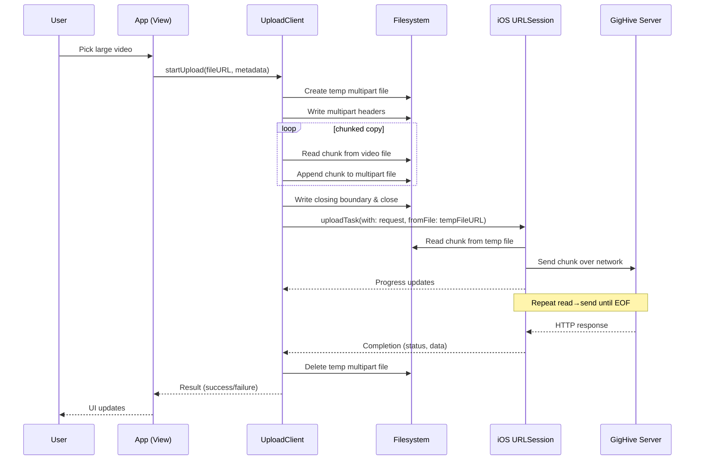

# How Direct-Streaming Uploads Work (iOS → GigHive)

This doc explains **why** and **how** we stream large videos efficiently on iOS without loading the full file into RAM. It shows the **two‑layer chunking model**, memory/disk implications, and failure/cleanup behavior.

---

## TL;DR

- We **do not** load the whole video into memory.
- We build a **temporary multipart body file** on disk **incrementally in small chunks** (Layer 1).
- We ask `URLSession` to **upload that temp file from disk**, which iOS **streams in small chunks** to the server (Layer 2).
- Memory stays flat; uploads start immediately; it scales to very large videos.

---

## The Two-Layer Chunking Model

### Layer 1 — Assembling the multipart body on disk (App side)

We create the HTTP **multipart/form-data** body on disk, not in memory.

1. Create a temp file: `multipart-<UUID>.tmp`
2. Write text fields + boundaries (headers) to the file handle.
3. Open the picked video file for **reading**.
4. Copy **small chunks** of the video (e.g., 1–4 MB) into the multipart temp file.
5. Write the closing boundary and close the handle.

> ✅ The temp file is **complete** before upload starts, but it was built **in chunks**, never holding the full video in RAM.

### Layer 2 — Uploading from the temp file (OS side)

Call:
```swift
URLSession.uploadTask(with: request, fromFile: tempBodyURL)
```
iOS opens that file and **streams** it over the network, reading small **internal chunks** and sending them to the server.

> ✅ The OS handles buffering; memory usage stays low; progress is available via `task.progress`.

---

## End‑to‑End Flow (ASCII Diagram)

```
[User picks video]
        |
        v
 [App gets local fileURL]     (Photos picker or Files picker -> copied into app sandbox)
        |
        v
 [Open multipart temp file for writing]
        |
        |-- write headers/boundaries (small)
        |
        |-- open source video for reading
        |    +--> read 1..4 MB chunk  ---> append to multipart temp file
        |    +--> read 1..4 MB chunk  ---> append to multipart temp file
        |    +--> ... repeat until EOF ...
        |
        |-- write closing boundary
        v
 [Close temp file: multipart body is now on disk]
        |
        v
 [URLSession.uploadTask(fromFile: tempFileURL)]   <-- OS reads & streams from disk in chunks
        |
        v
 [Server receives multipart stream -> processes -> responds]
        |
        v
 [Completion handler -> cleanup temp file -> update UI]
```

---

## Mermaid Sequence Diagram



> If your Markdown viewer doesn’t render Mermaid, see the ASCII diagram above.

---

## Memory & Disk Considerations

| Aspect | Load-into-RAM approach | Direct streaming with temp file |
|---|---|---|
| RAM | **High** (entire file) | **Low** (KB–MB buffer only) |
| Disk | Original video only | Original video + short‑lived multipart temp |
| Start time | After full read | Immediate |
| Backgrounding | Limited | Good with background `URLSession` |
| Reliability with large files | Poor | Strong |

**Disk usage note:** During upload, you briefly have **two** files: the original video and the multipart temp body. Overhead is roughly the size of the video plus a small header/footer. We can preflight free space and fail early with a friendly message.

---

## Swift Pseudocode (Layer 1: Assemble body on disk)

```swift
let boundary = "Boundary-\(UUID().uuidString)"
let tempBodyURL = FileManager.default.temporaryDirectory
    .appendingPathComponent("multipart-\(UUID().uuidString).tmp")

let bodyHandle = try FileHandle(forWritingTo: tempBodyURL)
defer { try? bodyHandle.close() }

func write(_ s: String) throws {
    try bodyHandle.write(contentsOf: Data(s.utf8))
}

try write("--\(boundary)\r\n")
try write("Content-Disposition: form-data; name=\"event_date\"\r\n\r\n\(eventDate)\r\n")
// ... other text fields ...

let fileName = fileURL.lastPathComponent
let mime = mimeType(for: fileURL)

try write("--\(boundary)\r\n")
try write("Content-Disposition: form-data; name=\"file\"; filename=\"\(fileName)\"\r\n")
try write("Content-Type: \(mime)\r\n\r\n")

let inHandle = try FileHandle(forReadingFrom: fileURL)
defer { try? inHandle.close() }

let chunk = 4 * 1024 * 1024 // 4MB
while let data = try inHandle.read(upToCount: chunk), !data.isEmpty {
    try bodyHandle.write(contentsOf: data)
}

try write("\r\n--\(boundary)--\r\n")
```

---

## Swift Pseudocode (Layer 2: Upload from file)

```swift
var req = URLRequest(url: finalURL)
req.httpMethod = "POST"
req.setValue("multipart/form-data; boundary=\(boundary)", forHTTPHeaderField: "Content-Type")

let task = urlSession.uploadTask(with: req, fromFile: tempBodyURL) { data, response, error in
    // handle completion & delete tempBodyURL
}
let progress = task.progress // observe completedUnitCount / totalUnitCount
task.resume()
```

> `task.progress.totalUnitCount` is set automatically for `uploadTask(fromFile:)`, so progress bars work as expected.

---

## Failure, Cancellation & Cleanup

- **Failure**: On error/response handling, delete the temp multipart file.
- **Cancellation**: Call `task.cancel()`; in completion or `cancelCurrentUpload()`, delete the temp body.
- **Low disk**: Check free space before assembly; fail fast if not enough space.
- **iCloud/Photos**: If the asset is not yet materialized, the picker will fail early (we distinguish cancel vs. error).

---

## When to Consider Resumable Uploads (TUS)

Direct streaming to a single PHP endpoint can’t resume after interruptions. For very large uploads or poor networks, consider:
- Use **TUS** for files over a size threshold (e.g., > 2 GB) and keep PHP for smaller.
- Or migrate media uploads fully to resumable endpoints.

Both paths can co‑exist behind a simple size or setting toggle.
