# GigHive Documentation Knowledge Map

## Purpose

This document visualizes the current documentation corpus using the vocabulary defined in `docs/vocabulary_classification.md`.

It is intended to help you:

- navigate the corpus by knowledge area
- understand how documents relate to concerns and document types
- locate leaf documents through a network-style map
- see the classification path that leads from the corpus root to a document

## How to Read This Map

The map is organized as a layered network:

- **Corpus**
  - the full documentation set
- **Concern**
  - the primary knowledge area
- **Type**
  - the kind of document inside that concern
- **Document**
  - the leaf node representing an individual file

The route from root to leaf gives the path context:

- concern
- type
- lifecycle
- audience
- aspect

In Mermaid-capable renderers, some document nodes may be clickable.
If your renderer does not support interactive Mermaid click actions, the curated lists below the graph provide the same navigation in plain markdown.

## Corpus Knowledge Map

```mermaid
graph TD
    C["GigHive Docs Corpus"]

    C --> INF["Infrastructure"]
    C --> DEP["Deployment"]
    C --> DB["Database"]
    C --> UPL["Upload"]
    C --> MED["Media"]
    C --> STR["Streaming"]
    C --> SEC["Security"]
    C --> AUTH["Authentication"]
    C --> API["API"]
    C --> OPS["Operability"]
    C --> OBS["Observability"]
    C --> PERF["Performance"]
    C --> CFG["Configuration"]

    INF --> INF_REF["Reference"]
    INF --> INF_HOW["Howto"]
    INF --> INF_CHG["Change"]
    INF --> INF_PROP["Proposal"]
    INF --> INF_ARCH["Architecture"]

    DEP --> DEP_REF["Reference"]
    DEP --> DEP_HOW["Howto"]
    DEP --> DEP_RUN["Runbook"]
    DEP --> DEP_PROP["Proposal"]
    DEP --> DEP_ARCH["Architecture"]
    DEP --> DEP_RCA["RCA"]

    DB --> DB_REF["Reference"]
    DB --> DB_HOW["Howto"]
    DB --> DB_RUN["Runbook"]
    DB --> DB_FEATURE["Feature"]
    DB --> DB_PROP["Proposal"]
    DB --> DB_CHG["Change"]
    DB --> DB_DBG["Debug"]

    UPL --> UPL_REF["Reference"]
    UPL --> UPL_HOW["Howto"]
    UPL --> UPL_ARCH["Architecture"]
    UPL --> UPL_PROP["Proposal"]
    UPL --> UPL_CHG["Change"]
    UPL --> UPL_DBG["Debug"]

    MED --> MED_REF["Reference"]
    MED --> MED_HOW["Howto"]
    MED --> MED_RUN["Runbook"]
    MED --> MED_ARCH["Architecture"]
    MED --> MED_FEATURE["Feature"]
    MED --> MED_PROP["Proposal"]
    MED --> MED_CHG["Change"]

    STR --> STR_REF["Reference"]
    STR --> STR_ARCH["Architecture"]
    STR --> STR_CHG["Change"]
    STR --> STR_RCA["RCA"]

    SEC --> SEC_REF["Reference"]
    SEC --> SEC_HOW["Howto"]
    SEC --> SEC_PROP["Proposal"]
    SEC --> SEC_CHG["Change"]
    SEC --> SEC_RCA["RCA"]

    AUTH --> AUTH_REF["Reference"]
    AUTH --> AUTH_HOW["Howto"]
    AUTH --> AUTH_PROP["Proposal"]
    AUTH --> AUTH_CHG["Change"]

    API --> API_REF["Reference"]
    API --> API_ARCH["Architecture"]
    API --> API_PROP["Proposal"]

    OPS --> OPS_REF["Reference"]
    OPS --> OPS_RUN["Runbook"]
    OPS --> OPS_PROP["Proposal"]
    OPS --> OPS_RCA["RCA"]

    OBS --> OBS_REF["Reference"]
    OBS --> OBS_DBG["Debug"]
    OBS --> OBS_FEATURE["Feature"]

    PERF --> PERF_REF["Reference"]
    PERF --> PERF_DBG["Debug"]
    PERF --> PERF_RCA["RCA"]
    PERF --> PERF_FEATURE["Feature"]

    CFG --> CFG_REF["Reference"]
    CFG --> CFG_CHG["Change"]
    CFG --> CFG_PROP["Proposal"]

    INF_REF --> D_ANSIBLE_FILE_INTERACTION["ANSIBLE_FILE_INTERACTION.md\nactive | developer,operator | non_functional"]
    INF_REF --> D_DOCKER_COMPOSE_BEHAVIOR["DOCKER_COMPOSE_BEHAVIOR.md\nactive | developer,operator | non_functional"]
    INF_REF --> D_MIXING_HOSTVM_DOCKER_VERSIONS["MIXING_HOSTVM_DOCKER_VERSIONS.md\nactive | operator,developer | non_functional"]
    INF_REF --> D_ROLE_BASE["role_base.md\nactive | developer,operator | non_functional"]
    INF_HOW --> D_RESIZE_REQUEST["resizeRequestInstructions.md\nactive | operator | non_functional"]
    INF_CHG --> D_DOCKER_IMAGE_BUILD_CHANGE["DOCKER_IMAGE_BUILD_CHANGE.md\nhistorical | developer,operator | non_functional"]
    INF_CHG --> D_REFACTORED_HOME["refactored_gighive_home_and_scripts_dir.md\nhistorical | developer,operator | non_functional"]
    INF_PROP --> D_REFACTOR_BIND_MOUNT_GUARD["refactor_bind_mount_guard_pattern.md\nproposed | developer,operator | non_functional"]
    INF_ARCH --> D_FEATURE_SET_INF["feature_set.md\nactive | architect,developer,operator | non_functional"]

    DEP_REF --> D_PREREQS["PREREQS.md\nactive | operator,developer | non_functional"]
    DEP_REF --> D_QUICKSTART_VS_FULL["process_download_quickstart_versus_full_build.md\nactive | operator,developer | non_functional"]
    DEP_REF --> D_LAB_STAGING_CFG["process_download_directory_for_tgz_lab_staging_configuration.md\nactive | operator,developer | non_functional"]
    DEP_HOW --> D_AUTOINSTALL["autoinstall.md\nactive | operator | non_functional"]
    DEP_HOW --> D_SETUP_FULL["setup_instructions_fullbuild.md\nactive | operator,developer | non_functional"]
    DEP_HOW --> D_SETUP_QUICK["setup_instructions_quickstart.md\nactive | operator,developer | non_functional"]
    DEP_RUN --> D_REBUILD_CRITERIA["process_download_quickstart_rebuild_criteria.md\nactive | operator,maintainer | non_functional"]
    DEP_RUN --> D_ONE_SHOT_BUNDLE["process_one_shot_bundle_original_creation.md\nactive | operator,maintainer | non_functional"]
    DEP_PROP --> D_BOOTSTRAP_PHASE1["BOOTSTRAP_PHASE1.md\nproposed | operator,architect,developer | non_functional"]
    DEP_PROP --> D_MIGRATE_BOOTSTRAP["migrate-bootstrap-to-ansible.md\nproposed | operator,architect,developer | non_functional"]
    DEP_PROP --> D_QUICKSTART_M2["process_quickstart_milestone2.md\nproposed | architect,developer,operator | non_functional"]
    DEP_ARCH --> D_TGZ_DESIGN["process_download_directory_for_tgz_design.md\nproposed | architect,developer | non_functional"]
    DEP_RCA --> D_PROBLEM_DOT254["problem_donot_use_dot254_address.md\nactive | operator,developer | non_functional"]

    DB_REF --> D_DB_LOAD_METHODS["DATABASE_LOAD_METHODS.md\nactive | developer,architect | mixed"]
    DB_REF --> D_DB_IMPORT_PROCESS["database-import-process.md\nactive | developer,operator | mixed"]
    DB_REF --> D_MY_INIT_LOAD["load_and_transform_mysql_initialization.md\nactive | developer,operator | non_functional"]
    DB_HOW --> D_DB_FILE_RECORD_DELETE["database_file_record_deletion.md\nactive | admin,developer | mixed"]
    DB_HOW --> D_CALC_HASH["calculate_durationseconds_hash.md\nactive | developer,operator | mixed"]
    DB_RUN --> D_PROCESS_MYSQL_INIT["process_mysql_init.md\nactive | operator,developer | non_functional"]
    DB_RUN --> D_CONVERT_LEGACY["convert_legacy_database.md\nactive | developer,operator | mixed"]
    DB_FEATURE --> D_ADD_TO_DATABASE["addToDatabaseFeature.md\nproposed | admin,developer,architect | functional"]
    DB_FEATURE --> D_ADMIN_IMPORT_45["admin_data_import_45.md\nactive | admin,developer | functional"]
    DB_PROP --> D_DB_SIMPLIFICATION["DATABASE_LOAD_METHODS_SIMPLIFICATION.md\nproposed | developer,architect | mixed"]
    DB_PROP --> D_PR_LIBRARIAN_EVENT["pr_librarianAsset_musicianEvent.md\nproposed | architect,developer | mixed"]
    DB_CHG --> D_ADD_MEDIA_INFO_COLUMNS["ADD_MEDIA_INFO_COLUMNS.md\nhistorical | developer | mixed"]
    DB_CHG --> D_PR_LIBRARIAN_IMPL["pr_librarianAsset_musicianEvent_implementation.md\nhistorical | developer,architect | mixed"]
    DB_DBG --> D_DB_HEALTH_TESTING["database-health-check-testing.md\nactive | qa,developer,operator | non_functional"]

    UPL_REF --> D_UPLOAD_OPTIONS["UPLOAD_OPTIONS.md\nactive | developer,operator | mixed"]
    UPL_REF --> D_WHAT_IS_TUS["WHAT_IS_TUS.md\nactive | developer,architect | mixed"]
    UPL_REF --> D_CHUNKED_FILE_CFG["chunkedfileconfiguration.md\nactive | developer,operator | non_functional"]
    UPL_HOW --> D_UPLOAD_BY_HASH["uploadMediaByHash.md\nactive | operator,admin,developer | mixed"]
    UPL_ARCH --> D_CORE_UPLOAD_IMPL["CORE_UPLOAD_IMPLEMENTATION.md\nactive | developer,architect | mixed"]
    UPL_PROP --> D_TUS_GUIDE["tus_implementation_guide.md\nproposed | developer,architect,operator | mixed"]
    UPL_PROP --> D_TUS_IPHONE["tus_implementation_iphone.md\nproposed | developer,architect | functional"]
    UPL_PROP --> D_REFACTOR_UPLOAD_TESTS["refactor_upload_tests.md\nproposed | developer,qa | mixed"]
    UPL_CHG --> D_UPLOAD_PHP_PATH_CHANGE["change20250314_upload_media_jibe_php_path.md\nhistorical | developer | mixed"]
    UPL_CHG --> D_UPLOAD_CHANGES_20250926["codingChanges/20250926uploaderchanges.md\nhistorical | developer | mixed"]
    UPL_DBG --> D_TUS_CHECKS["tus_checks_no_log.md\nactive | developer,qa | non_functional"]

    MED_REF --> D_MEDIA_FORMATS["mediaFormatsSupported.md\nactive | developer,admin | mixed"]
    MED_REF --> D_MEDIA_PATH_VARS["media_file_location_variables.md\nactive | developer,operator | non_functional"]
    MED_REF --> D_AUDIO_VIDEO_LOGIC["audioVideoFullReducedLogic.md\nactive | developer | mixed"]
    MED_REF --> D_THUMBNAIL_CALC["how_are_thumbnails_calculated.md\nactive | developer | mixed"]
    MED_HOW --> D_ADMIN_CLEAR_MEDIA["ADMIN_CLEAR_MEDIA.md\nactive | admin,operator,developer | mixed"]
    MED_RUN --> D_REPLACE_EXISTING_MEDIA["process_replace_existing_media.md\nactive | operator,admin,developer | mixed"]
    MED_ARCH --> D_PICKER_TRANSCODING["PICKER_TRANSCODING_METHOD.md\nactive | developer,architect | mixed"]
    MED_ARCH --> D_STREAMING_IMPL_MEDIA["howdoesstreamingwork_implementation.md\nactive | developer,architect | mixed"]
    MED_FEATURE --> D_IPHONE_ZOOM["feature_iphone_video_zoom.md\nproposed | developer,architect | functional"]
    MED_PROP --> D_REARCH_PREPARE_VIDEO_CANCEL["rearch_prepare_video_cancel.md\nproposed | developer,architect | functional"]
    MED_PROP --> D_DELETE_FOR_UPLOADER["pr_delete_for_uploader.md\nproposed | developer,architect | mixed"]
    MED_CHG --> D_STANDALONE_MEDIA_PLAYER["pr_standalone_media_player.md\nhistorical | developer | functional"]
    MED_CHG --> D_DELETE_UPLOAD_IPHONE["pr_delete_upload_iphone.md\nhistorical | developer | functional"]

    STR_REF --> D_CONTENT_RANGE_CF["CONTENT_RANGE_CLOUDFLARE.md\nactive | developer,operator | non_functional"]
    STR_ARCH --> D_STREAMING_IMPL["howdoesstreamingwork_implementation.md\nactive | developer,architect | mixed"]
    STR_CHG --> D_RANGE_REQUEST_FIX["RANGE_REQUEST_FIX.md\nhistorical | developer | non_functional"]
    STR_RCA --> D_RANGE_REQUEST_RCA["problem_server_did_not_honor_range_request.md\nactive | developer,operator | non_functional"]

    SEC_REF --> D_SECURITY_OVERVIEW["SECURITY.md\nactive | developer,operator,admin | non_functional"]
    SEC_REF --> D_APACHE_DIRECTIVES["APACHE_DIRECTIVE_MATCHING_ORDER.md\nactive | developer,operator | non_functional"]
    SEC_REF --> D_CERT_NAMING["cert_naming_consistency.md\nactive | developer,operator | non_functional"]
    SEC_HOW --> D_CERT_GUIDANCE["cert_internal_no_warnings_guidance.md\nactive | operator,developer | non_functional"]
    SEC_PROP --> D_SECURITY_UPGRADE["security-upgrade.md\nproposed | developer,operator,architect | non_functional"]
    SEC_PROP --> D_REFACTOR_HARDENING_45["refactor_hardening_sections45.md\nproposed | developer,architect | non_functional"]
    SEC_CHG --> D_SECURITY_REMEDIATIONS["security_remediations_20260218.md\nhistorical | developer,operator | non_functional"]
    SEC_CHG --> D_SECURITY_AUTH_CHANGES["codingChanges/20250926securityauthchanges.md\nhistorical | developer | non_functional"]
    SEC_RCA --> D_CACHED_ERRORS["problem_cached_error_messages.md\nactive | developer,operator | non_functional"]
    SEC_RCA --> D_CERT_TRUST["problem_cert_does_not_trust_gighive_internal.md\nactive | developer,operator | non_functional"]
    SEC_RCA --> D_HSTS_COLLISION["problem_hsts_collision.md\nactive | developer,operator | non_functional"]

    AUTH_REF --> D_SECURITY_REALMS["security_apache_realms.md\nactive | developer,operator,admin | non_functional"]
    AUTH_HOW --> D_USER_PROVISIONING["user_provisioning.md\nactive | admin,operator | non_functional"]
    AUTH_PROP --> D_JWT_MIGRATION["JWT_AUTH_MIGRATION_MAPPING.md\nproposed | developer,architect | mixed"]
    AUTH_CHG --> D_HTPASSWD_CHANGES["HTPASSWD_CHANGES.md\nhistorical | developer,operator | non_functional"]
    AUTH_CHG --> D_FEATURE_CHANGED_PASSWORDS["codingChanges/featureChangedPasswordsPage.md\nhistorical | developer | functional"]

    API_REF --> D_API_CURRENT["API_CURRENT_STATE.md\nactive | developer,architect | mixed"]
    API_REF --> D_INTERNAL_ENDPOINTS["internalEndpoints.md\nactive | developer | mixed"]
    API_ARCH --> D_FOUR_PAGE_REARCH["FOUR_PAGE_REARCHITECTURE.md\nproposed | architect,developer | mixed"]
    API_PROP --> D_API_CLEANUP["POTENTIAL_API_CLEANUP_IF_DESIRED.md\nproposed | developer,architect | mixed"]
    API_PROP --> D_AI_PLATFORM["ai_intelligence_platform.md\nproposed | architect,developer | mixed"]

    OPS_REF --> D_README["README.md\nactive | developer,operator | mixed"]
    OPS_REF --> D_INDEX["index.md\nactive | developer,operator,admin | mixed"]
    OPS_REF --> D_TERMS["APP_TERMS_OF_SERVICE.md\nactive | admin,maintainer | non_functional"]
    OPS_REF --> D_CONTENT_POLICY["gighive_content_policy.md\nactive | admin,maintainer | non_functional"]
    OPS_RUN --> D_ONE_SHOT_BUNDLE_BACKUPS["process_one_shot_bundle_original_creation_plus_backups.md\nactive | operator,maintainer | non_functional"]
    OPS_RUN --> D_MYSQL_BACKUPS["mysql_backups_procedure.md\nactive | operator | non_functional"]
    OPS_RCA --> D_PROBLEM_DOT254_OPS["problem_donot_use_dot254_address.md\nactive | operator,developer | non_functional"]
    OPS_PROP --> D_LICENSE_STRATEGY["feature_future_strategy_licensing_communitypro_monetization.md\nproposed | architect,maintainer,admin | non_functional"]

    OBS_REF --> D_TELEMETRY["TELEMETRY.md\nactive | developer,operator,architect | non_functional"]
    OBS_REF --> D_GA_TRACKING["media_google_analytics_tracking.md\nactive | developer,admin | non_functional"]
    OBS_DBG --> D_VIDEO_PERF_DEBUG["VIDEO_PERFORMANCE_DEBUG.md\nactive | developer,qa | non_functional"]
    OBS_DBG --> D_DB_HEALTH_OBS["database-health-check-testing.md\nactive | qa,developer,operator | non_functional"]
    OBS_FEATURE --> D_GA_FEATURE_MOD["media_google_analytics_feature_mod.md\nproposed | developer,admin | mixed"]

    PERF_REF --> D_THUMBNAIL_CALC_PERF["how_are_thumbnails_calculated.md\nactive | developer | mixed"]
    PERF_DBG --> D_VIDEO_PERF_DEBUG_NODE["VIDEO_PERFORMANCE_DEBUG.md\nactive | developer,qa | non_functional"]
    PERF_RCA --> D_RANGE_REQUEST_RCA_PERF["problem_server_did_not_honor_range_request.md\nactive | developer,operator | non_functional"]
    PERF_RCA --> D_VIRTIO_FIX["problem_virtio_ethtool_fix_2026019.md\nactive | operator,developer | non_functional"]
    PERF_FEATURE --> D_IPHONE_ZOOM_PERF["feature_iphone_video_zoom.md\nproposed | developer,architect | functional"]

    CFG_REF --> D_COMMON["COMMON.md\nactive | developer,operator | non_functional"]
    CFG_REF --> D_FLAVOR_CONTRACT["FLAVOR_CONTRACT.md\nactive | developer,architect | mixed"]
    CFG_REF --> D_MIME_TYPES["mime-types.md\nactive | developer | non_functional"]
    CFG_CHG --> D_UPLOADER_CONF_DETAIL["codingChanges/20250926uploaderConfDetail.md\nhistorical | developer | mixed"]
    CFG_PROP --> D_REFACTOR_EMAIL["refactor_email_address.md\nproposed | developer | mixed"]
    CFG_PROP --> D_REFACTOR_QUICKSTART_TEMPLATE["refactor_quickstart_specific_template.md\nproposed | developer,operator | non_functional"]

    INF -. related .-> DEP
    DEP -. related .-> OPS
    DEP -. related .-> CFG
    DB -. related .-> MED
    UPL -. related .-> MED
    UPL -. related .-> API
    UPL -. related .-> OBS
    STR -. related .-> MED
    STR -. related .-> PERF
    SEC -. related .-> AUTH
    SEC -. related .-> DEP
    API -. related .-> DB
    OBS -. related .-> PERF

    click D_ANSIBLE_FILE_INTERACTION "./ANSIBLE_FILE_INTERACTION.html" "Open ANSIBLE_FILE_INTERACTION"
    click D_DOCKER_COMPOSE_BEHAVIOR "./DOCKER_COMPOSE_BEHAVIOR.html" "Open DOCKER_COMPOSE_BEHAVIOR"
    click D_DB_IMPORT_PROCESS "./database-import-process.html" "Open database-import-process"
    click D_UPLOAD_BY_HASH "./uploadMediaByHash.html" "Open uploadMediaByHash"
    click D_SECURITY_OVERVIEW "./SECURITY.html" "Open SECURITY"
    click D_API_CURRENT "./API_CURRENT_STATE.html" "Open API_CURRENT_STATE"
    click D_INDEX "./index.html" "Open docs index"
    click D_README "./README.html" "Open docs README"
    click D_TUS_GUIDE "./tus_implementation_guide.html" "Open tus_implementation_guide"
    click D_IPHONE_ZOOM "./feature_iphone_video_zoom.html" "Open feature_iphone_video_zoom"
    click D_CACHED_ERRORS "./problem_cached_error_messages.html" "Open problem_cached_error_messages"
```

## Route Semantics

Each route can be read as:

`Corpus -> Concern -> Type -> Document`

The leaf node label then shows the remaining classification context:

- `lifecycle`
- `audience`
- `aspect`

Example:

- `Corpus -> Upload -> Proposal -> tus_implementation_guide.md`
- leaf metadata: `proposed | developer, architect, operator | mixed`

That means:

- concern: `upload`
- type: `proposal`
- lifecycle: `proposed`
- audience: `developer, architect, operator`
- aspect: `mixed`

## Entry Points by Knowledge Area

### Infrastructure

- `ANSIBLE_FILE_INTERACTION.md`
- `DOCKER_COMPOSE_BEHAVIOR.md`
- `role_base.md`
- `feature_set.md`

### Deployment

- `PREREQS.md`
- `setup_instructions_quickstart.md`
- `setup_instructions_fullbuild.md`
- `process_download_quickstart_rebuild_criteria.md`

### Database

- `DATABASE_LOAD_METHODS.md`
- `database-import-process.md`
- `process_mysql_init.md`
- `addToDatabaseFeature.md`

### Upload

- `CORE_UPLOAD_IMPLEMENTATION.md`
- `UPLOAD_OPTIONS.md`
- `uploadMediaByHash.md`
- `tus_implementation_guide.md`

### Media

- `mediaFormatsSupported.md`
- `PICKER_TRANSCODING_METHOD.md`
- `feature_iphone_video_zoom.md`
- `process_replace_existing_media.md`

### Streaming

- `CONTENT_RANGE_CLOUDFLARE.md`
- `howdoesstreamingwork_implementation.md`
- `problem_server_did_not_honor_range_request.md`

### Security and Authentication

- `SECURITY.md`
- `security_apache_realms.md`
- `user_provisioning.md`
- `security-upgrade.md`
- `problem_cached_error_messages.md`

### API

- `API_CURRENT_STATE.md`
- `internalEndpoints.md`
- `FOUR_PAGE_REARCHITECTURE.md`

### Operability and Observability

- `README.md`
- `index.md`
- `TELEMETRY.md`
- `mysql_backups_procedure.md`
- `VIDEO_PERFORMANCE_DEBUG.md`

## Notes and Limitations

- Mermaid interactivity depends on the renderer used by GitHub Pages, Jekyll plugins, IDE markdown preview, or browser integration.
- Some documents legitimately appear relevant to more than one concern. This first map uses one dominant route per leaf for readability, while cross-domain relationships are shown by concern-to-concern links.
- The knowledge map is intentionally selective rather than exhaustive at every branch, so the graph remains readable.
- `docs/vocabulary_classification.md` remains the source of truth for the full first-pass classification table.

## Suggested Next Visuals

This map can be followed by:

- a concern-by-type matrix
- an audience reading-path map
- a lifecycle timeline map
- a second-level expanded map for a single concern such as `upload` or `database`
