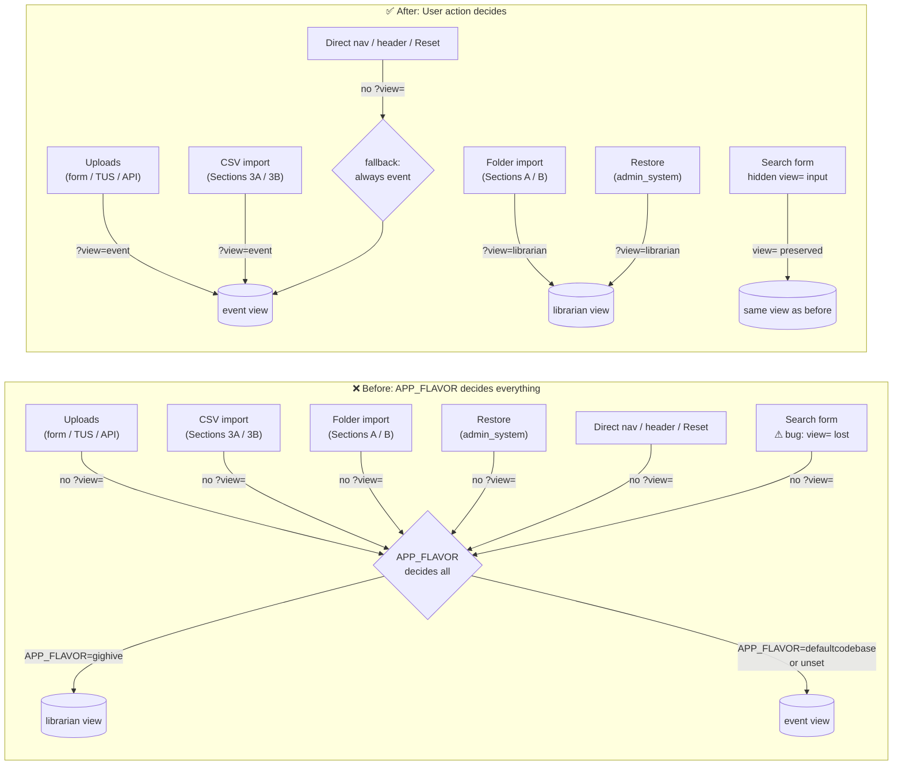

# Navigation: `view` Parameter and the Event vs Librarian View

Companion to: `docs/pr_librarianAsset_musicianEvent_implementation.md` (PR3)

---

## What this is about (plain language)

`db/database.php` is the main media listing page. It can show content in two ways:

- **Event view** — shows media grouped by show/event. This is the musician's view:
  "here's everything from the StormPigs show on March 18."
- **Librarian view** — shows every file as a flat asset list. This is the librarian's
  view: "here's every file in the system, regardless of which show it came from."

A `?view=` query parameter on the URL controls which one you see.

**The problem**: every page in the app that links to `database.php` after an action
(upload complete, import complete, restore complete) links to it with no `?view=`
parameter. So instead of showing the user what makes sense for what they just did,
the server guesses based on which deployment it is (`APP_FLAVOR`). That's the wrong
signal — the server config shouldn't decide what the user sees after their action.

**The fix**: link from each action to the view that matches what the user was just doing:

| What the user just did | Right view |
|---|---|
| Uploaded a single file (to a specific show/event) | `?view=event` |
| Imported event data from CSV (Sections 3A/3B) | `?view=event` |
| Reloaded or added media from a folder (Sections A/B in folder import) | `?view=librarian` |
| Restored the database (`admin_system.php`) | `?view=librarian` |
| Clicked "the database" in the site header (`header.php`) | `event` (fallback) |
| Navigated directly / used a bookmark | `event` (fallback) |
| Clicked "Reset to Default View" | Same `?view=` as current page — resets UI state only, not view mode |

**Also note — search form bug** (now fixed): the search form submitted via GET without
a hidden `view=` input, so every search silently dropped back to the fallback (`event`).
Fix: hidden `view=` input added to `list.php` preserves the current view across search
submissions.

The folder import (Reload/Add from Folder) is the librarian's bulk ingestion workflow.
Even though the server creates event records internally, the user's intent is
"I am managing my media collection" — not "I just worked on a specific show."
Sending them to the librarian view after a folder import is correct.

---

## How `resolveView()` works

```php
// MediaController.php
private function resolveView(): string
{
    $explicit = isset($_GET['view']) ? strtolower(trim($_GET['view'])) : '';
    if ($explicit === 'librarian' || $explicit === 'event') {
        return $explicit;
    }
    return 'event';
}
```

Priority order:
1. **Explicit `?view=event|librarian`** — always wins.
2. **Fallback** — always `event`, regardless of `APP_FLAVOR`.

### Why event is always the fallback

The event view shows significantly more data than the librarian view: Band/Event name,
Song Name, Musicians, Media File Info are all populated in event view and empty in
librarian view. For any user encountering the page cold — via a bookmark, the home page
link, or the site header — event view puts the software on better footing and is more
immediately useful.

The original `APP_FLAVOR=gighive → librarian` default was a premature design decision
that made gighive deployments show *less* information by default. With the home page
role fork not yet built, there is no good reason to default to the lower-information
view on any deployment. `?view=librarian` remains fully functional for users and flows
that explicitly need it.

---

## Problem: all current inbound links omit `?view=`

Every link to `database.php` in the codebase today passes no `view` param, so all
callers silently fall through to the APP_FLAVOR default regardless of context.
Upload and import flows are event-centric by definition — the user just created or
modified event data — but they show whatever view the server is configured for.

---

## Flow inventory

### Upload flows (should pass `?view=event`)

| Source file | Link constructed | Current param | Proposed fix |
|---|---|---|---|
| `db/upload_form.php` | JS creates `<a href="/db/database.php">` after upload success | none | `?view=event` |
| `db/upload_form_admin.php` | JS creates `<a href="/db/database.php">` after TUS upload success | none | `?view=event` |
| `src/index.php` (HTML mode) | PHP builds `/db/database.php#media-{id}` or `#all` after POST | none | `?view=event` |

### Import flows — event data (should pass `?view=event`)

| Source file | Link constructed | Current param | Proposed fix |
|---|---|---|---|
| `admin/admin_database_load_import_csv.php` | JS `renderDbLinkButton()` → `href="/db/database.php"` | none | `?view=event` |

### Import flows — library/folder (should pass `?view=librarian`)

| Source file | Link constructed | Current param | Proposed fix |
|---|---|---|---|
| `admin/admin_database_load_import_media_from_folder.php` | JS `renderDbLinkButton()` → `href="/db/database.php"` (Sections A + B) | none | `?view=librarian` |
| `admin/admin_system.php` | JS `renderDbLinkButton()` → `href="/db/database.php"` after restore | none | `?view=librarian` |

### Intentional fallback flows (APP_FLAVOR default is correct)

| Source | Link | Reason |
|---|---|---|
| `header.php` persistent nav | `<a href="db/database.php">the database</a>` | Top-nav link with no action context; APP_FLAVOR fallback is appropriate |
| Direct navigation / bookmark | `/db/database.php` | No context available; server default is appropriate |
| Pagination links (`$buildUrl`) in `list.php` | `database.php?page=N&...` | Preserves the existing query string including `view=` |
| `list.php` "Reset to Default View" | `database.php?view=<?= $view ?>` | Preserves `?view=` — resets UI state (filters, search, columns) only, not view mode |

### ⚠️ Search form — view is lost on submission

`list.php` line 340: `<form method="get" action="database.php">` — when the user
submits a search, the browser sends only the form's input fields as GET params. Any
`?view=` that was in the URL is **not automatically included**.

This means every search submission silently resets the view to the APP_FLAVOR default,
regardless of which view the user was in. Fix: add a hidden input to the search form
that echoes the current `$view` value:

```php
<input type="hidden" name="view" value="<?= htmlspecialchars($view, ENT_QUOTES) ?>">
```

This should be added to `list.php` as part of PR3.

---

## Mermaid: before and after



---

## Files to change to implement the After picture

| # | File | Change |
|---|---|---|
| 1 | `db/upload_form.php` | `link.href` → `?view=event` |
| 2 | `db/upload_form_admin.php` | `link.href` → `?view=event` |
| 3 | `src/index.php` | `$dbUrl` construction → `?view=event` before `#` anchor |
| 4 | `admin/admin_database_load_import_csv.php` | `renderDbLinkButton` href → `?view=event` |
| 5 | `admin/admin_database_load_import_media_from_folder.php` | `renderDbLinkButton` href → `?view=librarian` |
| 6 | `admin/admin_system.php` | `renderDbLinkButton` href → `?view=librarian` |
| 7 | `src/Views/media/list.php` | Add hidden `view=` input to search form |

### 1. `db/upload_form.php` — pass `?view=event` after upload
Line ~470. Change:
```js
link.href = '/db/database.php';
```
To:
```js
link.href = '/db/database.php?view=event';
```

---

### 2. `db/upload_form_admin.php` — pass `?view=event` after TUS upload
Line ~465. Same pattern as above:
```js
link.href = '/db/database.php';
```
To:
```js
link.href = '/db/database.php?view=event';
```

---

### 3. `src/index.php` — pass `?view=event` after API POST (HTML mode)
Line ~98. Change:
```php
$dbUrl = $newId !== '' ? ('/db/database.php#media-' . rawurlencode($newId)) : '/db/database.php#all';
```
To:
```php
$dbUrl = $newId !== '' ? ('/db/database.php?view=event#media-' . rawurlencode($newId)) : '/db/database.php?view=event#all';
```

---

### 4. `admin/admin_database_load_import_csv.php` — pass `?view=event` after CSV import
Line ~111. Change `renderDbLinkButton` href:
```js
return ' <a href="/db/database.php" ...
```
To:
```js
return ' <a href="/db/database.php?view=event" ...
```

---

### 5. `admin/admin_database_load_import_media_from_folder.php` — pass `?view=librarian` after folder import
Line ~302. Change `renderDbLinkButton` href:
```js
return ' <a href="/db/database.php" ...
```
To:
```js
return ' <a href="/db/database.php?view=librarian" ...
```

---

### 6. `admin/admin_system.php` — pass `?view=librarian` after restore
Line ~537. Change `renderDbLinkButton` href:
```js
return ' <a href="/db/database.php" ...
```
To:
```js
return ' <a href="/db/database.php?view=librarian" ...
```

---

### 7. `src/Views/media/list.php` — preserve `view=` across search form submissions
Line ~340. The search form submits via GET and loses `?view=` on every submission.
Add a hidden input immediately after the opening `<form>` tag:
```php
<form id="searchForm" method="get" action="database.php">
<input type="hidden" name="view" value="<?= htmlspecialchars($view, ENT_QUOTES) ?>">
```
`$view` is already passed to this template by `MediaController`.

---

### Do not change
- `header.php` — `<a href="db/database.php">` — no action context; falls back to `event` (universal fallback)
- `list.php` `$buildUrl` pagination — already preserves the full query string including `view=`

### Already fixed (preserves `?view=`, resets UI state only)
- `list.php` "Reset to Default View" — `database.php?view=<?= $view ?>` — carries `view=` through; clears search, filters, column state

---

## Future: role fork on home page

Direct URLs, bookmarks, and the `header.php` nav link all arrive without a `?view=` param
and currently fall back to `event` (the universal fallback). This is better than before
but still relies on the server choosing for the user. The natural resolution is a home page that
presents an explicit role fork:

> **"I'm a musician / event planner"** → `db/database.php?view=event`
> **"I'm a media librarian"** → `db/database.php?view=librarian`

This would:
- Make both views first-class features visible to the user, not a hidden URL toggle.
- Replace the last APP_FLAVOR-driven entry point with an explicit user-declared intent.
- Reduce APP_FLAVOR's role to a true last-resort fallback for old bookmarks and direct URLs only.

See `docs/refactor_user_flow.md` for the broader user flow refactor this is part of.
