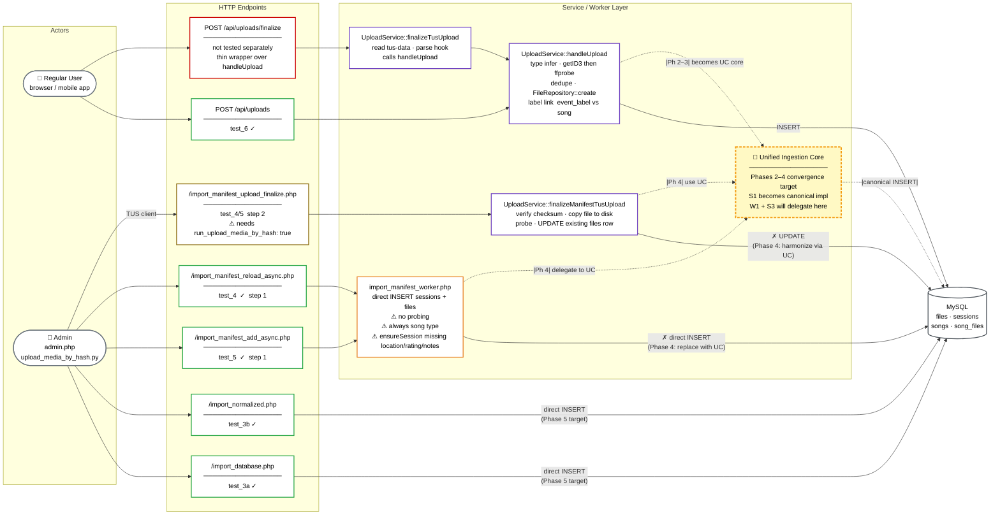

# Refactor: Unified Ingestion Core

## Goal
Create a shared server-side ingestion core that is used by both the upload API paths and the manifest add/reload import paths.

This is intended as a precursor to the broader Event/Asset hard cutover described in `docs/pr_librarianAsset_musicianEvent.md`.

The objective is to reduce drift between ingestion paths, centralize metadata extraction and persistence rules, and simplify the eventual migration from the current session/files-oriented model to the future Event/Asset canonical model.

## Why this should happen before the Event/Asset divergence plan
Today, GigHive has multiple ingestion entrypoints that create or link media records through different code paths:

- Upload API / direct upload flow
- TUS finalize flow
- Manifest add flow from `admin.php`
- Manifest reload flow from `admin.php`

These paths currently overlap in responsibility but do not share a single ingestion service. As a result, media metadata rules, persistence behavior, and future schema migration work are at risk of diverging.

If ingestion is unified first, the later session/event divergence work can port one canonical write-path abstraction instead of porting several partially duplicated implementations.

## Problem statement
The current architecture separates ingestion by transport and operator workflow rather than by domain responsibility.

Examples of duplicated or drift-prone responsibilities include:

- Media type determination
- Duration and ffprobe-based metadata extraction
- Canonical population of derived fields such as `media_created_at`
- Dedupe behavior
- Session/Event linkage behavior
- Song/label linking behavior
- File row insertion and future asset row insertion

The upload API path already contains richer media probing behavior, while the manifest import path currently performs direct inserts into `files` without reusing the same logic.

That split creates inconsistent outcomes depending on how the media entered the system.

The goal is to unify the write-path logic, not the HTTP endpoints. The two outer paths (upload API / TUS finalize vs. manifest add/reload) stay separate because they have legitimately different transport and batching concerns. What gets unified is the server-side ingestion service they both call — dedupe, metadata probing, field derivation, and record persistence.

This refactor is explicitly a precursor, not the end goal. Once both paths share one canonical ingestion abstraction, the later Event/Asset hard cutover only needs to port one write path instead of two partially-duplicated ones. It reduces drift risk and makes the cutover cleaner.

## Decision
Pursue a separate refactor that unifies the ingestion core while allowing different outer entrypoints to remain in place.

This means:

- We do **not** need to force all ingestion through one literal HTTP endpoint.
- We **do** want one canonical server-side ingestion service that both upload and manifest import flows call.

The preferred architecture is:

- Thin entrypoints for each workflow
- Shared ingestion service for domain logic
- Shared media metadata extraction/probing helper(s)
- Shared persistence behavior for file/media rows and linkage logic

## Non-goal
This refactor does **not** itself perform the Event/Asset cutover.

It is a precursor that reduces duplication and risk before the true remodel.

## Proposed architecture
### 1) Keep distinct entrypoints
The outer workflows still have different operational needs and should remain distinct:

- Upload API path
- TUS finalize path
- Manifest add path
- Manifest reload path

These differ in transport, batching, async job behavior, and operator intent.

### 2) Unify the ingestion core
Introduce a canonical ingestion service that accepts a normalized server-side request object and performs the shared write-path logic.

Responsibilities of the ingestion core should include:

- Validate normalized input
- Accept a server-readable media file path where probing is required
- Infer or validate media type
- Probe media metadata
- Extract canonical derived fields
- Persist media/file record
- Enforce dedupe rules
- Link to Event/session and label/song structures
- Return a normalized ingestion result

### 3) Centralize metadata extraction
Create a shared metadata/probing helper used by all ingestion paths.

Responsibilities should include:

- Running `ffprobe` when available
- Returning raw `media_info`
- Returning `media_info_tool`
- Extracting canonical derived fields such as:
  - `media_created_at`
  - later, potentially latitude/longitude, camera make/model, etc.

### 4) Keep raw metadata and derived fields separate
The refactor should preserve a clear distinction between:

- Raw source metadata
  - e.g. `media_info`
- Derived canonical columns
  - e.g. `media_created_at`

This is important for performance, queryability, and future schema migration.

## Why this provides value
### Consistency
All ingestion paths would produce the same metadata and persistence behavior.

### Simpler maintenance
Future changes to metadata handling or dedupe policy would be implemented once.

### Lower risk for Event/Asset cutover
The later remodel can migrate one canonical ingestion abstraction rather than several duplicated flows.

### Better testing
A shared ingestion core can be tested directly with multiple entrypoint wrappers.

### Easier future metadata rollout
New derived fields such as GPS or camera metadata can be added once and reused everywhere.

## Risks and caveats
### 1) Manifest imports may not always have an immediately probeable file path
The strongest form of unification depends on whether manifest import workers can access the actual media bytes or a server-readable path.

This must be confirmed and handled explicitly.

### 2) Upload and manifest flows still have legitimate outer differences
Manifest reload truncates tables and runs asynchronously.
Upload API paths deal with temporary uploaded files and client upload semantics.

The refactor should avoid flattening these differences too aggressively.

### 3) Scope creep
This should remain a write-path refactor, not become an accidental full schema remodel.

## Recommended implementation phases
### Phase 1: Extract shared media metadata helper
Create a reusable metadata helper for:

- probing media
- storing raw probe output
- extracting canonical derived fields

### Phase 2: Extract shared ingestion/persistence service
Create a canonical ingestion service that handles:

- validated normalized input
- dedupe
- metadata population
- file/media row creation
- session/Event and label/song linking

### Phase 3: Refactor upload API paths to use the shared service
Refactor:

- direct upload flow
- TUS finalize flow

so they rely on the shared ingestion service rather than path-specific persistence logic.

### Phase 4: Refactor manifest add/reload paths to use the shared service
Refactor:

- `import_manifest_lib.php`
- manifest add worker flow
- manifest reload worker flow

so they delegate record creation to the shared ingestion service.

### Phase 5: Reduce duplicated SQL and validation logic
After both sides share the same ingestion core, remove redundant insert/link logic from legacy wrappers.

## Suggested acceptance criteria
- Upload API and manifest import paths both use the same server-side ingestion service for record creation.
- Media metadata extraction logic exists in one canonical place.
- `media_created_at` and similar future derived fields are populated consistently regardless of ingestion path.
- Entry-point-specific behavior remains intact where operationally necessary.
- Existing upload and manifest workflows remain usable after the refactor.
- The resulting ingestion abstraction is suitable for later migration to the Event/Asset canonical model.

## Relationship to the Event/Asset hard cutover
This refactor should be treated as a precursor and enabler for `docs/pr_librarianAsset_musicianEvent.md`.

Expected benefit to the later remodel:

- one canonical write path to port
- fewer ingestion-specific edge cases
- cleaner mapping from current `files`-oriented persistence to future `assets`/`events` relationships
- lower risk of cross-contamination between librarian and capture workflows

## Recommended sequencing relative to other work
1. Implement the targeted `media_created_at` change now.
2. Plan and execute the unified ingestion core refactor as a separate effort.
3. Use the unified ingestion core as the precursor to the Event/Asset hard cutover.

## Out of scope for this plan
- Immediate Event/Asset schema cutover
- Compatibility layers for legacy runtime paths
- Read-path unification
- Broad UI redesign
- Full metadata expansion beyond the ingestion abstraction needed to support future fields

## Summary
The recommended direction is to unify the ingestion core, not necessarily collapse every ingestion workflow into one outer endpoint.

This provides architectural value now, reduces duplication and drift, and creates a better foundation for the planned Event/Asset remodel.

## Current Ingestion Architecture

The diagram below shows all active ingestion paths from both the regular user and admin perspectives, mapped to the six upload_tests coverage areas.

Border colors indicate test status:
- Green — currently tested
- Amber — test exists but flag must be enabled (`run_upload_media_by_hash: true`)
- Red — not tested separately (thin wrapper; core logic covered by test_6)
- Purple — `UploadService` layer (upload path, richer)
- Orange — manifest worker layer (direct insert path, leaner — primary unification target)
- Gold/yellow (dashed border) — **planned Unified Ingestion Core** (Phases 2–4 convergence target)

Edges marked **✗** are the flows the unified ingestion core will replace or harmonize.



## Testing the Changes

All upload ingestion paths covered by this refactor are exercised by the `upload_tests` Ansible role (`ansible/roles/upload_tests`). The role tests each ingestion path in isolation (separate variants) and verifies DB invariants after each run.

### Playbook command

```sh
script -q -c "ansible-playbook -i ansible/inventories/inventory_gighive2.yml ansible/playbooks/site.yml --tags set_targets,upload_tests" ansible-playbook-gighive2-20260402.log
```

The `script` wrapper captures full terminal output (including color/timing) to the named log file while also printing to the terminal.

### Test coverage per ingestion path

| Variant | Section | Ingestion path tested |
|---|---|---|
| `3a_legacy_import_gighive` | 3A | `/import_database.php` → direct INSERT |
| `3a_legacy_import_defaultcodebase` | 3A | `/import_database.php` → direct INSERT (defaultcodebase flavor) |
| `3b_normalized_import_gighive` | 3B | `/import_normalized.php` → direct INSERT |
| `3b_normalized_import_defaultcodebase` | 3B | `/import_normalized.php` → direct INSERT (defaultcodebase flavor) |
| `4_manifest_reload` | 4 | `/import_manifest_reload_async.php` → worker → direct INSERT (step 1); `/import_manifest_upload_finalize.php` → `finalizeManifestTusUpload` (step 2, requires `upload_test_run_upload_media_by_hash: true`) |
| `6_direct_upload_api` | 6 | `POST /api/uploads` → `UploadService::handleUpload` |
| `5_manifest_add` | 5 | `/import_manifest_add_async.php` → worker → direct INSERT (step 1); step 2 same as test_4 |

### Enabling all paths

Two flags must be set in `ansible/inventories/group_vars/gighive2/gighive2.yml` to exercise the full set:

```yaml
upload_test_run_upload_media_by_hash: true   # enables step 2 (TUS finalize) for tests 4 and 5
run_upload_tests: true
allow_destructive: true
```

### Variant ordering constraint

`6_direct_upload_api` must appear **before** `5_manifest_add` in `upload_test_variants`. Test 5 bulk-inserts all audio files from `audio_reduced` into the DB (including the test_6 fixture file). If test_6 runs after test_5, `UploadService::handleUpload` rejects the upload as a duplicate checksum (409) and the test fails.

### What is not yet covered

- `POST /api/uploads/finalize` (`UploadService::finalizeTusUpload`) — thin wrapper over `handleUpload`; core logic covered by test_6, but the TUS finalize entry point itself has no dedicated variant yet.
