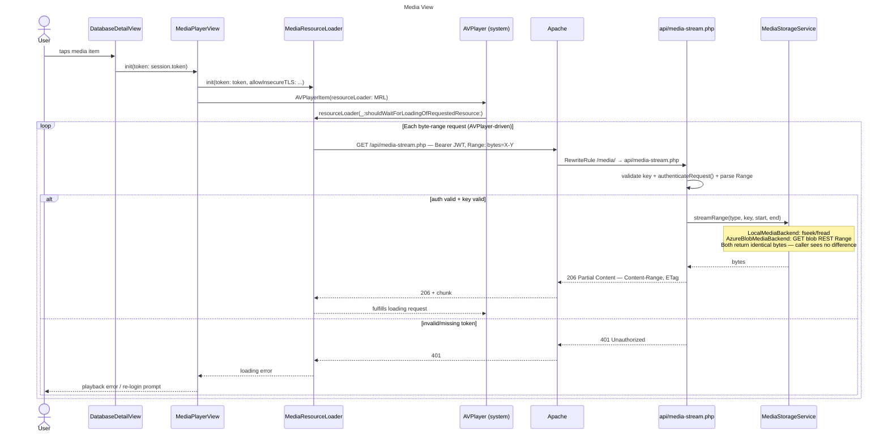
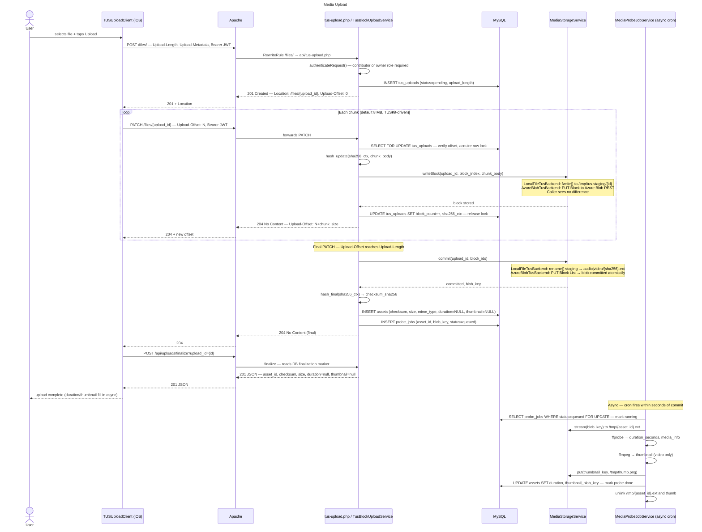

# Refactor: Media Storage via Private Azure Blob REST Endpoint

## Status — 2026-08-12

**Tranche 1 in progress — Phase 1 complete.**

Phase 1 (runtime configuration, IMDS access, storage backend env vars, Compose plumbing) is implemented in `gighiveinfra`. Phases 2–5 are approved and awaiting implementation.

---

## Elevator Pitch

Every piece of media GigHive serves today lives on a single server's hard drive — which means a server failure, replacement, or capacity problem puts that content at risk, and we've already seen live upload failures when the disk fills up. This change moves all media into Azure's dedicated cloud storage, which we already have provisioned but aren't fully using, so the server becomes disposable, storage costs drop significantly, and media is protected regardless of what happens to the infrastructure running the app.

## Rationale

### Problem #1: bind-mounted media directories

The Azure-hosted GigHive deployment provisions a VM, a private Blob Storage account, and a user-assigned managed identity through Terraform today. However, the Docker Apache service still relies on bind-mounted host directories (`/home/<user>/audio`, `/home/<user>/video`) as the canonical source of truth for media files. This means:

- media is coupled to the Azure VM disk — if the VM is resized, rebuilt, or replaced, media is at risk
- the VM OS disk cost grows with media volume rather than being priced on object storage economics
- there is no clean separation between compute and storage
- the existing Azure Blob import/export helpers in `admin_system.php` treat Blob as a backup/restore endpoint, not as the operational store

The architecture should match the intent already expressed in the Terraform config: the managed identity and private storage container are there; they are just not wired into the runtime media path yet.

### Problem #2: stateful tusd and post-finish hook

A future SaaS model requires separating services onto individually scalable units. At first glance this might suggest keeping tusd running as its own container. The opposite is true.

**tusd is not stateless — and that is the problem.** tusd holds partial upload state in its local filesystem, a Docker volume on the same VM. Running two tusd containers behind a load balancer requires PATCH requests for the same upload to always land on the same instance that holds the partial file. You cannot distribute them freely. Horizontal scaling of tusd requires a shared distributed filesystem underneath it, which reintroduces exactly the storage-coupling problem this refactor is meant to eliminate.

**The PHP tus server with `AzureBlobTusBackend` is the scalable architecture.** Each PATCH sends a `PUT Block` directly to Azure Blob, and upload state is tracked in MySQL. Both are shared, distributed stores. Any PHP container in a load-balanced pool can handle any PATCH request for any upload — the container holds no state between requests. That is the correct foundation for SaaS scale-out: N stateless PHP containers, each capable of independently handling uploads.

**The hook mechanism compounds the problem.** The current tusd model writes a post-finish hook file to a shared Docker volume that PHP polls. That coordination pattern breaks entirely in a multi-node setup. The PHP tus server eliminates it — upload completion is a synchronous DB write, immediately visible to any node.

**The services worth isolating for independent scale-out are:** the PHP application tier, MySQL (or a managed DB service), and the async probe job workers. Those are the units that hit resource ceilings under load. tusd is not one of them — keeping it as a separate container does not make uploads more scalable; it preserves a stateful single-instance bottleneck behind a separate process wrapper.

This refactor is the prerequisite for SaaS scale-out, not an obstacle to it. Moving upload state to MySQL and Azure Blob is what makes the upload path horizontally scalable.

---

## Goal

Make the GigHive media store independent of VM disk by moving all media into Azure Blob Storage, accessed exclusively through the PHP application layer over REST.

**Policy: no media file is canonical on VM disk in Azure deployments; the VM may be rebuilt or replaced without data loss.**

---

## Decision

Move the canonical media store for the Azure deployment from VM-local directories to private Azure Blob Storage, accessed exclusively through the application over REST.

**The Apache web server under `ansible/roles/docker` is the only public-facing media surface. No Blob endpoint is ever exposed directly to end users.**

---

## Architecture Anti-Patterns Avoided

We will not use blobfuse2.

blobfuse2 would mount Blob Storage as a FUSE filesystem on the VM host, making it appear as `/home/<user>/audio` and `/home/<user>/video` — preserving the exact filesystem-coupling problem this refactor is meant to eliminate. It also introduces known issues with private-endpoint DNS resolution from FUSE contexts, complicates Docker container visibility, and creates implicit assumptions about mount state that are fragile in a stateless build pipeline.

The chosen design is **application-mediated object storage over REST**:

- PHP calls Blob Storage REST API directly (GET / PUT / DELETE)
- Managed Identity provides runtime auth with no long-lived secrets in config
- Blob is reachable privately via Azure Private Link from inside the VNet
- Apache/PHP remains the exclusive public interface for media access
- VM filesystem is staging/temp only — never canonical

---

## Industry Precedent

Modern media platforms generally separate compute from storage: media lives in private object storage, while the application layer mediates reads and writes. This proposal follows that same pattern for GigHive by making Blob the canonical store and keeping the VM out of the persistent media path.

---

## Real World Use Cases

Two operators on the same Azure-hosted GigHive instance.

---

### Scenario 1 — Admin uploads audio from the web UI

**Before:** File is uploaded via tusd → moved to `/home/ubuntu/audio` on the VM disk → bind-mounted into the Apache container → PHP reads it from `/var/www/html/audio`. If the VM is torn down and rebuilt, the file is gone.

**After:** File chunks arrive at `api/tus-upload.php` directly — no tusd container involved. Each tus PATCH body streams through PHP into Azure Blob `PUT Block` via REST. On the final chunk, `PUT Block List` commits the blob atomically. PHP writes the DB asset row immediately (duration and thumbnail filled asynchronously). If the VM is torn down and rebuilt, the file survives in Blob.

---

### Scenario 2 — User streams a video in the browser

**Before:** Browser requests `/video/<sha>.mp4` → Apache serves the file as a static bind-mount from `/var/www/html/video`. If the VM runs out of disk, playback fails. Range requests work via Apache static serving.

**After:** Browser requests `/media/video/<sha>.mp4` → PHP resolves blob key → GETs blob range from private Blob via REST → streams `206 Partial Content` back to browser with correct headers. Disk is irrelevant. Range seeking is explicitly implemented at the application layer.

---

## Benefits

### Operational reliability

Uploads no longer consume persistent VM disk in Azure mode, which removes the documented disk-full failure path. VM rebuilds and interrupted uploads also become operationally safer because media lives in Blob and abandoned partial state expires automatically.

---

### Cost

Media growth shifts from premium VM disk to Blob object storage, which is materially cheaper per GB and scales with actual bytes stored. Removing `tusd` also reduces container footprint and operational overhead across deployments.

---

### Security posture

Media is no longer stored on VM disk in Azure mode, and the runtime path uses Managed Identity instead of long-lived storage credentials. Public access remains disabled, so blob access stays private behind the application layer.

---

### Observability and operability

Upload state and probe-job state become directly queryable in MySQL instead of being split across hidden files and container volumes. Removing the tusd hook-file handoff also eliminates a fragile coordination point.

---

### Architecture simplification

All deployments use the same PHP upload path and the same `MediaStorageService` abstraction, with only the backend implementation changing by environment. That removes scattered filesystem/blob special cases and makes future storage changes more contained.

---

## Design Principles

The following invariants must hold after the refactor is complete:

1. **No public blob endpoint** — `container_access_type` stays `private`; storage account public network access is disabled for media runtime path; no SAS URL is ever given to an end-user browser
2. **Apache is the only gate** — all media reads and writes go through the PHP application layer
3. **Managed Identity is the runtime auth mechanism** — no long-lived account keys or SAS tokens in the runtime media path
4. **Blob is the system of record for Azure** — VM filesystem holds only transient data in Azure deployments; no backup or recovery process should rely on the VM disk for media
5. **One upload path for all deployments** — `tusd` is retired everywhere; the PHP tus server handles all environments; `LocalFileTusBackend` writes to local disk for VirtualBox/baremetal, `AzureBlobTusBackend` streams to Blob; the client (TUSKit, tus-js-client) sees no difference
6. **No blobfuse2** — at no point is a FUSE filesystem mount part of this design
7. **Single authoritative storage service** — all media operations (put, get, range-get, delete, exists, list) go through one PHP service class and one PHP tus server; never through inline scattered code or inter-container volume coordination


---

## High Level Implementation

The refactor is structured as two tranches delivered sequentially.

**Tranche 1 — Local-first abstraction (Phases 1, 2, 3, 4, 5)**

Tranche 1 eliminates the `tusd` container and replaces it with a PHP TUS implementation. `MediaStorageService` and its backend interfaces establish the abstraction layer. All uploads and reads flow through PHP service classes regardless of environment. In local mode, `LocalFileTusBackend` writes upload blocks to `/tmp/tus-staging/` and `LocalMediaBackend` reads from bind-mounted host directories — the same filesystem layout as today, but mediated through the new service layer rather than directly accessed by scattered inline code.

Tranche 1 is not fully stateless yet: upload blocks still write to local disk, so a multi-server setup would still require server affinity. True stateless horizontal scalability is a Tranche 2 property. For the single-server VirtualBox and baremetal targets that are the primary near-term focus, this is not a constraint.

**Tranche 2 — Azure activation (Phases 6, 7, 8, 9, 10, 11)**

Tranche 2 activates the abstraction built in Tranche 1 for Azure Blob Storage by swapping `LocalFileTusBackend` and `LocalMediaBackend` for `AzureBlobTusBackend` and `AzureBlobMediaBackend` — controlled by a single environment variable. This is where true horizontal scalability is achieved: upload blocks write directly to Azure Blob Storage as uncommitted block-put operations with no local staging and no server affinity, and media reads bypass the VM disk entirely. Tranche 2 is a backend activation, not a code rewrite. All the PHP work is done in Tranche 1.

**One codebase, one template, two delivery phases**

There is no separate Azure implementation. The same `docker-compose.yml.j2`, the same PHP application code, and the same Ansible roles serve all environments. `LocalFileTusBackend` and `AzureBlobTusBackend` are compiled into the same service class and selected by `GIGHIVE_MEDIA_STORAGE_BACKEND` at runtime. The natural delivery structure is **one design document, four PRs**:

| PR | Tranche | Scope |
|---|---|---|
| PR 1 | Tranche 1 | Phases 1–4: PHP tus server, `MediaStorageService` abstraction layer, `local` default everywhere |
| PR 2 | Tranche 1 | Phase 5: VirtualBox / baremetal bind-mount cutover, after Phases 1–4 verified |
| PR 3 | Tranche 2 | Phases 6–10: Terraform private endpoint, Azure Blob backends, IMDS auth, thumbnails, admin tooling |
| PR 4 | Tranche 2 | Phase 11: Azure blob cutover and media backfill |

---

## Pivotal Feature Enabling the Implementation: The Storage Backend Switch

The entire refactor is controlled by a single environment variable — `GIGHIVE_MEDIA_STORAGE_BACKEND` in `.env`. Changing its value and restarting the containers is all it takes to move between storage modes. The PHP application code above `MediaStorageService` never sees the difference.

| Value | What runs | When |
|---|---|---|
| `local` (default) | `LocalMediaBackend` + `LocalFileTusBackend` — bind mounts, VM disk | All deployments today; all deployments until Phase 11 |
| `azure_blob_with_local_fallback` | `FallbackMediaBackend` — tries Blob first, falls back to local file | Phase 11 only, during the backfill window |
| `azure_blob` | `AzureBlobMediaBackend` + `AzureBlobTusBackend` — pure Blob, no VM disk | After Phase 11 backfill is verified complete |

The plan is designed so that `local` remains fully operational right up until Phase 11. All Azure infrastructure (Phases 6–10) is built and verified while `GIGHIVE_MEDIA_STORAGE_BACKEND=local`, so nothing breaks at any intermediate step. The flip to `azure_blob_with_local_fallback` happens only when the backfill window opens, and the final flip to `azure_blob` happens only after every file is confirmed present in Blob.

**One important caveat on rolling back:** switching from `azure_blob` back to `local` after Phase 11 is technically possible (change the env var, restart), but any media uploaded directly to Blob after the switch would be invisible to the local backend — those files are not on the VM disk. The design handles the forward transition (local → Blob) via `FallbackMediaBackend`, but there is no reverse fallback. A rollback after Phase 11 is complete would require either restoring from a pre-10A VM snapshot or running a download-from-Blob-to-disk script that is not part of the current plan.

---

## How the Implementation Will Work

The entire abstraction rests on one interface with two concrete implementations, selected at boot time by a single env var. Here is how it works from top to bottom.

### The interface

`MediaStorageService` exposes a backend-agnostic API to all PHP application code:

```php
// MediaStorageBackendInterface — authoritative signatures (see implementation doc)
// Note: the backend interface uses pre-qualified blob keys (type prefix already included).
// MediaStorageService wraps these with qualifiedKey($type, $key) before calling through.
interface MediaStorageBackendInterface {
    public function put(string $key, string $localPath, string $mimeType): void;
    public function stream(string $key): void;
    public function streamRange(string $key, int $start, int $end): void;
    public function getMeta(string $key): ?MediaMetaDto;   // null on 404
    public function delete(string $key): void;
    public function exists(string $key): bool;
    public function list(string $prefix): array;
}
```

No PHP file outside `MediaStorageService` or `TusBlockUploadService` ever calls a disk path or a Blob REST URL directly. `TusBlockUploadService` owns upload-time Blob REST calls (`PUT Block`, `PUT Block List`); `MediaStorageService` owns read, delete, and metadata operations. All other application code uses only the `put`, `stream`, `streamRange`, `getMeta` interface (via the `MediaStorageService` facade which accepts `$type` and `$key` separately and builds the qualified key internally).

### How the backend is chosen

`GIGHIVE_MEDIA_STORAGE_BACKEND` in `.env` controls which implementation is instantiated:

```php
$backend = match($_ENV['GIGHIVE_MEDIA_STORAGE_BACKEND']) {
    'azure_blob' => new AzureBlobMediaBackend(...),
    default      => new LocalMediaBackend(...),
};
$storageService = new MediaStorageService($backend);
```

That single line at the service container bootstrap is the only place the two worlds diverge. Everything above it is identical.

> **Note on `put()`:** This interface method is used for admin operations and thumbnail writes (where a local temp file already exists). It is **not** called during primary upload — primary upload goes through `TusBlockUploadService` which streams directly to Blob without creating a local file. `put()` is never called with a non-existent local path in normal operation.

### Upload path

Both environments use the same `api/tus-upload.php` and `TusBlockUploadService`. The backend split happens inside the service:

| Step | Local / VirtualBox / Baremetal | Azure |
|---|---|---|
| Client sends PATCH chunk | `LocalFileTusBackend` appends chunk body to `/tmp/tus-staging/{upload_id}` | `AzureBlobTusBackend` streams chunk body to Azure Blob `PUT Block` REST API |
| SHA256 | accumulated in-stream via `hash_update()` — same in both | same |
| Final PATCH — commit | `mv /tmp/tus-staging/{id}` to `/var/www/html/audio\|video/{sha256}.ext` | `PUT Block List` seals the blob atomically |
| DB write | `INSERT INTO assets` — same in both | same |
| Where media lives after commit | VM disk `/var/www/html/audio\|video/` | Azure Blob Storage container (private) |

### Read path

Both environments route through `api/media-stream.php`. The split is inside the service:

| Step | Local / VirtualBox / Baremetal | Azure |
|---|---|---|
| `getMeta()` | `stat()` on local file path | HEAD request to Azure Blob REST |
| `stream()` | `fopen()` + `fread()` in 64 KB chunks | GET request to Azure Blob REST, body piped to PHP output |
| `streamRange()` | `fopen()` + `fseek($start)` + `fread($length)` | GET request with `Range: bytes=X-Y` header forwarded to Azure |
| PHP response headers | `Content-Type`, `Content-Length`, `Accept-Ranges`, `ETag`, `206` if range | identical — same PHP code sets the headers in both cases |
| Auth before bytes | PHP checks session/token before calling the backend | same |

### ffprobe / thumbnail

This is the one place the behaviour meaningfully differs:

- **Local:** the media file already exists at a known local path after commit. The async probe job calls `ffprobe /var/www/html/video/{sha256}.mp4` directly. No download needed.
- **Azure:** no local file exists after commit. The async probe job must first GET the blob to a temp file at `/tmp/{sha256}.ext`, run ffprobe on that, then delete the temp file.

The async job checks `GIGHIVE_MEDIA_STORAGE_BACKEND` and branches accordingly. The DB update at the end is identical.

### What the application code sees

From the perspective of any PHP controller, admin script, or API handler:

```php
// This code is identical in both environments.
// The injected $storage instance does the right thing for its backend.

$storage->put('video', $sha256 . '.mp4', $tempPath);    // local: move file; azure: PUT blob

// streamRange() is called via the MediaStorageService facade (which prefixes $type):
$storage->streamRange('video', $key, $start, $end); // local: fseek; azure: range GET
```

There are no `if ($backend === 'azure')` conditionals scattered through the application. The abstraction absorbs all environment differences in one place.

### Summary

| Concern | Local / VirtualBox / Baremetal | Azure |
|---|---|---|
| Where media lives | VM disk `/var/www/html/audio\|video/` | Azure Blob Storage (private container) |
| Upload staging | `/tmp/tus-staging/` (cleared on commit) | None — blocks go directly to Blob |
| Read mechanism | `fopen` / `fseek` / `fread` | REST GET with optional Range header |
| Auth for reads | PHP session auth only | PHP session auth + Managed Identity token for Blob |
| ffprobe | direct local file path | temp download to `/tmp`, probe, delete |
| Disk pressure | media accumulates on VM disk as before | upload path: zero; read path: zero; probe: short-lived /tmp only |
| Application code changes needed | none — same interface | none — same interface |

The abstraction means the iOS app, the browser, and the PHP admin tools do not know or care which environment they are running against. Swapping from local to Azure in any given deployment is a group vars change (`gighive_media_storage_backend: azure_blob`) and a redeploy — no code changes.

---

## Performance Implications

### Upload path — PHP-FPM worker pool pressure

**Before:** Upload PATCH requests proxy through Apache to tusd and never touch PHP-FPM. The tusd Go process handles all chunk I/O in its own container, leaving the PHP-FPM worker pool entirely free during active uploads.

**After:** Each PATCH request runs `api/tus-upload.php`, pinning a PHP-FPM worker for the full duration of receiving the chunk body and forwarding it to `/tmp` (local) or Azure Blob. For an 8 MB chunk on a modest uplink this is several seconds per PATCH. With the default pool ceiling of `pm.max_children = 20`, a handful of concurrent uploads meaningfully reduces headroom for regular API and page requests.

The `request_slowlog_timeout = 10s` in `www.conf.j2` will also trigger on large upload chunks — not a functional problem but worth knowing.

**Tuning lever:** raise `php_fpm_max_children` in group_vars if upload concurrency becomes a concern.

---

### Read/stream path — regression from Apache static to PHP-mediated

**Before:** Apache serves `/audio/{sha}` and `/video/{sha}` as static files via the kernel `sendfile` path. Zero PHP-FPM involvement; Apache handles many concurrent range requests (video seeks, iOS AVPlayer) at minimal cost.

**After:** Every media read routes through `api/media-stream.php`, pinning a PHP-FPM worker for the duration of the stream. This is the larger of the two regressions because reads are far more frequent than uploads — several simultaneous seekers create continuous worker pool pressure rather than occasional spikes.

This trade-off is accepted at current scale. X-Sendfile (`mod_xsendfile`) is the correct mitigation when it becomes a real constraint: PHP authenticates the request and emits an `X-Sendfile` header; Apache handles the actual byte transfer with no worker held.

---

### What is freed

The tusd container consumed ~22 MiB RAM and negligible CPU at idle. Removing it reclaims those resources on the same VM but does not materially offset the PHP-FPM pool pressure described above.

---

### Scale assessment

At GigHive's current deployment model (small number of operators, single server) neither issue is expected to be felt in practice. Uploads are admin-only and infrequent; the concurrent reader count is low. Both concerns are operational tuning levers, not blockers, and require no changes to the implementation plan before rollout.

---

## Backend Differences: Local vs Azure — Complete Reference

This section consolidates every point of divergence between the two backends in one place. All other code, protocol handling, DB schema, and client behaviour is identical.

### The single control point

| Thing | Value |
|---|---|
| Env var | `GIGHIVE_MEDIA_STORAGE_BACKEND` |
| Local value | `local` (default when unset) |
| Azure value | `azure_blob` |
| Where set | `.env.j2` → Ansible group_vars (`gighive_media_storage_backend`) |
| Effect | `MediaStorageService::make()` and `TusUploadConfig::fromEnv()` read this value at boot and wire the correct backend; no other code branches on it |

---

### Upload path divergence

The tus entry point (`api/tus-upload.php`), the routing, the DB schema, the SHA256 accumulation, the asset row insert, and the probe job enqueue are **identical** in both backends. Only what happens to the bytes during `PATCH` and on final commit differs.

| Step | Local / VirtualBox / Baremetal | Azure |
|---|---|---|
| **Class** | `LocalFileTusBackend` | `AzureBlobTusBackend` |
| **Each PATCH body** | Appended with `fwrite()` to `/tmp/tus-staging/{upload_id}` | Sent as a `PUT Block` to Azure Blob REST API via `AzureBlobRestClient` |
| **Block ID** | Not used — sequential append; `$blockId` accepted but ignored | `base64_encode(str_pad((string)$blockIndex, 6, '0', STR_PAD_LEFT))` — all IDs same byte-length |
| **Staging location** | `/tmp/tus-staging/{upload_id}` — temp file on VM disk | None — bytes go directly to Blob; no VM disk involvement |
| **On final PATCH** | `rename()` staging file to `/var/www/html/audio\|video/{sha256}.ext` | `PUT Block List` (XML body listing all block IDs) commits the blob atomically |
| **VM disk writes during upload** | One temp file in `/tmp` for the upload window, cleared on commit | Zero |
| **Staging cleanup on failure** | Temp file left in `/tmp/tus-staging/` — must be reaped by a cron or TTL on `tus_uploads.expires_at` | Nothing to clean up — uncommitted blocks expire automatically after 7 days (Azure default) |
| **Where media lives after commit** | `/var/www/html/audio\|video/{sha256}.ext` (bind-mounted VM disk) | Azure Blob Storage container (private) |
| **Infrastructure required** | None beyond existing Docker bind mounts | `AzureBlobRestClient` + Managed Identity token via IMDS |

---

### Read / stream path divergence

The auth check, key validation, `$type` allowlist, Range header parsing, and response headers (`Content-Type`, `Content-Length`, `Content-Range`, `ETag`, `206`) are **identical**.

| Step | Local / VirtualBox / Baremetal | Azure |
|---|---|---|
| **Class** | `LocalMediaBackend` | `AzureBlobMediaBackend` |
| **`getMeta()`** | `stat()` on the local file path | `HEAD` request to Azure Blob REST API |
| **`stream()`** | `fopen()` + `fread()` in 64 KB chunks | `GET` request; response body piped to PHP output buffer |
| **`streamRange()`** | `fopen()` + `fseek($start)` + `fread($length)` | `GET` with `Range: bytes=X-Y` forwarded to Azure |
| **`exists()`** | `file_exists()` | `HEAD` → 200 means exists; 404 means absent |
| **`delete()`** | `unlink()` | `DELETE` request to Azure Blob REST API |
| **`list()`** | `glob()` / `scandir()` in the media directory | `GET ?comp=list&prefix={prefix}` XML response parsed |
| **VM disk involvement** | Full file read for every stream request | Zero |
| **Network round-trip for meta** | None — local syscall | One HTTPS round-trip per request (IMDS token served from APCu) |

---

### Async probe job divergence (`MediaProbeJobService`)

The job claim query, retry logic, stuck-job reset, ffprobe invocation, thumbnail generation, DB update, and job status transitions are **identical**.

| Step | Local / VirtualBox / Baremetal | Azure |
|---|---|---|
| **File access for ffprobe** | File already exists at `/var/www/html/audio\|video/{sha256}.ext` — no download needed | Blob must be downloaded to `/tmp/{assetId}.ext` before ffprobe can run |
| **Download step** | Skipped — `ffprobeBin` called directly with the local path | `$storage->stream()` writes blob to a temp file |
| **Temp file cleanup** | N/A — no temp file created | `unlink()` after `UPDATE assets` regardless of success or failure |
| **Thumbnail output** | Written to `/var/www/html/video/thumbnails/{sha256}.png` via `LocalMediaBackend::put()` | Uploaded to Blob via `AzureBlobMediaBackend::put()`, stored as `video/thumbnails/{sha256}.png` |
| **VM disk during probe** | Zero extra disk — reads the committed file in place | Short-lived `/tmp` write for the duration of the probe job only |

> **Implementor note:** In local mode `downloadToTmp()` can be short-circuited — the local file path is already known and can be passed directly to ffprobe without a copy. `MediaStorageService` may optionally expose `localPathIfAvailable(string $type, string $key): ?string` returning the filesystem path in local mode and `null` in Azure mode; `MediaProbeJobService` should use this to skip the copy when non-null. This is an optimisation; the download-and-probe path also works correctly in local mode.

---

### Docker Compose divergence

| Setting | Local / VirtualBox / Baremetal | Azure |
|---|---|---|
| **Audio/video bind mounts** | Present: `- "/home/{{ ansible_user }}/audio:/var/www/html/audio"` | Absent: controlled by `when: gighive_media_storage_backend != 'azure_blob'` in `docker-compose.yml.j2` |
| **`extra_hosts`** | `host.docker.internal:host-gateway` — present in both (harmless on local; required for IMDS on Azure) | Same — present unconditionally |
| **`tusd` container** | Absent in both — retired everywhere | Absent in both |

---

### Env var requirements

All vars below live in `.env.j2` and their values are set in Ansible group_vars. Only the vars marked **Azure only** have no effect in local mode.

| Variable | Local | Azure | Notes |
|---|---|---|---|
| `GIGHIVE_MEDIA_STORAGE_BACKEND` | `local` | `azure_blob` | The single switch |
| `TUS_LOCAL_STAGING_DIR` | `/tmp/tus-staging` | `/tmp/tus-staging` | Used by `LocalFileTusBackend`; unused in Azure mode but must be set |
| `MEDIA_LOCAL_AUDIO_DIR` | `/var/www/html/audio` | N/A | Used by `LocalMediaBackend` and `LocalFileTusBackend` only |
| `MEDIA_LOCAL_VIDEO_DIR` | `/var/www/html/video` | N/A | Same |
| `MEDIA_LOCAL_THUMB_DIR` | `/var/www/html/video/thumbnails` | N/A | Used by `LocalMediaBackend` for thumbnail writes only |
| `AZURE_BLOB_ACCOUNT_NAME` | N/A | required | **Azure only** |
| `AZURE_BLOB_CONTAINER` | N/A | required | **Azure only** |
| `AZURE_IDENTITY_CLIENT_ID` | N/A | required | **Azure only** — user-assigned managed identity client ID |
| `AZURE_BLOB_PREFIX_AUDIO` | N/A | `audio/` | **Azure only** |
| `AZURE_BLOB_PREFIX_VIDEO` | N/A | `video/` | **Azure only** |

---

### Infrastructure requirements

| Requirement | Local / VirtualBox / Baremetal | Azure |
|---|---|---|
| VM disk space for media | Yes — media accumulates on VM disk indefinitely | No — only `/tmp` transient writes |
| Azure Blob Storage account | No | Yes — `azurerm_storage_account.media` (already in Terraform) |
| Private endpoint + DNS | No | Yes — Phase 6 Terraform changes |
| Managed Identity on VM | No | Yes — already provisioned; RBAC: Storage Blob Data Contributor |
| APCu PHP extension | No (unused) | Yes — `AzureIdentityTokenCache` caches IMDS tokens in APCu |
| `extra_hosts: host.docker.internal` | No (harmless if present) | Yes — Docker container must reach `169.254.169.254` via host network |
| `/tmp` space | Small — one staging file per in-flight upload | Small — one blob copy per concurrent probe job |

---

### What is identical across both backends

The following is an explicit list of things that do **not** differ between local and Azure. This list matters: it means these components are written once and tested once.

- tus protocol handling (POST / PATCH / HEAD, all headers, offset semantics, resume)
- SHA256 accumulation (`hash_update()` on every PATCH body)
- `tus_uploads` DB schema, row lifecycle, FOR UPDATE locking
- Asset row insertion on commit
- Probe job enqueue on commit
- `media-stream.php` entry point (auth, key validation, type allowlist, Range parsing, response headers)
- All client-facing HTTP status codes and headers
- Probe job retry logic, stuck-job reset, job status transitions
- iOS TUSKit and browser tus-js-client behaviour — both see an unmodified tus 1.0 `creation` extension server

---

## TUS container removal, current vs new

`tusd` the **server/container** is eliminated, but **tus the protocol** stays.

So the distinction is:

- **Removed:** `tusd` Go binary, Docker container, hook script, `tusd_data`, `tus_hooks`
- **Kept:** tus 1.0 upload protocol semantics over HTTP
- **Replaced with:** a PHP implementation of the tus server at `/api/tus-upload.php`

That means the clients still do the same things they do today:

- `POST /files/` to create an upload
- `PATCH /files/{id}` to send chunks
- `HEAD /files/{id}` to resume/check offset
- `Upload-Offset`, `Upload-Length`, tus metadata headers, etc.

So from the iOS app and browser’s point of view, it is still “a tus upload.” The only change is **who speaks tus on the server side**:

- **Before:** Apache → `tusd`
- **After:** Apache → PHP tus handler

The `tusd` container is retired, but the tus protocol is retained. Uploads continue to use tus 1.0 semantics, now implemented by `api/tus-upload.php`.

### Rationale for removing the TUS container

The primary driver is an operational failure mode that has already hit production. The `tusd_data` Docker volume stores every incoming byte to VM disk as chunks arrive — a 4 GB video upload consumes 4 GB of VM disk for the entire upload window. The admin UI already surfaces this as a known live error: `"SERVER DISK FULL: free space on /srv/tusd-data/data/"`. This is the same disk coupling this refactor eliminates from the read path. Keeping `tusd` would preserve the exact failure mode we are removing everywhere else.

Beyond disk pressure, `tusd` introduces structural complexity that compounds the failure surface:

- a separate Go container with its own lifecycle, independent from PHP
- a `post-finish` hook that fires asynchronously, creating a race window with the PHP finalize call
- two inter-container shared volumes (`tusd_data`, `tus_hooks`) that both containers must mount
- a 200 ms polling retry loop in `finalizeTusUpload()` to wait for the hook file — a documented timing dependency with no guaranteed bound

Removing `tusd` eliminates all of these in one move. The upload lifecycle becomes a single in-process PHP transaction rather than a choreography across two containers and two shared volumes.

#### Is a PHP tus implementation reliable?

A PHP tus handler is a real and viable approach, but it is not the lowest-risk one by default:

- **tus itself is a standard protocol**, not tied to `tusd`
- **`tusd` is the official reference implementation** from the tus project
- **PHP tus servers exist and are used in production** — `ankitpokhrel/tus-php` (1,470 stars, actively maintained through 2025) and PSR-based `SpazzMarticus/TusServer` are both proven
- So **PHP doing tus is ecosystem-supported**
- But **a custom PHP tus server is not automatically as battle-tested as `tusd`**

#### Required tus subset is small

GigHive only needs the `creation` extension:

- `POST /files/` — create upload, return `Location`
- `PATCH /files/{id}` — receive chunk, advance `Upload-Offset`
- `HEAD /files/{id}` — return current `Upload-Offset` for resume

No `concatenation`, no `checksum` extension (SHA256 is computed internally), no `termination` extension. This is a narrow, achievable scope.

#### Known implementation risks and their mitigations

| Risk | Mitigation in this plan |
|---|---|
| Exact offset semantics on retry/resume | `Upload-Offset` read from DB block count x block size on every `HEAD`; client always resumes from DB-confirmed offset |
| Concurrent PATCH to same upload ID | `SELECT FOR UPDATE` row lock on the upload row at the start of every PATCH handler; second concurrent PATCH blocks until first completes |
| Partial failure on final commit | `PUT Block List` is idempotent on Azure; retry of final PATCH commits the same block list to the same result; documented in Phase 3 failure table |
| Duplicate final PATCH | Upload `status=complete` check at PATCH entry point; if already committed, return 204 with final offset immediately |
| Re-upload of a file already in `assets` | `INSERT ... ON DUPLICATE KEY UPDATE asset_id = LAST_INSERT_ID(asset_id)` on final commit — makes re-upload idempotent; existing asset row is reused, probe job is skipped if one already exists |
| Failed upload leaving `status=pending` and consuming quota | `markFailed()` called in `handlePatch` `\Throwable` catch before `respond(500)` — transitions row to `failed` immediately so it no longer counts against `UPLOAD_MAX_PENDING_PER_TOKEN` |
| Runaway pending upload accumulation per user | `checkPendingLimit()` on every POST: counts `status=pending AND expires_at > NOW()` rows per `user_id`; returns 429 if count ≥ `UPLOAD_MAX_PENDING_PER_TOKEN` (default 5). Rationale: uploads are admin-only and infrequent; 5 concurrent in-flight uploads per token is generous for normal use, prevents a stuck client or bug from holding unbounded staging disk. The limit only bites if uploads genuinely fail without being marked failed — fixed by the `markFailed` mitigation above. |
| Client header/status code expectations | Explicit compatibility tests against TUSKit and tus-js-client before Phase 11 cutover |
| tus-js-client `parallelUploads > 1` triggering concatenation extension | Server implements only the `creation` extension; `parallelUploads > 1` causes tus-js-client to issue `Upload-Concat: partial` POSTs with no `Upload-Metadata`, which the server rejects with 415. `tus_client_parallel_uploads` must remain `1` unless `TusBlockUploadService` is extended to handle the concatenation extension. See `docs/problem_tus_415_bare_type_label_in_filetype_metadata.md`. |

#### Why existing PHP tus libraries are not used directly

`ankitpokhrel/tus-php` and similar libraries assume chunk data lands in local file storage or Redis before being passed to application logic. There is no hook point to intercept the raw PATCH body stream and redirect it to Azure Blob `PUT Block` without buffering to disk first — which is exactly the disk write this refactor is eliminating. A custom narrow implementation covering only the required subset is the correct choice; it is not a corner-cutting decision.

#### Decision rationale summary

- removes the known `SERVER DISK FULL` failure mode from the upload path
- removes a separate Go container and its independent lifecycle from every deployment
- removes the `post-finish` hook async race and the polling retry loop
- removes `tusd_data` / `tus_hooks` inter-container shared volumes
- makes Azure direct-to-Blob upload practical with zero VM disk writes
- gives all deployment models a single upload architecture

This plan implements a **custom narrow PHP tus handler** covering only the `creation` extension, with explicit concurrent PATCH protection via DB row locking, idempotent commit handling, and client compatibility tests before cutover. It is protocol work scoped accordingly.

---

## Current State

### VM host layout

`site.yml` sets these facts for every provisioned host:

```yaml
root_dir:  "/home/{{ ansible_user }}"   # or /root if ansible_user == root
video_dir: "{{ root_dir }}/video"       # e.g. /home/ubuntu/video
audio_dir: "{{ root_dir }}/audio"       # e.g. /home/ubuntu/audio
```

### Docker Compose bind mounts

`ansible/roles/docker/templates/docker-compose.yml.j2` currently binds those VM-host directories directly into the Apache container:

```yaml
volumes:
  - "/home/{{ ansible_user }}/audio:{{ media_search_dir_audio }}"
  - "/home/{{ ansible_user }}/video:{{ media_search_dir_video }}"
```

`media_search_dir_audio` resolves to `/var/www/html/audio`; `media_search_dir_video` to `/var/www/html/video`. PHP reads files from those paths. Apache serves them as static files.

### Container environment

`ansible/roles/docker/templates/.env.j2` sets:

```
MEDIA_SEARCH_DIRS=/var/www/html/audio:/var/www/html/video
```

Several PHP files hard-fail or silently skip if this var is absent or empty. `clear_media_files.php` exits 500 if it is missing.

### Existing Azure Blob helpers (admin tooling — not runtime)

`admin_system.php`, `export_media_worker_azure.php`, and `import_media_zip_worker_azure.php` already implement correct REST-based blob upload and download using SAS tokens. These functions are currently admin-only (backup/restore); they are the code foundation for the new runtime storage service:

| Function | File | Reuse value |
|---|---|---|
| `uploadBlobFromFile()` | `export_media_worker_azure.php` | PUT blob via REST — directly reusable for write path |
| `downloadBlobToFile()` | `import_media_zip_worker_azure.php` | GET blob via REST, atomic tmp+rename — directly reusable for read path |
| `listAzureBlobs()` | `admin_media_lib.php` | blob listing via REST — reusable for admin stats in Blob-backed mode |

These must be extracted into the new storage service rather than reinvented.

### Hardcoded path strings to be eliminated

The following path strings are duplicated across multiple files and must all migrate behind the storage abstraction:

- `$audioDir = '/var/www/html/audio'` — `export_media_worker_azure.php:35`
- `$videoDir = '/var/www/html/video'` — `export_media_worker_azure.php:36`
- `if (!is_dir('/var/www/html/audio') || !is_dir('/var/www/html/video'))` — `import_media_zip_worker_azure.php:87`
- `$dest = '/var/www/html/audio/' . $basename` — `import_media_zip_worker_azure.php:109`
- `$dest = '/var/www/html/video/' . $basename` — `import_media_zip_worker_azure.php:111`
- `$destDir = '/var/www/html/video/thumbnails'` — `import_media_zip_worker_azure.php:105`
- `$thumbPath = '/var/www/html/video/thumbnails/' . $m[1] . '.png'` — `api/guest-gallery.php:83` — used in an `is_file()` existence check before emitting `thumbnail_url`; harmless in local mode (bind mount makes the path valid inside the container) but will always return `false` in Azure mode since there is no local thumbnails directory. **Tranche 2 fix:** replace with a call to `MediaStorageService::exists()` so the check works against whichever backend is active.

### Existing Terraform infrastructure (already provisioned)

`terraform/main.tf` already creates the Blob Storage foundation:

- subnet with `Microsoft.Storage` service endpoint
- user-assigned managed identity attached to the VM
- storage account (`azurerm_storage_account.media`)
- private blob container (`container_access_type = "private"`)
- `Storage Blob Data Contributor` RBAC for the managed identity

What is missing:
- private endpoint for the Blob subresource
- private DNS zone for `privatelink.blob.core.windows.net`
- disabling public network access for media storage

**Critical disambiguation:** `terraform/backend.tfvars` names a separate storage account used for Terraform remote state (provisioned in `2bootstrap.sh` before Terraform runs). `azurerm_storage_account.media` in `main.tf` is the media-specific account (`var.media_storage_account_name`). These are distinct accounts. Locking down the media account's public network access does not affect Terraform state backend operations.

### blobfuse2 Ansible role

`ansible/roles/blobfuse2/` exists but is always skipped in production runs (`--skip-tags blobfuse2`). This role must be explicitly retired from the playbook rather than left dormant.

---

## Architecture Flow Diagrams

### Upload flow — current (all deployments)

```
  iOS (TUSKit)            Browser (tus-js-client)
      │                           │
      └──────────── tus PATCH /files/ (8 MB chunks) ─────────────┘
                                  │
                    ┌─────────────▼────────────┐
                    │  Apache (HTTPS)           │
                    │  ProxyPass /files/        │
                    │    → tusd container:8080  │
                    └─────────────┬────────────┘
                                  │ raw bytes forwarded
                                  ▼
                    ┌─────────────────────────┐
                    │  tusd (Go, own container)│ ← separate process,
                    │                         │   separate lifecycle
                    └──────────┬──────────────┘
                               │ writes every chunk to disk as it arrives
                               ▼
                    ┌─────────────────────────┐
                    │  tusd_data Docker volume │ ← full file accumulates
                    │  /data/{upload_id}       │   (4 GB video = 4 GB disk)
                    └──────────┬──────────────┘
                               │ upload done → async post-finish hook fires
                               ▼
                    ┌─────────────────────────┐
                    │  post-finish (shell)     │ ← async; race window with
                    │  → tus_hooks volume JSON │   PHP finalize call
                    └──────────┬──────────────┘
  ─── 204 reaches client ──────┘
  client calls POST /api/uploads/finalize
                               │
                    ┌──────────▼──────────────┐
                    │  PHP finalizeTusUpload() │ ← polls for hook file
                    │  UploadService.php       │   (200ms retry loop)
                    └──────────┬──────────────┘
                               │ reads full file from tusd_data volume
                               │ hash_file(sha256)  ← second full disk read
                               │ move → /var/www/html/audio|video/{sha256}.ext
                               │ ffprobe / ffmpeg  ← synchronous, blocks 201
                               │ INSERT INTO assets (duration, thumbnail ready)
                               ▼
                    ┌─────────────────────────┐
                    │  MySQL                  │
                    └─────────────────────────┘
                    201 JSON → client
                    (duration + thumbnail included in response)

  ✗  tusd container required in every deployment model
  ✗  tusd_data + tus_hooks volumes — two inter-container shared volumes
  ✗  post-finish hook async race — PHP polls up to 2 s for hook file
  ✗  full file sits on VM disk from first chunk → finalize complete
  ✗  sha256 computed by reading the file a second time after assembly
  ✗  ffprobe synchronous — blocks 201 response on large files
```

---

### Upload flow — proposed (unified, all deployments)

```
  iOS (TUSKit)            Browser (tus-js-client)
      │                           │
      └──────────── tus PATCH /files/ (unchanged protocol) ──────┘
                                  │
                    ┌─────────────▼────────────┐
                    │  Apache (HTTPS)           │
                    │  RewriteRule /files/ →    │ ← unconditional
                    │    api/tus-upload.php     │   all deployments
                    └─────────────┬────────────┘
                                  │
                    ┌─────────────▼────────────┐
                    │  PHP TusBlockUploadService│ ← single process,
                    │  api/tus-upload.php       │   no extra container
                    └──────┬──────────┬─────────┘
                           │          │
              Azure backend│          │ Local / VirtualBox / Baremetal
                           │          │ backend
                           ▼          ▼
          ┌────────────────┐  ┌───────────────────────┐
          │  PUT Block     │  │  stream chunk body to  │
          │  Azure Blob    │  │  /tmp/tus-staging/     │
          │  REST API      │  │  {upload_id}           │
          │  (private      │  │  (temp, never webroot) │
          │   endpoint)    │  └───────────┬────────────┘
          └──────┬─────────┘             │
                 │  SHA256 accumulated in-memory across all PATCH bodies
                 └──────────────┬────────┘
                                │ on final PATCH:
                   Azure: PUT Block List → blob committed (atomic)
                   Local: mv staging → audio|video/{sha256}.ext
                                │
                                │ INSERT INTO assets
                                │   (duration=NULL, thumbnail=NULL)
                                │ enqueue async probe job
                                ▼
                    ┌─────────────────────────┐
                    │  MySQL                  │
                    └─────────────────────────┘
                    204 → client (immediately)
                    finalize call → 201 JSON (duration null, fills async)

                    Async probe job (same VM, seconds later):
                    ┌─────────────────────────────────────────────┐
                    │  Azure: GET blob → /tmp/{key}.ext            │
                    │  Local: fopen existing local file            │
                    │  ffprobe → duration_seconds, media_info      │
                    │  If video: ffmpeg → thumbnail                │
                    │    Azure: PUT thumbnail blob                 │
                    │    Local: save thumbnail to thumbnails/      │
                    │  UPDATE assets SET duration=..., thumb=...   │
                    │  rm /tmp/{key}.ext  (Azure only)             │
                    └─────────────────────────────────────────────┘

  ✓  no extra container — tusd retired everywhere
  ✓  no shared inter-container volumes — tusd_data, tus_hooks gone
  ✓  no async hook race — commit happens synchronously in PHP
  ✓  Azure: zero VM disk during upload
  ✓  Local: only /tmp staging during upload window, cleared on commit
  ✓  SHA256 computed once, in-stream, during upload
  ✓  finalize call returns immediately; probe is async (industry standard)
```

---

### Read/serve flow — current (all deployments)

```
  Browser / iOS AVPlayer
      │
      │  GET /video/{sha256}.mp4
      │  GET /audio/{sha256}.mp3
      │  Range: bytes=X-Y  (seek)
      │
      ▼
  ┌─────────────────────────────────┐
  │  Apache                         │
  │  serves static file from        │
  │  bind-mounted volume            │
  │  /var/www/html/audio|video/     │
  └──────────────┬──────────────────┘
                 │ Apache native static file handler
                 │ Accept-Ranges: bytes handled by Apache
                 ▼
  ┌─────────────────────────────────┐
  │  VM disk                        │
  │  /home/ubuntu/audio|video/      │ ← bind-mounted host path
  │  (same physical disk as OS)     │   grows without bound
  └─────────────────────────────────┘
  200 / 206 bytes → client

  ✗  media on same disk as OS — disk pressure affects whole VM
  ✗  VM must be kept alive and disk intact for media continuity
  ✗  no application auth before byte delivery — Apache serves files
      to anyone who can construct the URL
```

---

### Read/serve flow — proposed (unified, all deployments)

```
  Browser / iOS AVPlayer
      │
      │  GET /media/video/{sha256}.mp4
      │  GET /media/audio/{sha256}.mp3
      │  Range: bytes=X-Y  (seek)
      │
      ▼
  ┌─────────────────────────────────┐
  │  Apache                         │
  │  RewriteRule /media/ →          │ ← unconditional
  │    api/media-stream.php         │   all deployments
  └──────────────┬──────────────────┘
                 │
  ┌──────────────▼──────────────────┐
  │  PHP MediaStorageService        │
  │  api/media-stream.php           │
  │  1. validate key format (regex) │
  │  2. authenticate request        │
  │  3. getMeta() → size, ETag, CT  │
  │  4. parse Range header          │
  └──────┬───────────────┬──────────┘
         │               │
  Azure  │               │ Local / VirtualBox / Baremetal
  backend│               │ backend
         ▼               ▼
  ┌─────────────┐  ┌──────────────────────────┐
  │  GET blob   │  │  fopen() local file       │
  │  REST API   │  │  fseek() to range start   │
  │  Range: X-Y │  │  fread() in 64 KB chunks  │
  │  (private   │  └───────────┬──────────────┘
  │   endpoint) │              │
  └──────┬──────┘              │
         └──────────┬──────────┘
                    │  PHP sets headers:
                    │    Content-Type, Content-Length
                    │    Accept-Ranges: bytes
                    │    Content-Range: bytes X-Y/Z  (206)
                    │    ETag, Cache-Control: private
                    ▼
  200 / 206 bytes → client

  ✓  PHP authenticates before any bytes are served
  ✓  key format validated before any storage access
  ✓  Range seeks work for both backends (Blob REST native, fseek for local)
  ✓  Azure: VM disk not involved in read path
  ✓  Local: same file, PHP-mediated instead of Apache-static
  ⚠  Local: PHP file serving is less efficient than Apache static; acceptable
      at current scale; X-Sendfile is a future optimisation if needed
```

---

### Media View — iOS streaming flow (sequence diagram)

The following diagram shows the iOS-specific streaming path in detail: how AVPlayer drives byte-range requests through `MediaResourceLoader`, and how `api/media-stream.php` authenticates and routes each request to the correct storage backend.



**Notes:**
- `MediaStorageService` is the abstraction boundary — `media-stream.php` calls `streamRange()` identically regardless of backend. Which backend runs (`LocalMediaBackend` vs `AzureBlobMediaBackend`) is determined at boot by `GIGHIVE_MEDIA_STORAGE_BACKEND`; no code above `MediaStorageService` branches on it.
- `MediaResourceLoader` is the `AVAssetResourceLoaderDelegate`. AVPlayer drives byte-range requests; `MediaResourceLoader` injects `Authorization: Bearer <token>` on every outbound request.
- The auth check in `authenticateRequest()` runs once per HTTP request regardless of byte range — stateless, no DB call.
- A 401 surfaces via `AVPlayerItem.status` observation — the app should trigger re-login if the token has expired.
- Auth mechanism: Basic Auth (Phases 1–3, Apache-enforced); JWT Bearer (Phase 4+, PHP sole gatekeeper). See `feature_security_authentication_migration_jwt_implementation.md` for the cutover detail.

---

### Media Upload — iOS upload flow (sequence diagram)

The following diagram shows the iOS upload path end to end: the tus protocol exchange between TUSKit and `api/tus-upload.php`, the per-chunk storage write via `TusBlockUploadService`, and the async probe job that fills in duration and thumbnail after commit.



**Notes:**
- `TusBlockUploadService` is the abstraction boundary for the per-chunk write — `TUSUploadClient` speaks standard tus 1.0 `creation` extension protocol and sees no difference between local and Azure backends.
- SHA256 is accumulated in-memory across all PATCH bodies via a serialized `HashContext` stored in `tus_uploads.sha256_ctx` — no second full-file read at commit time.
- The `SELECT FOR UPDATE` row lock at each PATCH prevents concurrent PATCH races on the same upload ID.
- The finalize call is idempotent — if the client retries after a network drop post-204, it gets the same 201 JSON from the DB.
- Auth: JWT Bearer with contributor or owner role required. The QR guest upload path (`X-Upload-Token` header) bypasses JWT auth entirely and is unchanged by this refactor — see `feature_security_authentication_migration_jwt_implementation.md`.

---

## Proposed Implementation

### Files Under Change

#### Phase and Tranche Overview

> This table is a build-ordering index only. The authoritative file-by-file change descriptions are in the numbered lists (New / Modified / Retired / Unchanged) below.

| Tranche / Phase | Full file path and name | New or existing |
|---|---|---|
| Tranche 1 / Phase 1 | `ansible/inventories/group_vars/` | Existing |
| Tranche 1 / Phase 1 | `ansible/roles/docker/templates/.env.j2` | Existing |
| Tranche 1 / Phase 2 | `ansible/roles/docker/files/apache/webroot/composer.json` | Existing |
| Tranche 1 / Phase 2 | `ansible/roles/docker/files/apache/webroot/src/Infrastructure/MediaBackend.php` | New |
| Tranche 1 / Phase 2 | `ansible/roles/docker/files/apache/webroot/src/Services/AzureBlobRestClient.php` | New |
| Tranche 1 / Phase 2 | `ansible/roles/docker/files/apache/webroot/src/Services/AzureIdentityTokenCache.php` | New |
| Tranche 1 / Phase 2 | `ansible/roles/docker/files/apache/webroot/src/Services/MediaStorageService.php` | New |
| Tranche 1 / Phase 2 | `ansible/roles/docker/files/apache/webroot/src/Services/FallbackMediaBackend.php` | New (stub — required by MediaStorageService autoloader at Phase 2; fully implemented in Tranche 2 / Phase 11) |
| Tranche 1 / Phase 3 | `ansible/roles/docker/files/apache/webroot/api/tus-upload.php` | New |
| Tranche 1 / Phase 3 | `ansible/roles/docker/files/apache/webroot/src/Jobs/cleanup_expired_uploads.php` | New |
| Tranche 1 / Phase 3 | `ansible/roles/docker/files/apache/webroot/src/Jobs/run_probe_job.php` | New |
| Tranche 1 / Phase 3 | `ansible/roles/docker/files/apache/webroot/src/Services/MediaProbeJobService.php` | New |
| Tranche 1 / Phase 3 | `ansible/roles/docker/files/apache/webroot/src/Services/TusBlockUploadService.php` | New |
| Tranche 1 / Phase 3 | `ansible/roles/docker/files/apache/webroot/src/Services/UploadService.php` | Existing |
| Tranche 1 / Phase 3 | `ansible/roles/docker/templates/default-ssl.conf.j2` | Existing |
| Tranche 1 / Phase 3 | `ansible/roles/docker/templates/docker-compose.yml.j2` | Existing |
| Tranche 1 / Phase 3 | `ansible/roles/docker/templates/gighive-probe.cron.j2` | New |
| Tranche 1 / Phase 3 | `ansible/roles/post_build_checks/tasks/main.yml` | Existing |
| Tranche 1 / Phase 3 | `create_media_db.sql` | Existing |
| Tranche 1 / Phase 3 | `ansible/roles/db_migrations/tasks/main.yml` | Existing |
| Tranche 1 / Phase 3 | `ansible/roles/upload_tests/tasks/test_7.yml` | Existing |
| Tranche 1 / Phase 3 | `ansible/roles/validate_app/tasks/main.yml` | Existing |
| Tranche 1 / Phase 3 | `ansible/roles/docker/files/logrotate.d/gighive-probe` | New |
| Tranche 1 / Phase 1 | `ansible/roles/docker/files/apache/webroot/admin/clear_media_files.php` | Existing |
| Tranche 1 / Phase 4 | `ansible/roles/docker/files/apache/webroot/api/media-stream.php` | New |
| Tranche 1 / Phase 4 | `ansible/roles/docker/files/apache/webroot/api/guest-gallery.php` | Existing (verify only — no code change expected; confirm `thumbnail_url` format is still compatible with nonce path in `media-stream.php`) |
| Tranche 1 / Phase 5 | `ansible/roles/blobfuse2/` | Retired — remove role directory entirely; already absent from `site.yml` |
| Tranche 1 / Phase 5 | `docs/media_file_location_variables.md` | Existing — update to reflect new local-backend/azure-blob-backend/container model |
| Tranche 2 / Phase 6 | `ansible/playbooks/site.yml` | Existing |
| Tranche 2 / Phase 6 | `terraform/main.tf` | Existing |
| Tranche 2 / Phase 6 | `terraform/outputs.tf` | Existing |
| Tranche 2 / Phase 6 | `terraform/variables.tf` | Existing |
| Tranche 2 / Phase 9 | `2bootstrap.sh` | Existing |
| Tranche 2 / Phase 10 | `ansible/roles/docker/files/apache/webroot/admin/admin_system.php` | Existing |
| Tranche 2 / Phase 10 | `ansible/roles/docker/files/apache/webroot/admin/export_media_worker_azure.php` | Existing |
| Tranche 2 / Phase 10 | `ansible/roles/docker/files/apache/webroot/admin/import_media_zip_worker_azure.php` | Existing |
| Tranche 2 / Phase 10 | `ansible/roles/docker/files/apache/webroot/admin/mysqlPrep_normalized.py` | Existing |
| Tranche 2 / Phase 11 | `ansible/roles/docker/files/apache/webroot/src/Jobs/backfill_media_to_blob.php` | New |

#### New

1. `ansible/roles/docker/files/apache/webroot/src/Infrastructure/MediaBackend.php` — `gighiveinfra` — **required Phase 2 deliverable** (not optional): constants class exposing `MediaBackend::AZURE_BLOB`, `MediaBackend::LOCAL`, `MediaBackend::AZURE_FALLBACK`; every comparison against the `GIGHIVE_MEDIA_STORAGE_BACKEND` value in PHP code uses these constants — no raw string literals; prevents silent backend mismatch from typos
2. `ansible/roles/docker/files/apache/webroot/src/Services/MediaStorageService.php` — `gighiveinfra` — new PHP storage service implementing `put`, `stream`, `streamRange`, `getMeta`, `delete`, `exists`, `list`, `putThumbnail`; initially backed by either local filesystem or Azure Blob depending on `GIGHIVE_MEDIA_STORAGE_BACKEND`; extracts and wraps `uploadBlobFromFile` and `downloadBlobToFile` from existing admin helpers
2. `ansible/roles/docker/files/apache/webroot/api/media-stream.php` — `gighiveinfra` — new PHP endpoint for streaming media and thumbnails to authenticated browser clients; handles `Range` headers; returns `206 Partial Content`; replaces static file serving for audio, video, and thumbnails
3. `ansible/roles/docker/files/apache/webroot/api/tus-upload.php` — `gighiveinfra` — new PHP tus 1.0 `creation`-extension server endpoint; handles `POST /files/` (create), `PATCH /files/{id}` (stream chunk), `HEAD /files/{id}` (resume query); replaces `tusd` container in **all** deployments; zero VM disk writes in Azure mode; /tmp staging only in local mode
4. `ansible/roles/docker/files/apache/webroot/src/Services/TusBlockUploadService.php` — `gighiveinfra` — new PHP service implementing the tus server with two concrete backends: `AzureBlobTusBackend` (each PATCH → `PUT Block` to Azure Blob REST, `PUT Block List` on final PATCH, SHA256 in-stream) and `LocalFileTusBackend` (each PATCH body streamed to `/tmp/tus-staging/{id}`, moved to media dir on final PATCH, SHA256 in-stream); both backends track state in DB; both enqueue async probe job on commit
5. `ansible/roles/docker/files/apache/webroot/src/Services/MediaProbeJobService.php` — `gighiveinfra` — new async post-processing service: downloads blob to `/tmp`, runs ffprobe for duration/media info, generates video thumbnail, PUTs thumbnail blob, updates DB asset row, deletes temp file
6. `ansible/roles/docker/files/apache/webroot/src/Services/AzureIdentityTokenCache.php` — `gighiveinfra` — new shared APCu-backed identity token helper; token keyed on `"azure_token:{clientId}"`; eliminates redundant IMDS calls under concurrent load
7. `ansible/roles/docker/files/apache/webroot/src/Services/AzureBlobRestClient.php` — `gighiveinfra` — new shared Azure Blob REST helper; centralises auth header construction (`Authorization: Bearer`, `x-ms-version`, `x-ms-date`), blob URL building, and cURL execution into one class used by both `AzureBlobMediaBackend` and `AzureBlobTusBackend`; eliminates duplication of these three concerns across two backends
8. `ansible/roles/docker/files/apache/webroot/src/Jobs/run_probe_job.php` — `gighiveinfra` — new cron-invoked probe job runner; claims one `queued` row from `probe_jobs` via `SELECT ... FOR UPDATE`, runs ffprobe+thumbnail flow, marks `done` or `failed`; resets stuck `running` rows on startup
9. `ansible/roles/docker/files/apache/webroot/src/Jobs/cleanup_expired_uploads.php` — `gighiveinfra` — new cron-invoked script; deletes expired `tus_uploads` rows and their `/tmp/tus-staging/{upload_id}` staging files in local mode; no-op in Azure mode (no staging files); run daily via `gighive-probe.cron.j2`
10. `ansible/roles/docker/files/apache/webroot/src/Jobs/backfill_media_to_blob.php` — `gighiveinfra` — new one-shot Phase 11 migration script; copies VM-disk audio/video/thumbnail files to Azure Blob, verifies SHA256 per file, skips already-present blobs; idempotent; `--dry-run` flag previews without writing; exits non-zero on any checksum failure
11. `ansible/roles/docker/files/apache/webroot/src/Services/FallbackMediaBackend.php` — `gighiveinfra` — **created as a stub in Phase 2** (required: `MediaStorageService::make()` references it statically so the autoloader must resolve it from day one); fully implemented in Tranche 2 / Phase 11 as the **temporary** split-read backend that tries Azure Blob first and falls back to local file for assets not yet backfilled; activated via `GIGHIVE_MEDIA_STORAGE_BACKEND=azure_blob_with_local_fallback`; removed from codebase after Phase 11 step 9 backfill is verified complete
12. `ansible/roles/docker/templates/gighive-probe.cron.j2` — `gighiveinfra` — new Ansible template for `/etc/cron.d/gighive-probe`; provides ~10-second polling cadence via staggered per-minute entries; includes daily `cleanup_expired_uploads.php` entry; deployed by the `docker` role

#### Modified

1. `terraform/main.tf` — `gighiveinfra` — add `azurerm_private_endpoint.blob`, `azurerm_private_dns_zone.blob`, `azurerm_private_dns_zone_virtual_network_link.blob`, `azurerm_private_dns_zone_group.blob`; set `public_network_access_enabled = false` on media storage account; remove service-endpoint-only reliance
2. `terraform/variables.tf` — `gighiveinfra` — add `media_storage_account_name` output if not already exported; add variable for private endpoint subnet if parameterized
3. `terraform/outputs.tf` — `gighiveinfra` — add outputs for `media_storage_account_name`, `media_container_name`, `media_identity_client_id` (used by Ansible variable wiring)
4. `ansible/roles/docker/templates/docker-compose.yml.j2` — `gighiveinfra` — remove `tusd` container definition entirely; remove `tusd_data` and `tus_hooks` volume declarations; make `audio`/`video` bind mounts conditional on `gighive_media_storage_backend != 'azure_blob'`; add `extra_hosts: host.docker.internal:host-gateway` unconditionally (required for IMDS in Azure mode; harmless for local)
5. `ansible/roles/docker/templates/default-ssl.conf.j2` — `gighiveinfra` — replace `ProxyPass /files/ → tusd` with **unconditional** `RewriteRule /files/ → api/tus-upload.php`; remove all tusd proxy config; remove modsecurity `LocationMatch /files/` tusd exception (add equivalent for PHP endpoint)
6. `ansible/roles/docker/templates/.env.j2` — `gighiveinfra` — add `GIGHIVE_MEDIA_STORAGE_BACKEND`, `AZURE_BLOB_PREFIX_AUDIO`, `AZURE_BLOB_PREFIX_VIDEO`; add `AZURE_IDENTITY_CLIENT_ID`; add `MEDIA_LOCAL_AUDIO_DIR`, `MEDIA_LOCAL_VIDEO_DIR`, `MEDIA_LOCAL_THUMB_DIR`, `TUS_LOCAL_STAGING_DIR`; update `MEDIA_SEARCH_DIRS` handling for Blob-backed mode. `AZURE_BLOB_PREFIX_THUMBNAILS` is **not** a runtime env var — the thumbnail prefix `video/thumbnails/` is baked into the blob key convention in `MediaStorageService::putThumbnail()`
7. `ansible/inventories/group_vars/` — `gighiveinfra` — add all new variables to `gighive2.yml`, `gighive.yml`, `prod.yml`, and an Azure-specific group vars file; never hardcode in templates
8. `ansible/playbooks/site.yml` — `gighiveinfra` — remove `blobfuse2` from any skip-tag docs; mark role retired
9. `ansible/roles/post_build_checks/tasks/main.yml` — `gighiveinfra` — add `[smoke]` 401 unauthenticated GET checks for `api/media-stream.php` and `api/tus-upload.php`
10. `ansible/roles/docker/files/apache/webroot/admin/export_media_worker_azure.php` — `gighiveinfra` — remove inline `uploadBlobFromFile`; delegate to `MediaStorageService`
11. `ansible/roles/docker/files/apache/webroot/admin/import_media_zip_worker_azure.php` — `gighiveinfra` — remove inline `downloadBlobToFile`; delegate to `MediaStorageService`
12. `ansible/roles/docker/files/apache/webroot/admin/admin_system.php` — `gighiveinfra` — update media stats display to use Blob-backed counts when `GIGHIVE_MEDIA_STORAGE_BACKEND=azure_blob`; update delete-media-from-disk section to be safe under Blob mode
13. `ansible/roles/docker/files/apache/webroot/src/Services/UploadService.php` — `gighiveinfra` — split `handleUpload` ingestion pipeline: file-write and probe steps separated; probe/thumbnail moved to async job; `finalizeTusUpload` retired and replaced with a simple DB lookup (see Phase 3). **Validation handoff required:** `finalizeTusUpload()` currently enforces allowed file types (audio/video only), MIME type checking, and max file size. These guards must be ported to `TusBlockUploadService::handlePost()` (type and size checks on `POST /files/`) and `TusBlockUploadService::handlePatch()` (MIME check after final block is received). Do not retire these guards with `finalizeTusUpload()`.
14. `2bootstrap.sh` — `gighiveinfra` — add post-apply Terraform output extraction for storage account name, container, and identity client ID; wire into Ansible variable rendering
15. `create_media_db.sql` — `gighiveinfra` — add `CREATE TABLE IF NOT EXISTS tus_uploads` and `CREATE TABLE IF NOT EXISTS probe_jobs` DDL (schemas defined in Phase 3); must be applied on all environments before Phase 3 is deployed
16. `ansible/roles/docker/files/apache/webroot/admin/mysqlPrep_normalized.py` — `gighiveinfra` — update ffprobe invocation: in Blob-backed mode there is no local file path; download blob to `/tmp/{assetId}.{ext}` via `MediaStorageService`, probe, then delete (mirrors the async probe job pattern from Phase 3); see Phase 10 admin tooling table for full description
17. `ansible/roles/docker/files/apache/webroot/composer.json` — `gighiveinfra` — raise PHP version constraint from `">=7.4"` to `">=8.2"` to reflect the minimum required by `readonly class`, `HashContext` serialization, and `readonly` promoted constructor properties used in the new service layer; must be updated before Phase 2 implementation begins
18. `ansible/roles/docker/files/apache/webroot/admin/clear_media_files.php` — `gighiveinfra` — Phase 1: remove hard-fail on absent `MEDIA_SEARCH_DIRS`; add `GIGHIVE_MEDIA_STORAGE_BACKEND` guard so Azure mode does not 500 when local media directories are absent. **Must be done in Phase 1**, before new env vars land without a `MEDIA_SEARCH_DIRS` replacement, or the admin page will return 500 immediately after Phase 1 deploys. Full Blob-aware delete logic is a Phase 10 concern; this change is the minimum guard.
19. `ansible/roles/db_migrations/tasks/main.yml` — `gighiveinfra` — Phase 3: add idempotent existence checks and `CREATE TABLE IF NOT EXISTS` tasks for `tus_uploads` and `probe_jobs`, following the existing pattern in this role; ensures tables are present on any environment regardless of whether `create_media_db.sql` was manually applied
20. `ansible/roles/upload_tests/tasks/test_7.yml` — `gighiveinfra` — Phase 3: remove the 3-second pause waiting for the tusd `post-finish` hook (the hook no longer exists; the DB row is committed synchronously during the final PATCH); replace tusd volume artifact cleanup with a DB row delete for the smoke-test `upload_id`; add a comment that `duration_seconds` and `thumbnail` are null until the async probe job completes and must not be asserted as non-null in finalize response checks
21. `ansible/roles/validate_app/tasks/main.yml` — `gighiveinfra` — Phase 3: remove the `stack_tusd_raw` task (gets tusd version via `docker exec`) and the `tusd:` line from `stack_versions_summary`; add a static `PHP_TUS_Server:` label confirming the PHP block-upload service is the active upload backend
22. `ansible/roles/docker/files/logrotate.d/gighive-probe` — `gighiveinfra` — Phase 3 (new file deployed by docker role): logrotate config for `/var/log/probe_job.log`; `daily`, `rotate 14`, `compress`, `missingok`, `notifempty`; without this the log grows unboundedly from the moment Phase 3 cron begins running

#### Retired in all deployments

- `ansible/roles/docker/files/tusd/hooks/post-finish` — retired; PHP tus server handles upload lifecycle in-process; no hook required in any deployment model
- `tusd_data` Docker named volume — retired everywhere; no file ever assembled on VM disk during upload
- `tus_hooks` Docker named volume — retired everywhere; inter-container notification pattern eliminated
- `tusd` container (`tusproject/tusd:latest`) — retired everywhere; removed from compose; `TusBlockUploadService` replaces it for both Azure and local backends
- `ansible/roles/blobfuse2/` — retired in Phase 5; the role already has no references in `site.yml` and was never applied in production; remove the directory entirely to prevent future accidental inclusion

#### Unchanged (explicitly)

- `ansible/roles/docker/files/apache/webroot/src/Controllers/UploadController.php` — upload controller routing unchanged; delegates to `UploadService`; service internals change, not the controller interface
- `GigHive/Sources/App/TUSUploadClient.swift` — iOS tus client unchanged; speaks same tus 1.0 `creation` extension protocol to same `/files/` endpoint; no iOS release needed for this refactor
- Browser `tus-js-client` — unchanged; same protocol, same endpoint URL; no client-side changes needed

---

### Phase 1 – Phase 11 — Implementation Guide

> The complete phase-by-phase implementation guide (Terraform, Ansible, PHP, and
> migration steps for all environments) has been moved to the companion document
> to keep this file focused on architecture, rationale, and decision record:
>
> **[`refactor_storage_media_rest_endpoint_implementation.md`](refactor_storage_media_rest_endpoint_implementation.md)
> → Section: "Implementation Phases (Phase 1 – Phase 11)"**

---

## Full Execution Trace

### Upload — normal path (PHP Block Blob streaming)

1. Client (TUSKit / tus-js-client) sends `POST /files/` with `Upload-Length` and tus metadata headers
2. Apache routes to `api/tus-upload.php` — no tusd container involved in any deployment
3. PHP `TusBlockUploadService` creates DB row `status=pending`, returns `Location: /files/{upload_id}` with `Upload-Offset: 0`
4. Client sends `PATCH /files/{upload_id}` with chunk body (default 8 MB per chunk)
5. PHP acquires/refreshes identity token via IMDS (cached 55-min window)
6. PHP restores serialized `HashContext` from `tus_uploads.sha256_ctx`; streams PATCH body through `hash_update()` and forwards to Azure Blob REST `PUT Block` with generated block ID
7. Azure returns 201; PHP advances `block_count`, persists updated `HashContext` to `sha256_ctx`, returns `204 No Content` with updated `Upload-Offset`
8. Steps 4–7 repeat for each chunk — zero VM disk writes at any step
9. On final PATCH (Upload-Offset reaches Upload-Length):
   - PHP calls `PUT Block List` with all committed block IDs → Azure returns 201 (blob committed)
   - PHP calls `hash_final()` on the restored `HashContext` — yields correct SHA256 of full file
   - PHP inserts DB asset row: `checksum_sha256`, `size_bytes`, `mime_type`, `file_type` — `duration_seconds=NULL`, `thumbnail=NULL`
   - PHP enqueues async post-processing job `{asset_id, blob_key, file_type}`
   - PHP returns `204 No Content` to client
10. Client calls `POST /api/uploads/finalize` with `upload_id` to get the full asset response (idempotent; reads from DB finalization marker)
11. Async job runs (same VM, within seconds):
    - GET blob from Blob Storage to `/tmp/{upload_id}.{ext}` temp file
    - ffprobe: extract `duration_seconds`, `media_info_json`
    - If video: generate thumbnail → PUT thumbnail blob → update `thumbnail_blob_key`
    - UPDATE DB asset row with probed fields
    - unlink `/tmp/{upload_id}.{ext}` and temp thumbnail

### Upload — client resume after disconnect

This is the core tus scenario: client sends several PATCHes, connection drops, client reconnects.

1. Client reconnects and sends `HEAD /files/{upload_id}`
2. Apache routes to `api/tus-upload.php`
3. PHP queries DB: `SELECT block_count, block_size, upload_length FROM tus_uploads WHERE upload_id = ?`
4. PHP returns `Upload-Offset: block_count * block_size` and `Upload-Length: upload_length` — no Azure call needed
5. Client sends `PATCH /files/{upload_id}` starting at the reported offset
6. PHP acquires `FOR UPDATE` lock, verifies `Upload-Offset` in request header matches `block_count * block_size`; if mismatch returns `409 Conflict`
7. Upload continues normally from step 5 of the normal path

**Note:** The `sha256_ctx` blob in `tus_uploads` is restored at step 6, so the hash accumulation continues correctly from where it left off. No re-upload of already-committed blocks is required.

### Upload — PUT Block fails mid-upload

- One PATCH returns error; PHP returns `500` to client; does not advance `Upload-Offset`
- Client retries the same PATCH from the last committed offset (tus resume behavior)
- Uncommitted blocks on Azure expire in 7 days; no accumulation concern

### Upload — PUT Block List (commit) fails

- All blocks transmitted; final PATCH fails at the commit step
- DB asset row not written; `status` remains `pending`
- PHP returns `500` to client; tus client may retry final PATCH
- Retry: PHP calls `PUT Block List` again with same block IDs (idempotent for Azure)

### Upload — DB write fails after blob commit

- Blob committed in Azure; DB row not written
- PHP logs error; returns `500` to client
- Blob exists as orphan; reconciliation tool (Phase 10) detects blobs with no DB record

### Upload — async probe job fails

- Asset is fully committed in Blob; DB row exists with `duration_seconds=NULL`
- Asset is accessible and streamable immediately
- Duration and thumbnail are absent until job succeeds or is retried
- Admin can re-trigger probe job per asset

---

### Bugs discovered and fixed during Phases 3–5 integration testing (2026-08-17)

These failures were caught during `playwright_admin_tests` and `upload_tests` on gighive2
and fixed before any production deployment.

#### F1 — tus-js-client `parallelUploads > 1` triggers concatenation extension → 415

**Symptom:** Every `POST /files/` from the browser returned 415 during Playwright tests.
PHP was never reached — the 415 came before `handlePost` executed.

**Root cause:** `tus_client_parallel_uploads: 3` was carried over from the tusd era.
When `parallelUploads > 1`, tus-js-client activates the tus concatenation extension and
issues `Upload-Concat: partial` POSTs with no `Upload-Metadata`. `TusBlockUploadService`
does not implement the concatenation extension and rejected every partial POST with 415.
tusd implemented concatenation natively; the PHP replacement does not.

**Diagnostic path:** Temporary `error_log` in `handlePost` never fired → PHP not reached.
ModSecurity audit log showed `Upload-Concat: partial` with no `Upload-Metadata` on every
415 request. `printenv TUS_CLIENT_PARALLEL_UPLOADS` in the container returned `3`.

**Fix:** `tus_client_parallel_uploads: 1` in all environment group_vars.

**Constraint:** `parallelUploads` must remain `1` unless `TusBlockUploadService` is
extended to handle `Upload-Concat: partial` (skip metadata validation, accumulate chunk)
and `Upload-Concat: final` (validate combined metadata, commit asset). See
`docs/problem_tus_415_bare_type_label_in_filetype_metadata.md`.

---

#### F2 — Re-upload of existing checksum → unhandled duplicate key → 500 cascade

**Symptom:** After fixing F1, PATCH requests returned 500. FPM log showed
`SQLSTATE[23000]: Integrity constraint violation: 1062 Duplicate entry` as the first
error per upload, followed by staging file size mismatch errors on all subsequent retries.

**Root cause:** `finalizeUpload()` called `backend->finalizeUpload()` (which moves the
staging file via `rename()`) before the `INSERT INTO assets`. When the INSERT failed on
`CONSTRAINT uq_assets_tenant_checksum UNIQUE (tenant_id, checksum_sha256)`, the
transaction rolled back — but the staging file was already moved. Every subsequent retry
PATCH found the staging file missing and threw a size mismatch error. This happened
because `upload_tests` and `playwright_admin_tests` ran in the same playbook and
uploaded identical files, so assets were already present from the first suite.

**Fix:** `INSERT INTO assets ... ON DUPLICATE KEY UPDATE asset_id = LAST_INSERT_ID(asset_id)` —
makes re-upload of a known checksum idempotent. MySQL returns the existing `asset_id`
via `LAST_INSERT_ID()`; the transaction commits cleanly; the upload is marked complete
against the existing asset row. The staging file (which was already moved to its final
destination) remains valid at its destination path.

---

#### F3 — Failed uploads stayed `pending`, consuming quota → 429 on next run

**Symptom:** After the 500 cascade (F2), the next `POST /files/` from `post_build_checks`
returned 429 "Too many pending uploads".

**Root cause:** `handlePatch`'s `\Throwable` catch block rolled back the transaction and
called `respond(500)` but did not call `markFailed()`. The failed upload rows stayed as
`status=pending` and continued counting against `UPLOAD_MAX_PENDING_PER_TOKEN` (5).
Five failed uploads hit the limit exactly.

**Fix:** `markFailed($uploadId)` called in the `\Throwable` catch before `respond(500)`.
Runs outside the rolled-back transaction using its own statement. Transitions the row to
`failed` immediately, releasing the quota slot.

---

#### F4 — Redundant probe jobs queued on re-upload

**Symptom:** Not a runtime failure, but a quality issue identified during F2 investigation.
Re-uploading a file whose `asset_id` already exists (via `ON DUPLICATE KEY`) would
enqueue a second `probe_jobs` row for the same asset, causing unnecessary re-probing.

**Root cause:** `probe_jobs` has no unique constraint on `asset_id`; a plain `INSERT`
always succeeds.

**Fix:** Replaced the `INSERT INTO probe_jobs` with a conditional
`INSERT ... SELECT ... WHERE NOT EXISTS (SELECT 1 FROM probe_jobs WHERE asset_id = ?)`.
Probe job is skipped silently if one already exists for the asset.

---

### Read — full file

1. Client GET `/media/video/a3f2...c1.mp4`
2. PHP validates key regex — reject if invalid (400)
3. PHP authenticates request
4. `MediaStorageService::getMeta('video', 'a3f2...c1.mp4')` — HEAD blob → returns size, ETag, Content-Type
5. PHP sets response headers: `200 OK`, `Content-Type`, `Content-Length`, `Accept-Ranges: bytes`, `ETag`, `Cache-Control`
6. `MediaStorageService::stream()` (via backend `stream()`) → REST GET blob with identity token
7. PHP pipes bytes to client; calls `exit` after stream completes

### Read — range request (video seek)

1. Client GET `/media/video/<key>` with `Range: bytes=1048576-2097151`
2. Steps 2–4 same as above
3. PHP parses Range header; validates start <= end < size
4. Sets `206 Partial Content`, `Content-Range: bytes X-Y/Z`, `Content-Length: rangeLen`
5. `MediaStorageService::streamRange()` (via backend `streamRange()`) → REST GET blob with `Range: bytes=X-Y` header forwarded
6. PHP pipes the 1 MB partial response; calls `exit`

### Read — invalid key

- PHP rejects at step 2 with `http_response_code(400); exit`
- No blob access attempted

### Read — blob not found

- `getMeta()` returns 404 from Blob REST
- PHP responds `http_response_code(404); exit`
- Does not propagate Azure error body to client

### Read — identity token expired mid-stream

- Token cache miss detected before stream starts (5-minute pre-expiry buffer)
- Token refreshed before REST GET is issued
- Tokens do not expire mid-stream (Azure AD tokens are valid for ~1 hour; refresh happens at service instantiation time, not mid-pipe)

### Read — private endpoint unreachable (network failure)

- `getMeta()` curl times out
- PHP responds `http_response_code(503); exit`
- Error logged with request details (not the token URL)

---

## Risks and Constraints

### 1. IMDS access from Docker bridge network

The Azure IMDS endpoint (`169.254.169.254`) is only routable from the Azure VM host, not from inside a Docker bridge-networked container. Without `extra_hosts: host.docker.internal:host-gateway`, every identity token request silently fails. This is the single most likely silent failure mode during initial deployment. The fix is in Phase 1 (compose change) and must be verified before Phase 2 token code is tested.

### 2. Static-file assumptions are deep

Multiple PHP admin files reference `/var/www/html/audio` and `/var/www/html/video` as hardcoded strings. Every one of these must be routed through `MediaStorageService` before the bind mounts are removed from compose.

### 3. ffprobe requires a local file path

New uploads: handled by the async post-processing job in Phase 3 — blob committed, then downloaded to `/tmp`, probed, temp deleted. The file in `/tmp` is short-lived and does not accumulate.

`mysqlPrep_normalized.py` and the catalog scan pipeline probe **existing** media for duration and media info using ffprobe with a local path. These tools must be updated to download from Blob to a temp path, probe, then delete. This must be handled in Phase 10 tooling before the VM disk media is retired.

### 4. Range streaming semantics

The existing `problem_streaming_accept_ranges_none_fix.md` documents a prior fix for `Accept-Ranges`. Once streaming is PHP-mediated instead of Apache-static, those semantics must be deliberately reimplemented. The streaming endpoint in Phase 4 is the sole responsibility point.

### 5. Distributed write consistency

Blob write + DB write is not atomic. The failure modes are documented in the execution trace above. No distributed transaction mechanism is introduced; the design relies on logged errors and an admin reconciliation tool for the orphan-blob case.

### 6. Media URL prefix change must not break existing clients

The read path URL changes from `/audio/{sha}` and `/video/{sha}` (Apache static) to `/media/audio/{sha}` and `/media/video/{sha}` (PHP-mediated). Any URL stored in a DB `asset_url` column, cached by iOS `AVPlayer`, embedded in browser playback state, or referenced by admin tooling with the old prefix will silently 404 if the backward-compat `RewriteRule` entries (Phase 4) are omitted or deployed after the bind mounts are removed (Phase 11 step 10). Mitigation: the backward-compat rules in `default-ssl.conf.j2` are unconditional and deploy in Phase 4, before any bind mount removal in Phase 11 step 10. Verify both prefixes return bytes in Phase 11 step 9 before proceeding to step 10.

### 7. Terraform state backend is a different storage account

The `backend.tfvars` storage account (for Terraform remote state) is not `var.media_storage_account_name`. Locking down public access on the media account does not affect Terraform runs from the developer's machine. If they are ever the same account, this refactor must not be applied until they are separated.

---

## Deployment Assumptions

The following assumptions govern the scope and sequencing of this refactor. They are recorded here so that changes in circumstance can be evaluated explicitly rather than discovered mid-implementation.

1. **Tranche 1 will be implemented in full in a single session.** All five phases (1–5) deploy together before any production traffic is served against the new code. Phases 3 and 4 in particular must land in the same Ansible run so there is no window where tusd is retired but `media-stream.php` is not yet live.

2. **Local filesystem storage will remain the active backend for 3–6 months** while the SaaS version is prepared for release. Azure Blob (`azure_blob` mode) will not be activated in production until Tranche 2. All Tranche 1 code runs against `GIGHIVE_MEDIA_STORAGE_BACKEND=local`. This means:
   - Azure credentials, IMDS token acquisition, and `AzureBlobMediaBackend` are implemented but not exercised in production during this window.
   - The `ai_worker_enabled: false` Azure group_var safety gate (Phase 1) is not relevant until Tranche 2 activates Azure mode.
   - Phase 11 backfill and `FallbackMediaBackend` are Tranche 2 concerns only.
   - Any production issue with the new upload or streaming path during this window can be rolled back by reverting the Apache `RewriteRule` changes, with no storage migration required.

3. **The SaaS architecture uses a single MySQL instance as the shared backend for all PHP containers.** Upload state (`tus_uploads`), media metadata (`assets`), probe jobs (`probe_jobs`), and all application data live in one MySQL database. N stateless PHP containers in a load-balanced pool all read and write this same database — no per-container state exists after Tranche 1. This is the correct foundation; MySQL is a genuine distributed shared store for the workloads in this application. It is also the primary vertical scaling constraint: as the PHP layer scales out horizontally, all containers converge on a single MySQL endpoint. A managed, highly available MySQL service (e.g. Azure Database for MySQL Flexible Server) replaces the current single-container MySQL when SaaS launches.

4. **Before migrating to the SaaS model (Tranche 2 activation), the following pre-launch capacity work is required:**
   - **Traffic estimation** — project concurrent users, uploads per hour, and media streaming requests per hour at anticipated launch scale. Distinguish peak (event day) from baseline (off-peak) traffic patterns, since GigHive workload is bursty by nature.
   - **Load testing** — run load tests from the existing load test infrastructure (`~/gighive/load_tests/` on pop-os targeting `devvm.gighive.internal`) against the Tranche 1 local-mode implementation to establish baseline PHP throughput, DB connection pool saturation point, and upload chunk handling latency under concurrent load. These results become the sizing inputs.
   - **Capacity analysis** — determine the required PHP container count, MySQL tier (vCores, IOPS, max connections), and Azure Blob throughput limits for the projected peak load. Pay particular attention to: MySQL `max_connections` vs. PHP-FPM worker count × container count; `innodb_lock_wait_timeout` behaviour under concurrent PATCH requests; and Azure Blob `PUT Block` per-second limits per storage account.
   - **No SaaS cutover without passing load tests.** The load test results must confirm that the chosen MySQL tier does not saturate under peak concurrent upload load before Tranche 2 is approved for production.

---

## Non-Goals

- Public direct-to-blob client uploads (no SAS URLs exposed to browsers)
- blobfuse2 filesystem mounting at any point
- Multi-cloud object storage support beyond the `local`/`azure_blob` switch
- Rewriting local/VirtualBox/bare-metal environment workflows
- Replacing tusd for **baremetal or network-attached storage** models beyond local disk and Azure Blob — the `local` and `azure_blob` backends cover all current deployment models

---

## Current State of Abstracting Storage Across Clouds

> **Historical context — decision already made.** This section records the analysis behind the "Azure first, multi-cloud later" stance so future contributors understand what was considered and why. Do not change the implementation plan based on this section without a new decision record.

### The abstraction is already in place

The refactor as designed already does the right thing architecturally. The interface layer is cloud-agnostic:

- `MediaStorageBackendInterface` — `put()`, `stream()`, `streamRange()`, `getMeta()`, `delete()`, `exists()`, `list()`
- `TusChunkBackendInterface` — `writeChunk()`, `finalizeUpload()`, `getOffset()`

All Azure-specific logic is isolated in `AzureBlobRestClient`, `AzureBlobMediaBackend`, and `AzureBlobTusBackend`. Adding AWS S3 or GCS tomorrow means writing `S3MediaBackend` and `S3TusBackend` that implement those same interfaces — not restructuring anything above them. The abstraction is done; there are just no unnecessary concrete backends built yet.

### Where Azure assumptions do bleed through

| Area | Azure assumption baked in | S3 equivalent if porting |
|---|---|---|
| `tus_uploads` schema | `block_count`, `block_size` track Azure Block Blob state | S3 uses part numbers + ETags (`UploadPart` / `CompleteMultipartUpload`) — different state model |
| `AzureIdentityTokenCache` | Calls IMDS at `169.254.169.254` with Azure token path | AWS: same IMDS IP but different path and SigV4 signing; GCS: different again |
| Env var prefix | All `AZURE_BLOB_*` | Would add `AWS_S3_*` alongside — no conflict, just more group_vars |
| Block commit atomicity | `PUT Block List` is a single atomic commit | S3 `CompleteMultipartUpload` is equivalent — different API call, same contract |

The `tus_uploads.block_count` / `tus_uploads.block_size` columns are the most concrete coupling (see implementation doc DDL comments). An S3 backend would still work against this schema — it would ignore `block_size` and track part ETags in a separate mechanism — but the schema would not be clean. Worth revisiting if S3 support ever becomes a real requirement.

### Why pre-abstracting for multi-cloud would hurt right now

- Azure Block Blob upload and S3 Multipart upload are subtly different state machines. A generic interface that truly covers both ends up either leaky or overfit to one.
- GCS is mostly S3-compatible but not entirely — the auth model is different again.
- PHP has no widely-used multi-cloud storage library equivalent to Python's boto3/google-cloud-storage. Building a lowest-common-denominator interface on top of an interface adds complexity with no current benefit.
- `TusChunkBackendInterface` is already at the right abstraction level: it describes *what* happens (receive chunk, finalize upload), not *how* Azure does it. That is the correct boundary.

### Decision

Get Azure working first. The interface abstraction is complete. Build S3 or GCS concrete backends only if GigHive scales to a point where multi-cloud becomes a genuine operational requirement. When that time comes, the work is scoped to: write the new concrete classes, handle the differing upload state models in a new DB table or new columns, and add a new `GIGHIVE_MEDIA_STORAGE_BACKEND` value — nothing above `MediaStorageService` needs to change.

---

## Upload Flow Comparison — Swimlane Diagram

Each row is a system actor (swimlane). Read the CURRENT and PROPOSED columns top-to-bottom.
Arrows stop in PROPOSED for retired actors — the empty lane is the point.

```
┌────────────────────────┬──────────────────────────────────────────┬──────────────────────────────────────────┐
│ SWIMLANE               │ CURRENT  (all deployments)               │ PROPOSED  (all deployments)              │
│ (upload actor)         │                                          │                                          │
├────────────────────────┼──────────────────────────────────────────┼──────────────────────────────────────────┤
│                        │                                          │                                          │
│  CLIENT                │  TUSKit (iOS)  ·  tus-js-client (web)   │  TUSKit (iOS)  ·  tus-js-client (web)    │
│                        │  tus PATCH /files/  (8 MB chunks)        │  tus PATCH /files/  — no change          │
│                        │                                          │                                          │
├────────────────────────┼──────────────────────────────────────────┼──────────────────────────────────────────┤
│                        │                  ↓                       │                  ↓                       │
├────────────────────────┼──────────────────────────────────────────┼──────────────────────────────────────────┤
│                        │                                          │                                          │
│  APACHE                │  ProxyPass /files/ → tusd:8080           │  RewriteRule /files/                     │
│                        │                                          │    → api/tus-upload.php                  │
│                        │                                          │                                          │
├────────────────────────┼──────────────────────────────────────────┼──────────────────────────────────────────┤
│                        │                  ↓                       │                  ↓                       │
├────────────────────────┼──────────────────────────────────────────┼──────────────────────────────────────────┤
│                        │                                          │                                          │
│  tusd CONTAINER        │  Go binary · separate process            │  ✗  RETIRED                              │
│                        │  receives chunks · writes to disk        │                                          │
│                        │                                          │                                          │
├────────────────────────┼──────────────────────────────────────────┼──────────────────────────────────────────┤
│                        │                  ↓                       │                                          │
├────────────────────────┼──────────────────────────────────────────┼──────────────────────────────────────────┤
│                        │                                          │                                          │
│  tusd_data VOLUME      │  full file accumulates on VM disk        │  ✗  RETIRED                              │
│                        │  4 GB video = 4 GB disk consumed         │                                          │
│                        │                                          │                                          │
├────────────────────────┼──────────────────────────────────────────┼──────────────────────────────────────────┤
│                        │                  ↓                       │                                          │
├────────────────────────┼──────────────────────────────────────────┼──────────────────────────────────────────┤
│                        │                                          │                                          │
│  POST-FINISH HOOK      │  shell script fires async                │  ✗  RETIRED                              │
│                        │  race window with PHP finalize           │                                          │
│                        │                                          │                                          │
├────────────────────────┼──────────────────────────────────────────┼──────────────────────────────────────────┤
│                        │                  ↓                       │                                          │
├────────────────────────┼──────────────────────────────────────────┼──────────────────────────────────────────┤
│                        │                                          │                                          │
│  tus_hooks VOLUME      │  JSON notification file                  │  ✗  RETIRED                              │
│                        │  PHP polls until file appears            │                                          │
│                        │                                          │                                          │
├────────────────────────┼──────────────────────────────────────────┼──────────────────────────────────────────┤
│                        │                  ↓                       │          ↓  (per PATCH chunk)            │
├────────────────────────┼──────────────────────────────────────────┼──────────────────────────────────────────┤
│                        │                                          │                                          │
│  PHP UPLOAD HANDLER    │  finalizeTusUpload()                     │  TusBlockUploadService                   │
│                        │  · polls ~2s for hook file               │  Azure  →  PUT Block  →  Blob REST       │
│                        │  · reads full file (2nd disk read)       │  Local  →  stream to /tmp/tus-staging    │
│                        │  · moves file to webroot                 │  SHA256 accumulated in-stream            │
│                        │                                          │                                          │
├────────────────────────┼──────────────────────────────────────────┼──────────────────────────────────────────┤
│                        │                  ↓                       │          ↓  (on final PATCH only)        │
├────────────────────────┼──────────────────────────────────────────┼──────────────────────────────────────────┤
│                        │                                          │                                          │
│  AZURE BLOB REST       │  —  not in upload path                   │  PUT Block List  →  blob committed       │
│                        │                                          │  Azure mode only · private endpoint      │
│                        │                                          │                                          │
├────────────────────────┼──────────────────────────────────────────┼──────────────────────────────────────────┤
│                        │                  ↓                       │          ↓  (local mode only)            │
├────────────────────────┼──────────────────────────────────────────┼──────────────────────────────────────────┤
│                        │                                          │                                          │
│  VM DISK               │  /var/www/html/audio | video             │  /tmp/tus-staging  (local mode only)     │
│                        │  permanent · grows without bound         │  cleared on commit · never in webroot    │
│                        │  every upload lands here                 │  Azure: zero VM disk during upload       │
│                        │                                          │                                          │
├────────────────────────┼──────────────────────────────────────────┼──────────────────────────────────────────┤
│                        │                  ↓                       │                  ↓                       │
├────────────────────────┼──────────────────────────────────────────┼──────────────────────────────────────────┤
│                        │                                          │                                          │
│  MySQL  (on commit)    │  INSERT after synchronous probe          │  INSERT immediately on commit            │
│                        │  duration + thumbnail included           │  duration = NULL · thumbnail = NULL      │
│                        │  201 blocked until this step             │  201 returned immediately                │
│                        │                                          │                                          │
├────────────────────────┼──────────────────────────────────────────┼──────────────────────────────────────────┤
│                        │                  ↓                       │          ↓  async · non-blocking         │
├────────────────────────┼──────────────────────────────────────────┼──────────────────────────────────────────┤
│                        │                                          │                                          │
│  ffprobe / ffmpeg      │  synchronous                             │  MediaProbeJobService                    │
│                        │  runs before INSERT                      │  async · runs after 201 returned         │
│                        │  blocks 201 response                     │  Azure: GET blob → /tmp → probe → rm     │
│                        │                                          │  Local:  fopen existing local file       │
│                        │                                          │                                          │
├────────────────────────┼──────────────────────────────────────────┼──────────────────────────────────────────┤
│                        │    (merged into INSERT above)            │                  ↓                       │
├────────────────────────┼──────────────────────────────────────────┼──────────────────────────────────────────┤
│                        │                                          │                                          │
│  MySQL  (probe done)   │  —  not a separate step                  │  UPDATE duration + thumbnail             │
│                        │                                          │  seconds after 201 was returned          │
│                        │                                          │                                          │
└────────────────────────┴──────────────────────────────────────────┴──────────────────────────────────────────┘
```

---

## Verification Overview

This table maps each backend mode to the validation checklist that covers it. All automated checks use the Ansible `post_build_checks` or `validate_app` roles; manual checks require a live environment.

| Backend mode | `GIGHIVE_MEDIA_STORAGE_BACKEND` | Checklist location | Automated? |
|---|---|---|---|
| Local / VirtualBox / Baremetal | `local` | Implementation doc → Phase 5 Validation Checklist | Mostly — 5 of 7 automated |
| Azurite (dev, Azure code path only) | `azure_blob` + `AZURE_BLOB_ENDPOINT_OVERRIDE` | Azurite doc → Testing Checklist | Manual (no Ansible target) |
| Azure VM — Terraform private endpoint | `local` (deployed first, Phase 6) | Implementation doc → Phase 6 Validation Checklist | 2 of 7 automated |
| Azure VM — runtime config + IMDS | `local` → `azure_blob` (Phase 1) | Implementation doc → Phase 1 Validation Checklist | 6 of 6 automated |
| Azure VM — upload (PHP tus server) | `azure_blob` (Phase 3) | Implementation doc → Phase 3 Validation Checklist | Partial — Ansible smoke tests |
| Azure VM — media streaming | `azure_blob` (Phase 4) | Implementation doc → Phase 4 Validation Checklist (SonarQube notes) | Smoke test only |
| Azure VM — thumbnails in Blob | `azure_blob` (Phase 7) | Implementation doc → Phase 7 Validation Checklist | Partial |
| Azure VM — Managed Identity auth | `azure_blob` (Phase 8) | Implementation doc → Phase 8 Validation Checklist | Partial |
| Azure VM — full cutover + backfill | `azure_blob_with_local_fallback` → `azure_blob` (Phase 11) | Implementation doc → Phase 11 Validation Checklist | Partial — 4 manual steps |

**Pre-deployment prerequisites not covered by any per-phase checklist:**

- `media-stream.php` session-cookie auth added and verified (browser `` thumbnail rendering) — tracked in Follow-on Tasks
- iOS thumbnail auth updated to use `URLSession` (not `UIImageView` + plain URL) — Phase 4 acceptance criterion
- `composer.json` PHP constraint raised to `>=8.2` before Phase 2 begins
- `create_media_db.sql` updated and live DDL applied before Phase 3 deploys

---

## Progress

**Status:** Draft — not yet approved for implementation.

Full task tracking (per-phase checklists, completed items, follow-on tasks) is maintained in the implementation companion doc:
→ [`refactor_storage_media_rest_endpoint_implementation.md` → Progress](refactor_storage_media_rest_endpoint_implementation.md#progress)

### Completed

_(nothing yet — plan stage)_

### Remaining — This Refactor

See implementation doc Progress → Remaining — This Refactor.

### Remaining — Follow-on Tasks

See implementation doc Progress → Remaining — Follow-on Tasks.
